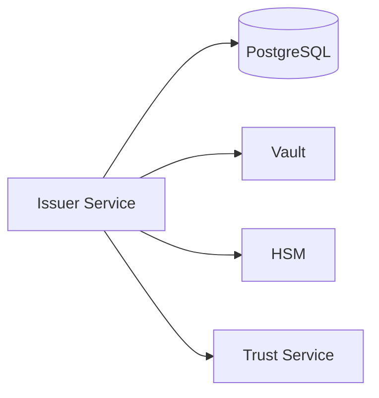
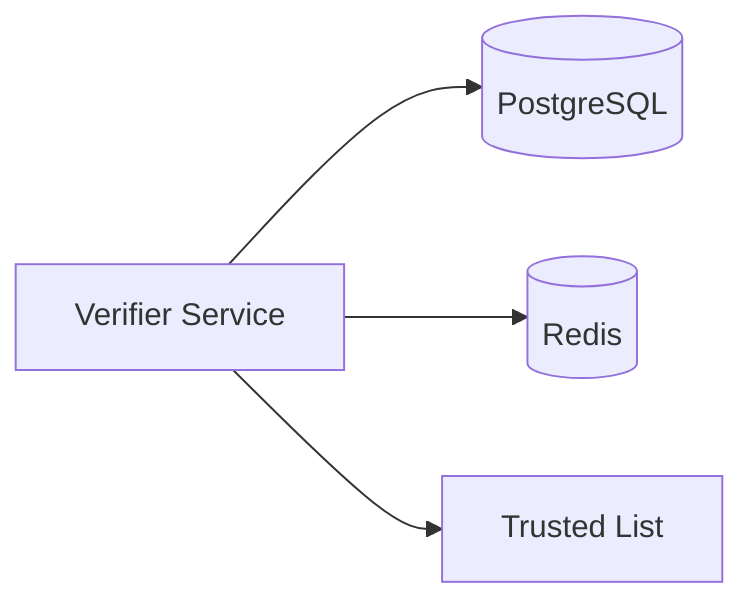
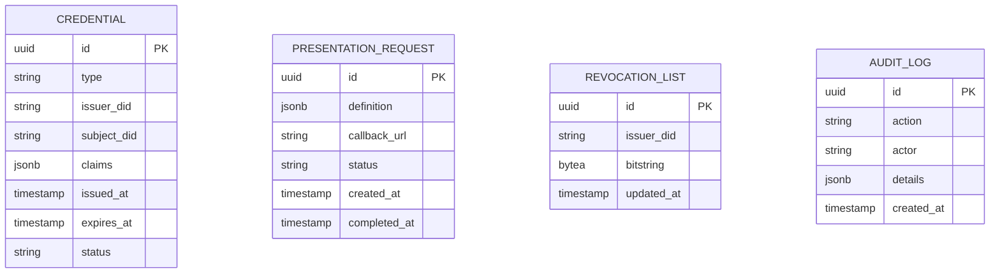

# Components

Aquesta pagina descriu en detall cada component del sistema EUDIStack.

## Issuer Service

Servei responsable de l'emissio de credencials verificables.

### Responsabilitats

- Rebre sollicituds d'emissio de credencials
- Validar les dades d'entrada
- Generar i signar credencials
- Gestionar el cicle de vida de les credencials
- Publicar estat de revocacio

### Endpoints principals

| Endpoint | Metode | Descripcio |
|----------|--------|------------|
| `/credentials/offer` | POST | Crear oferta de credencial |
| `/credentials/{id}` | GET | Obtenir credencial |
| `/credentials/{id}` | DELETE | Revocar credencial |
| `/.well-known/openid-credential-issuer` | GET | Metadata de l'emissor |

### Dependencies



---

## Verifier Service

Servei responsable de la verificacio de presentacions de credencials.

### Responsabilitats

- Generar sollicituds de presentacio
- Rebre i validar presentacions
- Verificar signatures criptografiques
- Comprovar estat de revocacio
- Validar contra llista d'emissors confiables

### Endpoints principals

| Endpoint | Metode | Descripcio |
|----------|--------|------------|
| `/presentations/request` | POST | Crear sollicitud |
| `/presentations/verify` | POST | Verificar presentacio |
| `/presentations/requests/{id}` | GET | Estat de sollicitud |

### Dependencies



---

## Wallet Backend Service

Servei de backend per a l'aplicacio wallet.

### Responsabilitats

- Sincronitzacio de credencials entre dispositius
- Backup xifrat de credencials
- Gestio de notificacions push
- Recuperacio de compte

### Endpoints principals

| Endpoint | Metode | Descripcio |
|----------|--------|------------|
| `/wallet/sync` | POST | Sincronitzar estat |
| `/wallet/backup` | POST | Crear backup |
| `/wallet/restore` | POST | Restaurar backup |
| `/wallet/devices` | GET | Llistar dispositius |

---

## Auth Service

Servei d'autenticacio i autoritzacio.

### Responsabilitats

- Autenticacio OAuth 2.0
- Emissio de tokens JWT
- Gestio de sessions
- Validacio de tokens

### Fluxos suportats

| Flux | Descripcio |
|------|------------|
| Client Credentials | Aplicacions servidor |
| Authorization Code + PKCE | Aplicacions client |
| Refresh Token | Renovacio de tokens |

### Endpoints principals

| Endpoint | Metode | Descripcio |
|----------|--------|------------|
| `/oauth/token` | POST | Obtenir token |
| `/oauth/authorize` | GET | Inici d'autoritzacio |
| `/oauth/revoke` | POST | Revocar token |
| `/.well-known/openid-configuration` | GET | Metadata OIDC |

---

## API Gateway

Punt d'entrada unificat per a totes les peticions.

### Responsabilitats

- Routing de peticions
- Rate limiting
- Autenticacio de peticions
- Logging i metriques
- CORS

### Configuracio de rutes

```yaml
routes:
  - path: /api/v1/credentials/**
    service: issuer-service
    rate_limit: 100/minute

  - path: /api/v1/presentations/**
    service: verifier-service
    rate_limit: 200/minute

  - path: /api/v1/wallet/**
    service: wallet-backend
    rate_limit: 50/minute
```

---

## Base de dades (PostgreSQL)

Emmagatzematge persistent principal.

### Esquema principal



---

## Cache (Redis)

Cache distribuida per millorar rendiment.

### Casos d'us

| Clau | TTL | Descripcio |
|------|-----|------------|
| `session:{id}` | 1h | Sessions d'usuari |
| `token:{jti}` | 24h | Tokens revocats |
| `rate:{ip}` | 1min | Comptadors rate limit |
| `issuer:{did}` | 1h | Metadata d'emissors |

---

## Vault

Gestio de secrets i claus criptografiques.

### Secrets emmagatzemats

| Path | Descripcio |
|------|------------|
| `secret/issuer/keys` | Claus de signatura de l'emissor |
| `secret/database` | Credencials de BD |
| `secret/api-keys` | API keys de serveis |
| `transit/issuer` | Motor de xifrat |

## Seguent pas

[:material-arrow-decision: Veure fluxos de treball](flujos.md){ .md-button }
