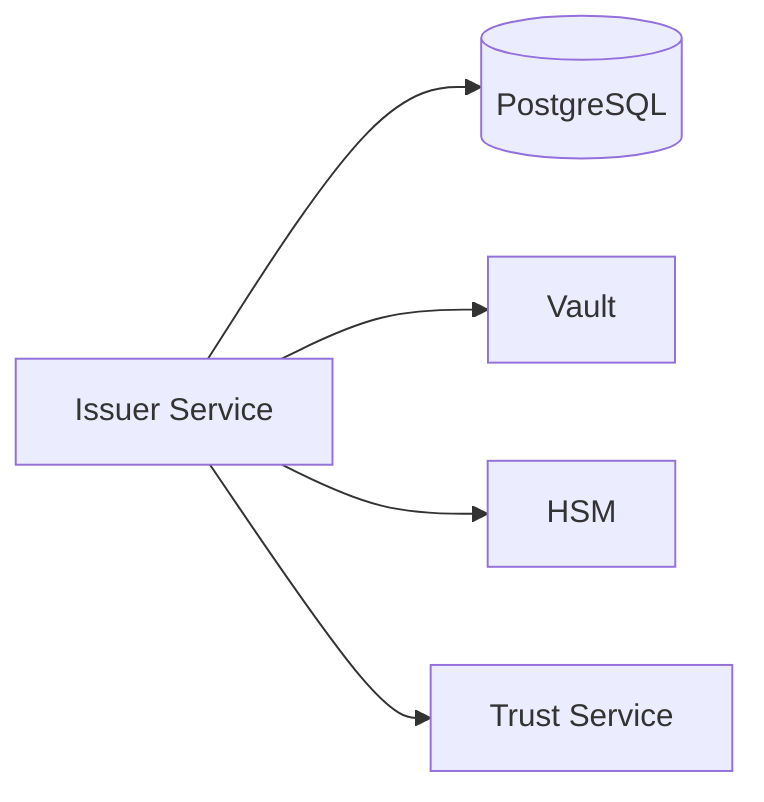
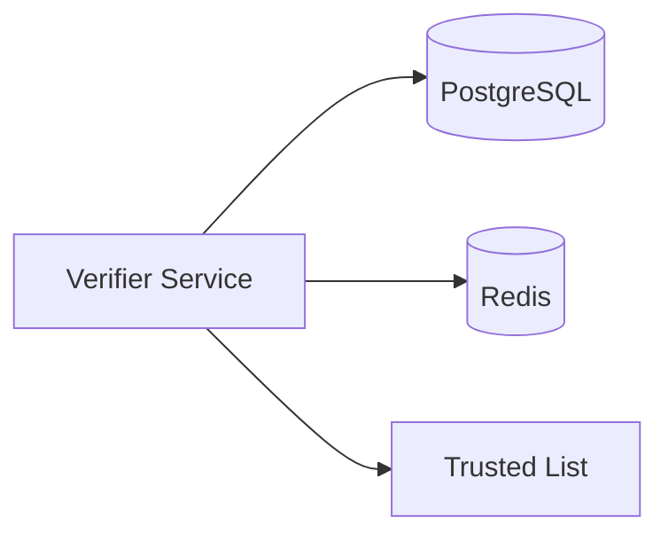
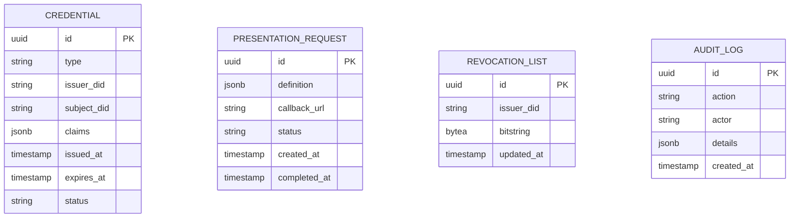

# Components

This page describes in detail each component of the EUDIStack system.

## Issuer Service

Service responsible for issuing verifiable credentials.

### Responsibilities

- Receive credential issuance requests
- Validate input data
- Generate and sign credentials
- Manage credential lifecycle
- Publish revocation status

### Main Endpoints

| Endpoint | Method | Description |
|----------|--------|-------------|
| `/credentials/offer` | POST | Create credential offer |
| `/credentials/{id}` | GET | Get credential |
| `/credentials/{id}` | DELETE | Revoke credential |
| `/.well-known/openid-credential-issuer` | GET | Issuer metadata |

### Dependencies



---

## Verifier Service

Service responsible for verifying credential presentations.

### Responsibilities

- Generate presentation requests
- Receive and validate presentations
- Verify cryptographic signatures
- Check revocation status
- Validate against trusted issuers list

### Main Endpoints

| Endpoint | Method | Description |
|----------|--------|-------------|
| `/presentations/request` | POST | Create request |
| `/presentations/verify` | POST | Verify presentation |
| `/presentations/requests/{id}` | GET | Request status |

### Dependencies



---

## Wallet Backend Service

Backend service for the wallet application.

### Responsibilities

- Credential synchronization between devices
- Encrypted credential backup
- Push notification management
- Account recovery

### Main Endpoints

| Endpoint | Method | Description |
|----------|--------|-------------|
| `/wallet/sync` | POST | Sync state |
| `/wallet/backup` | POST | Create backup |
| `/wallet/restore` | POST | Restore backup |
| `/wallet/devices` | GET | List devices |

---

## Auth Service

Authentication and authorization service.

### Responsibilities

- OAuth 2.0 authentication
- JWT token issuance
- Session management
- Token validation

### Supported Flows

| Flow | Description |
|------|-------------|
| Client Credentials | Server applications |
| Authorization Code + PKCE | Client applications |
| Refresh Token | Token renewal |

### Main Endpoints

| Endpoint | Method | Description |
|----------|--------|-------------|
| `/oauth/token` | POST | Get token |
| `/oauth/authorize` | GET | Start authorization |
| `/oauth/revoke` | POST | Revoke token |
| `/.well-known/openid-configuration` | GET | OIDC metadata |

---

## API Gateway

Unified entry point for all requests.

### Responsibilities

- Request routing
- Rate limiting
- Request authentication
- Logging and metrics
- CORS

### Route Configuration

```yaml
routes:
  - path: /api/v1/credentials/**
    service: issuer-service
    rate_limit: 100/minute

  - path: /api/v1/presentations/**
    service: verifier-service
    rate_limit: 200/minute

  - path: /api/v1/wallet/**
    service: wallet-backend
    rate_limit: 50/minute
```

---

## Database (PostgreSQL)

Main persistent storage.

### Main Schema



### Recommended Indexes

```sql
-- Search credentials by issuer
CREATE INDEX idx_credential_issuer ON credentials(issuer_did);

-- Search credentials by status
CREATE INDEX idx_credential_status ON credentials(status);

-- Search pending requests
CREATE INDEX idx_request_status ON presentation_requests(status)
WHERE status = 'pending';
```

---

## Cache (Redis)

Distributed cache to improve performance.

### Use Cases

| Key | TTL | Description |
|-----|-----|-------------|
| `session:{id}` | 1h | User sessions |
| `token:{jti}` | 24h | Revoked tokens |
| `rate:{ip}` | 1min | Rate limit counters |
| `issuer:{did}` | 1h | Issuer metadata |

### Configuration

```yaml
redis:
  host: redis
  port: 6379
  maxmemory: 256mb
  maxmemory-policy: allkeys-lru
```

---

## Vault

Secrets and cryptographic key management.

### Stored Secrets

| Path | Description |
|------|-------------|
| `secret/issuer/keys` | Issuer signing keys |
| `secret/database` | DB credentials |
| `secret/api-keys` | Service API keys |
| `transit/issuer` | Encryption engine |

### Usage Example

```python
import hvac

client = hvac.Client(url='http://vault:8200')
client.token = os.environ['VAULT_TOKEN']

# Read secret
secret = client.secrets.kv.v2.read_secret_version(
    path='issuer/keys',
    mount_point='secret'
)
private_key = secret['data']['data']['private_key']

# Sign with transit
signature = client.secrets.transit.sign_data(
    name='issuer',
    hash_input=base64.b64encode(data).decode()
)
```

## Next Step

[:material-arrow-decision: View workflows](flujos.md){ .md-button }
