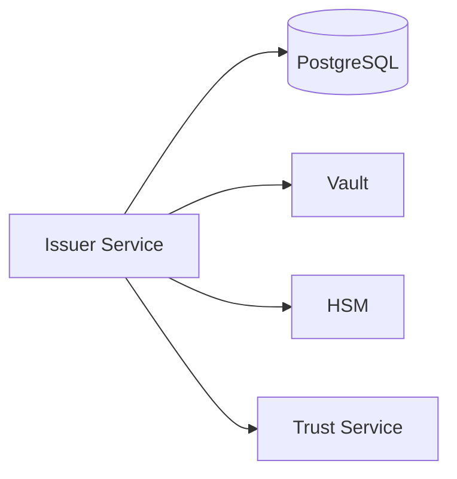
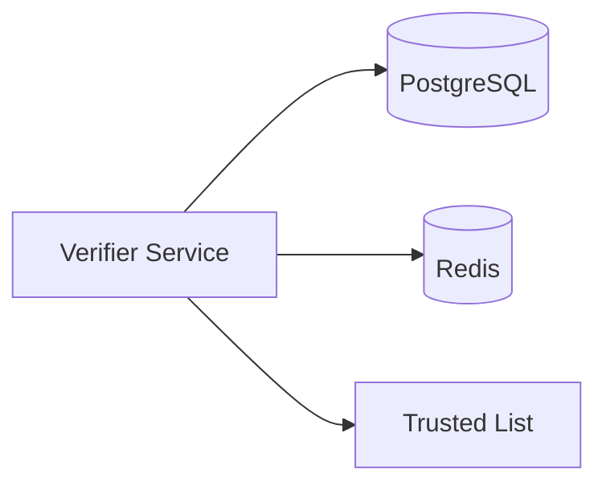
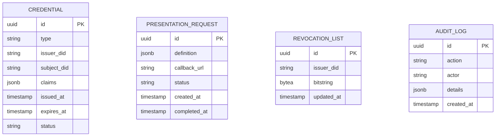

# Componentes (C3)

Esta pagina describe en detalle cada componente del sistema EUDIStack, correspondiendo al nivel C3 (Components) del modelo C4. Aqui se profundiza en la estructura interna de cada contenedor.

!!! note "Nivel de abstraccion"
    Este documento esta orientado a **arquitectos y desarrolladores** que necesitan entender la estructura interna de los servicios. Para una vision de alto nivel, consulta [Vision General](vision-general.md).

## Issuer Service

Servicio responsable de la emision de credenciales verificables.

### Responsabilidades

- Recibir solicitudes de emision de credenciales
- Validar los datos de entrada
- Generar y firmar credenciales
- Gestionar el ciclo de vida de las credenciales
- Publicar estado de revocacion

### Endpoints principales

| Endpoint | Metodo | Descripcion |
|----------|--------|-------------|
| `/credentials/offer` | POST | Crear oferta de credencial |
| `/credentials/{id}` | GET | Obtener credencial |
| `/credentials/{id}` | DELETE | Revocar credencial |
| `/.well-known/openid-credential-issuer` | GET | Metadata del emisor |

### Dependencias



---

## Verifier Service

Servicio responsable de la verificacion de presentaciones de credenciales.

### Responsabilidades

- Generar solicitudes de presentacion
- Recibir y validar presentaciones
- Verificar firmas criptograficas
- Comprobar estado de revocacion
- Validar contra lista de emisores confiables

### Endpoints principales

| Endpoint | Metodo | Descripcion |
|----------|--------|-------------|
| `/presentations/request` | POST | Crear solicitud |
| `/presentations/verify` | POST | Verificar presentacion |
| `/presentations/requests/{id}` | GET | Estado de solicitud |

### Dependencias



---

## Wallet Backend Service

Servicio de backend para la aplicacion wallet.

### Responsabilidades

- Sincronizacion de credenciales entre dispositivos
- Backup cifrado de credenciales
- Gestion de notificaciones push
- Recuperacion de cuenta

### Endpoints principales

| Endpoint | Metodo | Descripcion |
|----------|--------|-------------|
| `/wallet/sync` | POST | Sincronizar estado |
| `/wallet/backup` | POST | Crear backup |
| `/wallet/restore` | POST | Restaurar backup |
| `/wallet/devices` | GET | Listar dispositivos |

---

## Auth Service

Servicio de autenticacion y autorizacion.

### Responsabilidades

- Autenticacion OAuth 2.0
- Emision de tokens JWT
- Gestion de sesiones
- Validacion de tokens

### Flujos soportados

| Flujo | Descripcion |
|-------|-------------|
| Client Credentials | Aplicaciones servidor |
| Authorization Code + PKCE | Aplicaciones cliente |
| Refresh Token | Renovacion de tokens |

### Endpoints principales

| Endpoint | Metodo | Descripcion |
|----------|--------|-------------|
| `/oauth/token` | POST | Obtener token |
| `/oauth/authorize` | GET | Inicio de autorizacion |
| `/oauth/revoke` | POST | Revocar token |
| `/.well-known/openid-configuration` | GET | Metadata OIDC |

---

## API Gateway

Punto de entrada unificado para todas las peticiones.

### Responsabilidades

- Routing de peticiones
- Rate limiting
- Autenticacion de peticiones
- Logging y metricas
- CORS

### Configuracion de rutas

```yaml
routes:
  - path: /api/v1/credentials/**
    service: issuer-service
    rate_limit: 100/minute

  - path: /api/v1/presentations/**
    service: verifier-service
    rate_limit: 200/minute

  - path: /api/v1/wallet/**
    service: wallet-backend
    rate_limit: 50/minute
```

---

## Base de datos (PostgreSQL)

Almacenamiento persistente principal.

### Esquema principal



### Indices recomendados

```sql
-- Busqueda de credenciales por emisor
CREATE INDEX idx_credential_issuer ON credentials(issuer_did);

-- Busqueda de credenciales por estado
CREATE INDEX idx_credential_status ON credentials(status);

-- Busqueda de solicitudes pendientes
CREATE INDEX idx_request_status ON presentation_requests(status)
WHERE status = 'pending';
```

---

## Cache (Redis)

Cache distribuida para mejorar rendimiento.

### Casos de uso

| Clave | TTL | Descripcion |
|-------|-----|-------------|
| `session:{id}` | 1h | Sesiones de usuario |
| `token:{jti}` | 24h | Tokens revocados |
| `rate:{ip}` | 1min | Contadores rate limit |
| `issuer:{did}` | 1h | Metadata de emisores |

### Configuracion

```yaml
redis:
  host: redis
  port: 6379
  maxmemory: 256mb
  maxmemory-policy: allkeys-lru
```

---

## Vault

Gestion de secretos y claves criptograficas.

### Secretos almacenados

| Path | Descripcion |
|------|-------------|
| `secret/issuer/keys` | Claves de firma del emisor |
| `secret/database` | Credenciales de BD |
| `secret/api-keys` | API keys de servicios |
| `transit/issuer` | Motor de cifrado |

### Ejemplo de uso

```python
import hvac

client = hvac.Client(url='http://vault:8200')
client.token = os.environ['VAULT_TOKEN']

# Leer secreto
secret = client.secrets.kv.v2.read_secret_version(
    path='issuer/keys',
    mount_point='secret'
)
private_key = secret['data']['data']['private_key']

# Firmar con transit
signature = client.secrets.transit.sign_data(
    name='issuer',
    hash_input=base64.b64encode(data).decode()
)
```

## Siguiente paso

[:material-arrow-decision: Ver flujos de trabajo](flujos.md){ .md-button }
