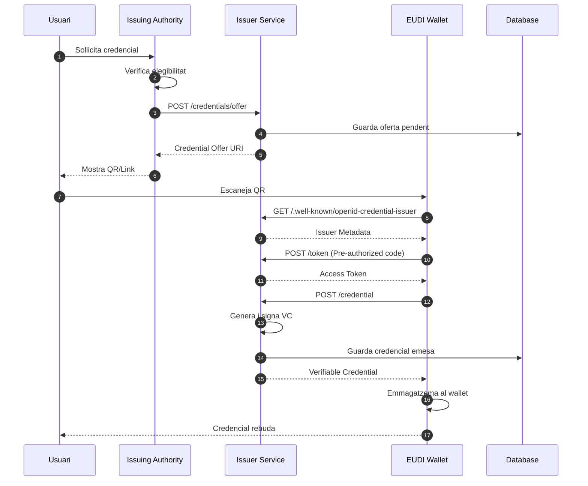
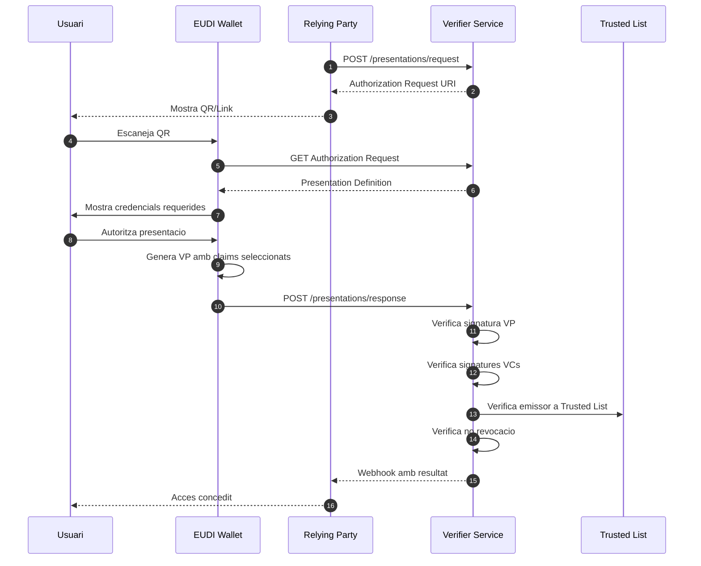
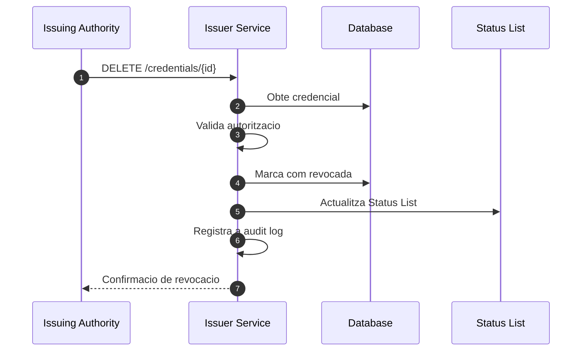
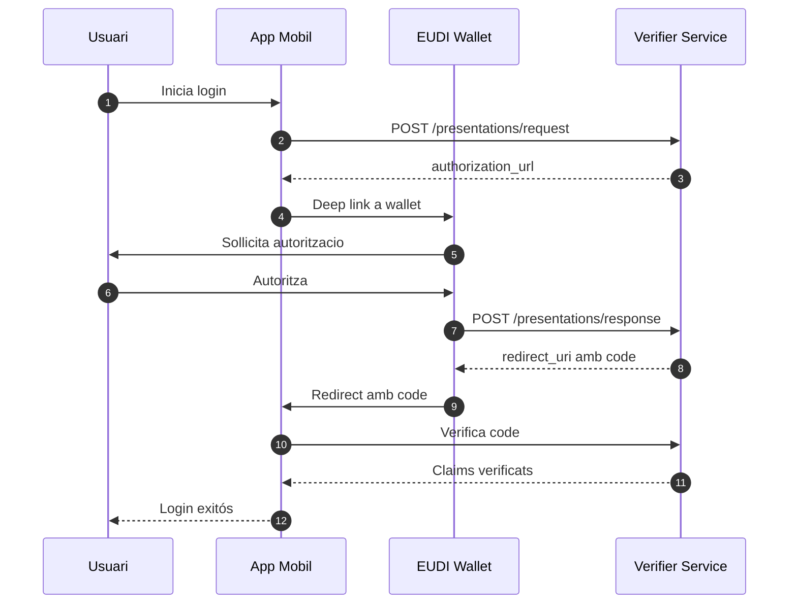
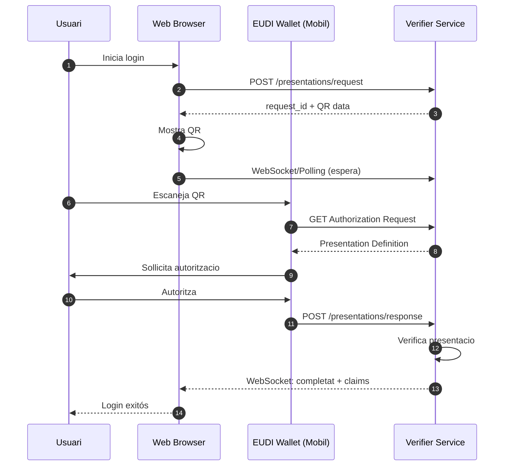
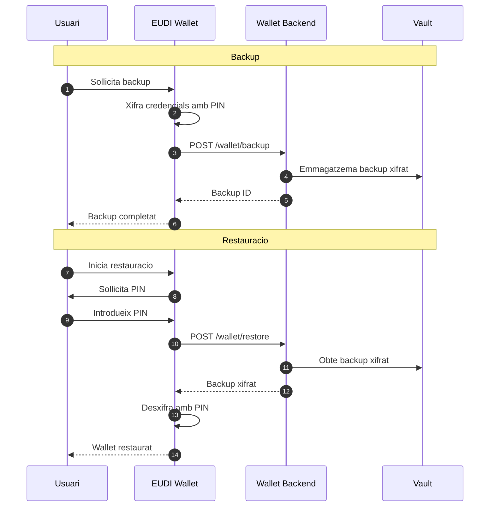
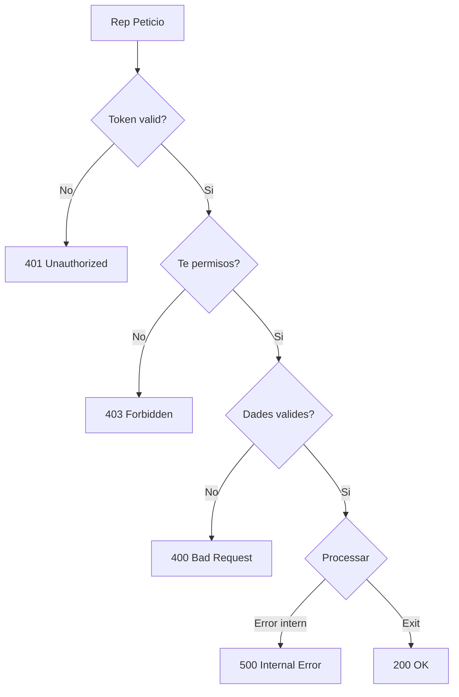

# Fluxos

Aquesta pagina documenta els principals fluxos de treball del sistema EUDIStack.

## Flux d'emissio de credencials

El flux complet d'emissio d'una credencial verificable.

### Passos detallats

1. **Sollicitud inicial**: L'usuari sollicita una credencial a l'autoritat emissora
2. **Verificacio**: L'autoritat verifica que l'usuari es elegible
3. **Creacio d'oferta**: Es genera una oferta de credencial amb les dades
4. **Presentacio**: L'usuari veu un QR o link per acceptar
5. **Escaneig**: El wallet escaneja i obte l'oferta
6. **Metadata**: El wallet obte la configuracio de l'emissor
7. **Token**: El wallet obte un token d'acces
8. **Emissio**: El wallet sollicita la credencial
9. **Signatura**: El servei genera i signa la credencial
10. **Emmagatzematge**: La credencial es guarda al wallet

---

## Flux de verificacio de credencials

El flux complet de verificacio d'una presentacio.

---

## Flux de revocacio

Proces de revocacio d'una credencial emesa.

---

## Flux d'autenticacio Same-Device

Quan el wallet i el servei estan al mateix dispositiu.

---

## Flux d'autenticacio Cross-Device

Quan el wallet esta a un dispositiu diferent (ex: QR a web).

---

## Flux de backup i restauracio

Proces de backup i recuperacio del wallet.

---

## Gestio d'errors

### Errors comuns i respostes

| Escenari | Codi | Accio |
|----------|------|-------|
| Token expirat | 401 | Renovar token |
| Credencial revocada | 403 | Informar a l'usuari |
| Emissor no confiable | 403 | Rebutjar presentacio |
| Signatura invalida | 400 | Rebutjar credencial |
| Timeout | 408 | Reintentar |

### Diagrama de gestio d'errors

## Recursos addicionals

- [:material-home: Tornar a l'inici](../index.md)
- [:material-api: Referencia API](../referencia-api/index.md)
- [:material-certificate: Model de credencials](../modelo-credenciales/index.md)
