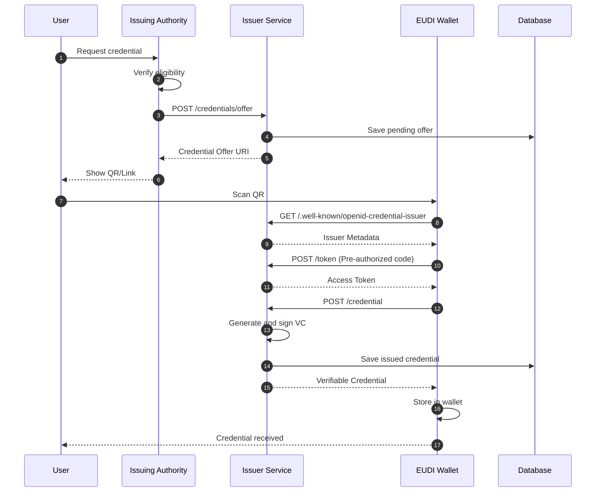
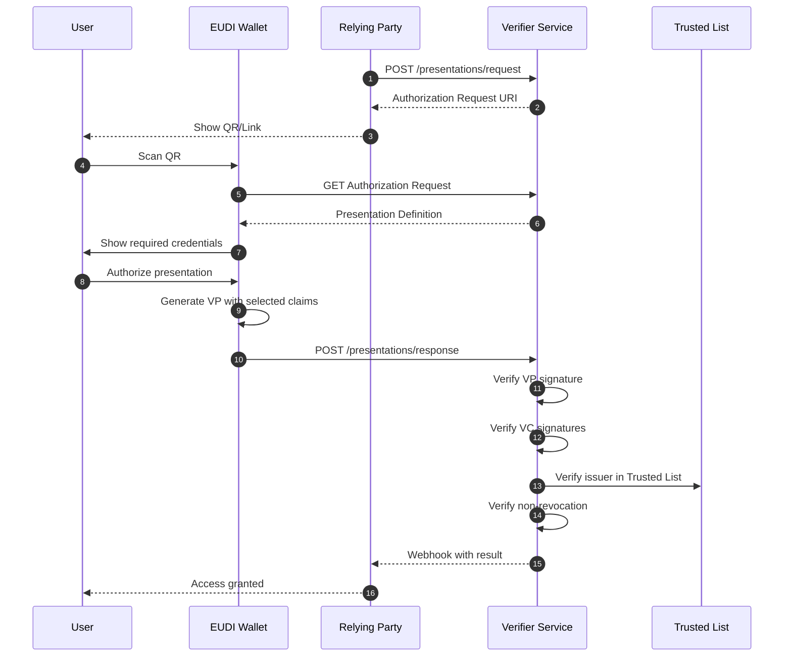
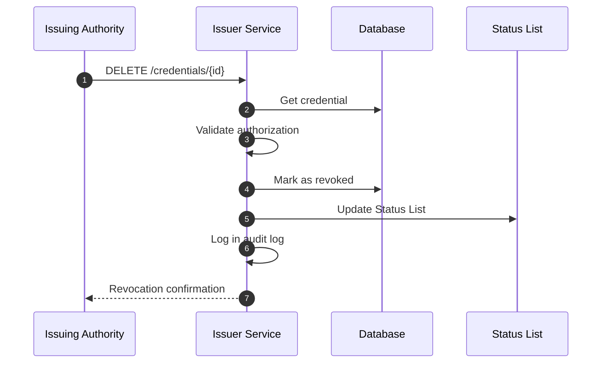
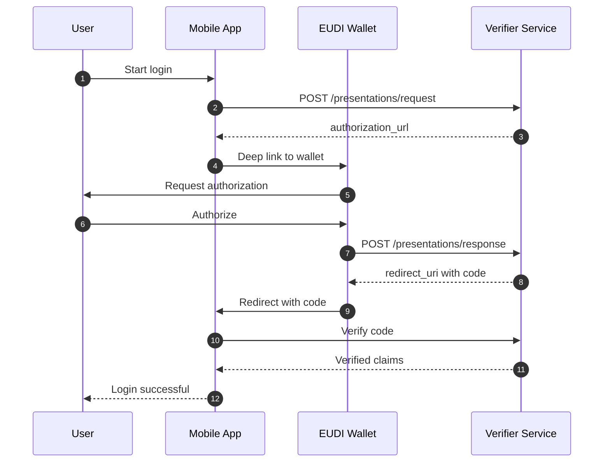
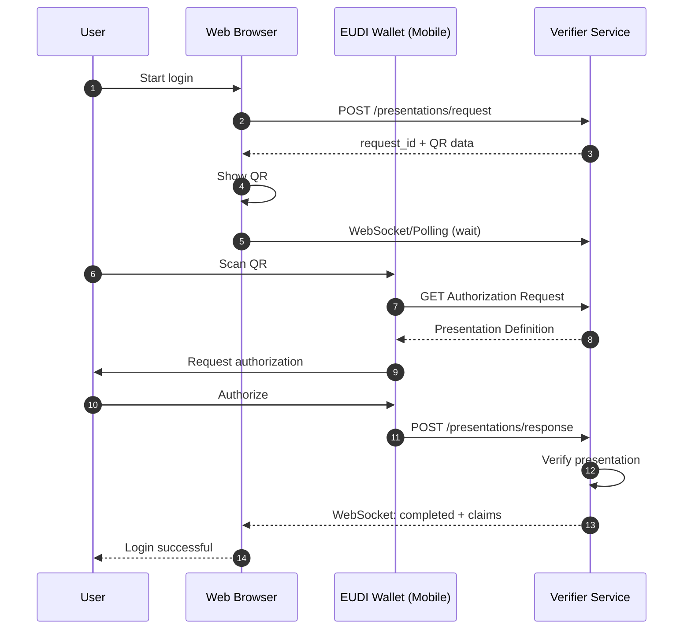
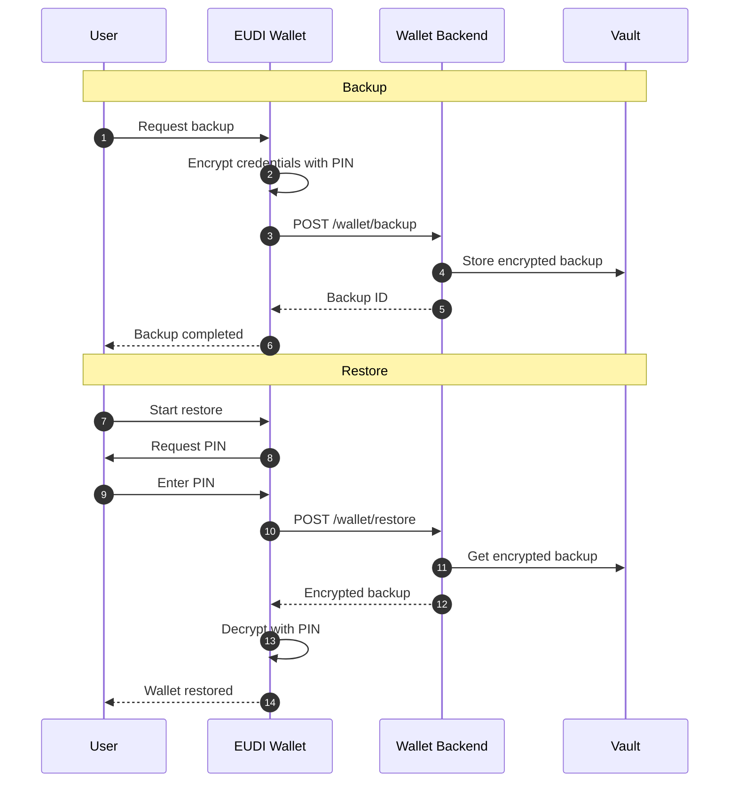
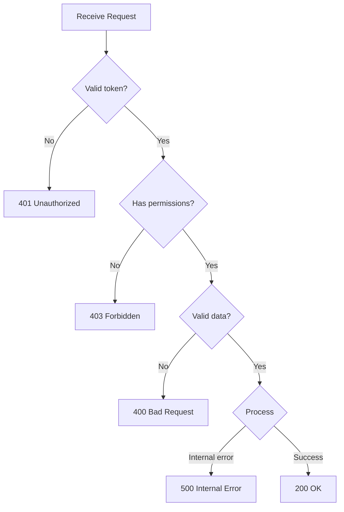

# Flows

This page documents the main workflows of the EUDIStack system.

## Credential Issuance Flow

The complete flow for issuing a verifiable credential.

### Detailed Steps

1. **Initial request**: User requests a credential from the issuing authority
2. **Verification**: Authority verifies user eligibility
3. **Offer creation**: A credential offer is generated with the data
4. **Presentation**: User sees a QR or link to accept
5. **Scanning**: Wallet scans and gets the offer
6. **Metadata**: Wallet obtains issuer configuration
7. **Token**: Wallet obtains an access token
8. **Issuance**: Wallet requests the credential
9. **Signing**: Service generates and signs the credential
10. **Storage**: Credential is stored in the wallet

---

## Credential Verification Flow

The complete flow for verifying a presentation.

### Detailed Steps

1. **Request**: RP requests a presentation from verifier
2. **Authorization URI**: URL/QR is generated for wallet
3. **User presentation**: RP shows the QR
4. **Scanning**: User scans with their wallet
5. **Definition**: Wallet gets what credentials are required
6. **Consent**: User sees and authorizes data to share
7. **VP Generation**: Wallet generates signed presentation
8. **Submission**: Presentation is sent to verifier
9. **Signature verification**: All signatures are validated
10. **Issuer verification**: Issuer is checked against trusted list
11. **Revocation check**: Credential is checked for revocation
12. **Result**: RP receives confirmation

---

## Revocation Flow

Process for revoking an issued credential.

---

## Same-Device Authentication Flow

When wallet and service are on the same device.

---

## Cross-Device Authentication Flow

When wallet is on a different device (e.g., QR on web).

---

## Backup and Restore Flow

Wallet backup and recovery process.

---

## Error Handling

### Common Errors and Responses

| Scenario | Code | Action |
|----------|------|--------|
| Expired token | 401 | Renew token |
| Revoked credential | 403 | Inform user |
| Untrusted issuer | 403 | Reject presentation |
| Invalid signature | 400 | Reject credential |
| Timeout | 408 | Retry |

### Error Handling Diagram

## Additional Resources

- [:material-home: Back to home](../index.md)
- [:material-api: API Reference](../referencia-api/index.md)
- [:material-certificate: Credential model](../modelo-credenciales/index.md)
