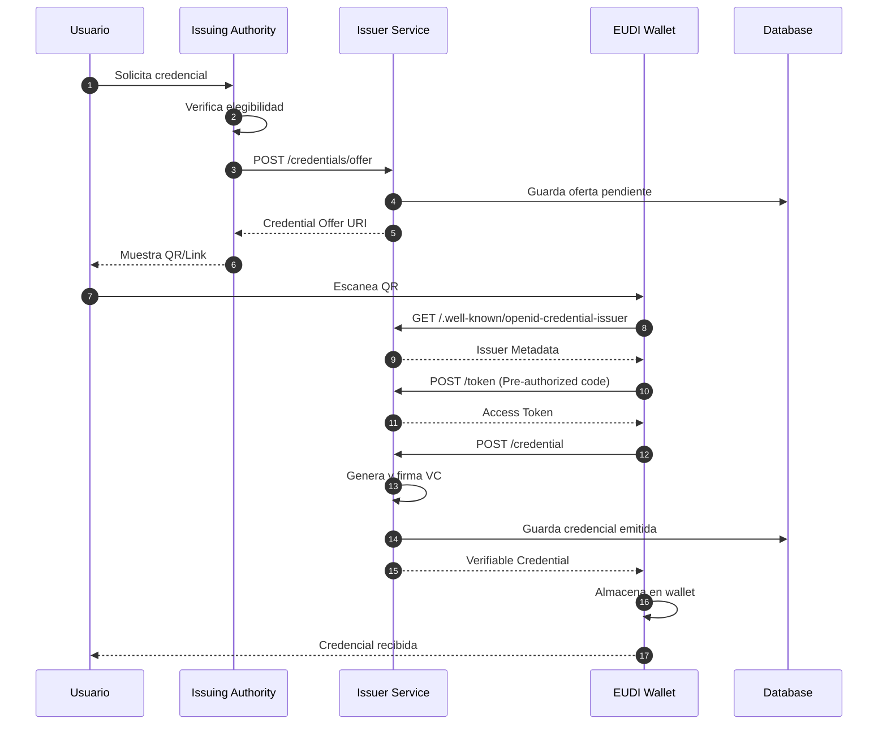
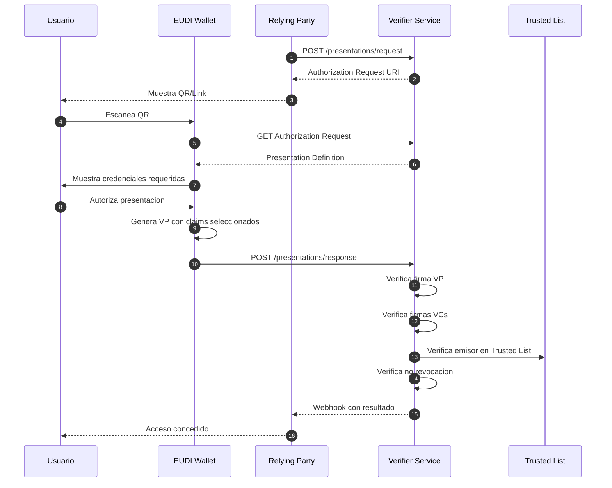
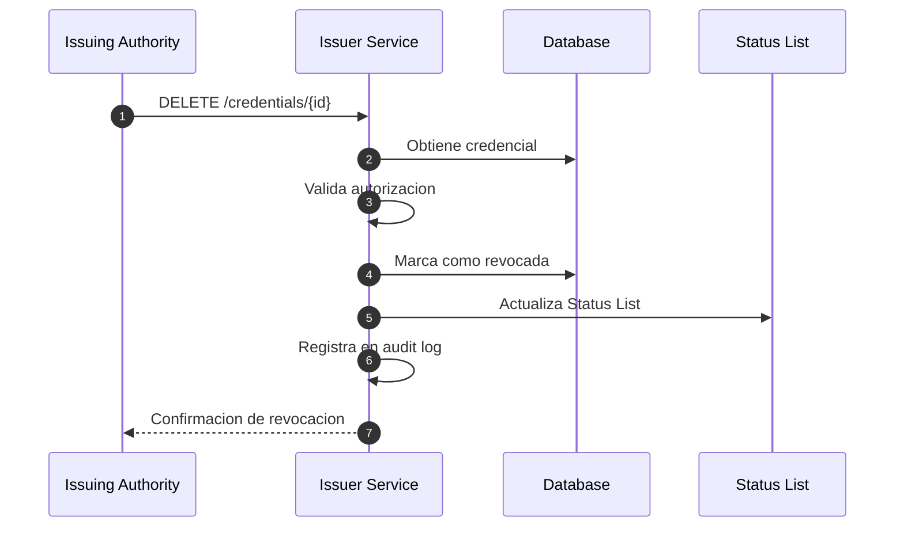
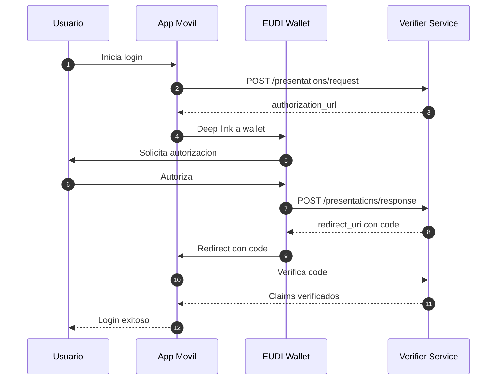
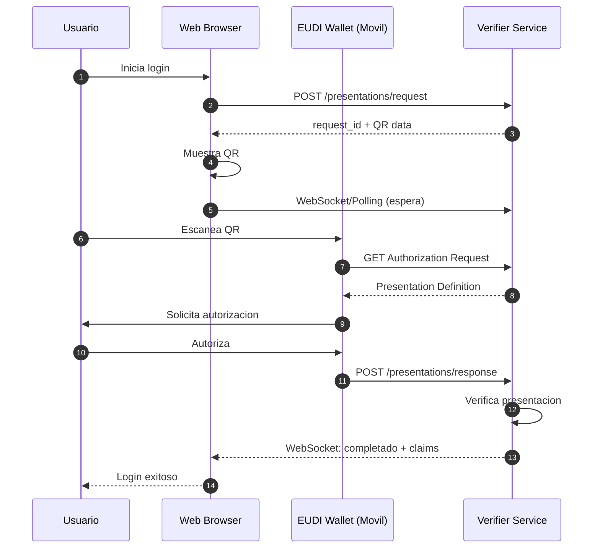
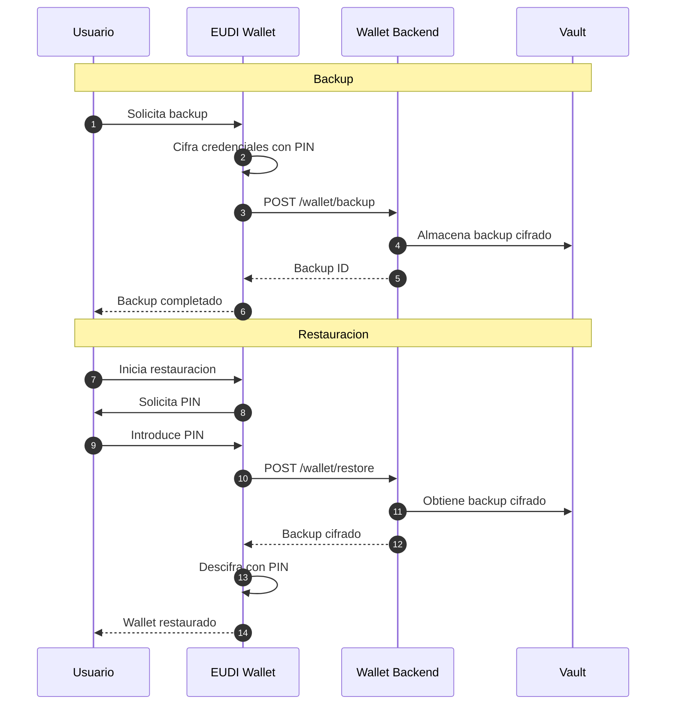
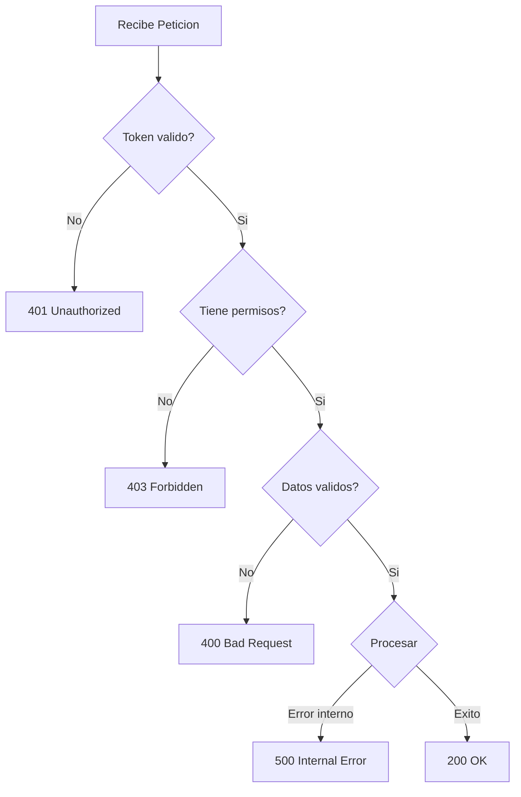

# Flujos

Esta pagina documenta los principales flujos de trabajo del sistema EUDIStack.

## Flujo de emision de credenciales

El flujo completo de emision de una credencial verificable.

### Pasos detallados

1. **Solicitud inicial**: El usuario solicita una credencial a la autoridad emisora
2. **Verificacion**: La autoridad verifica que el usuario es elegible
3. **Creacion de oferta**: Se genera una oferta de credencial con los datos
4. **Presentacion**: El usuario ve un QR o link para aceptar
5. **Escaneo**: El wallet escanea y obtiene la oferta
6. **Metadata**: El wallet obtiene la configuracion del emisor
7. **Token**: El wallet obtiene un token de acceso
8. **Emision**: El wallet solicita la credencial
9. **Firma**: El servicio genera y firma la credencial
10. **Almacenamiento**: La credencial se guarda en el wallet

---

## Flujo de verificacion de credenciales

El flujo completo de verificacion de una presentacion.

### Pasos detallados

1. **Solicitud**: El RP solicita una presentacion al verifier
2. **URI de autorizacion**: Se genera la URL/QR para el wallet
3. **Presentacion al usuario**: El RP muestra el QR
4. **Escaneo**: El usuario escanea con su wallet
5. **Definicion**: El wallet obtiene que credenciales se requieren
6. **Consentimiento**: El usuario ve y autoriza los datos a compartir
7. **Generacion VP**: El wallet genera la presentacion firmada
8. **Envio**: La presentacion se envia al verifier
9. **Verificacion de firmas**: Se validan todas las firmas
10. **Verificacion de emisor**: Se comprueba que el emisor es confiable
11. **Verificacion de revocacion**: Se comprueba que no este revocada
12. **Resultado**: El RP recibe la confirmacion

---

## Flujo de revocacion

Proceso de revocacion de una credencial emitida.

---

## Flujo de autenticacion Same-Device

Cuando el wallet y el servicio estan en el mismo dispositivo.

---

## Flujo de autenticacion Cross-Device

Cuando el wallet esta en un dispositivo diferente (ej: QR en web).

---

## Flujo de backup y restauracion

Proceso de backup y recuperacion del wallet.

---

## Manejo de errores

### Errores comunes y respuestas

| Escenario | Codigo | Accion |
|-----------|--------|--------|
| Token expirado | 401 | Renovar token |
| Credencial revocada | 403 | Informar al usuario |
| Emisor no confiable | 403 | Rechazar presentacion |
| Firma invalida | 400 | Rechazar credencial |
| Timeout | 408 | Reintentar |

### Diagrama de manejo de errores

## Recursos adicionales

- [:material-home: Volver al inicio](../index.md)
- [:material-api: Referencia API](../referencia-api/index.md)
- [:material-certificate: Modelo de credenciales](../modelo-credenciales/index.md)
