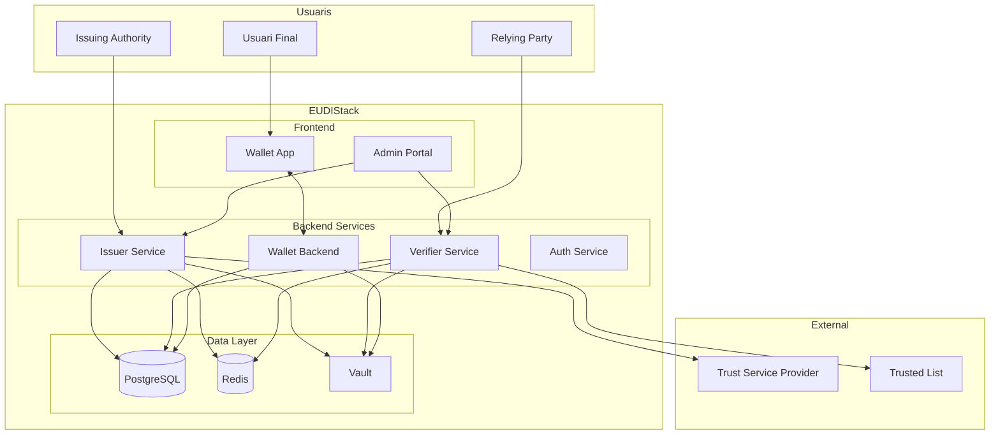

# Arquitectura

Aquesta seccio descriu l'arquitectura del sistema EUDIStack, els seus components principals i com interactuen entre si.

-   :material-eye:{ .lg .middle } **Visio General**

    ---

    Vista d'alt nivell de l'arquitectura del sistema

    [:octicons-arrow-right-24: Veure](vision-general.md)

-   :material-puzzle:{ .lg .middle } **Components**

    ---

    Descripcio detallada de cada component

    [:octicons-arrow-right-24: Veure](componentes.md)

-   :material-arrow-decision:{ .lg .middle } **Fluxos**

    ---

    Fluxos de treball i sequencies d'operacio

    [:octicons-arrow-right-24: Veure](flujos.md)

## Visio rapida

EUDIStack esta dissenyat seguint una arquitectura de microserveis que implementa els rols definits a l'ARF (Architecture and Reference Framework) de la Comissio Europea.

## Principis de disseny

### Seguretat per defecte

- Comunicacions xifrades (TLS 1.3)
- Claus criptografiques en hardware segur (HSM) o Vault
- Autenticacio i autoritzacio a totes les capes
- Auditoria completa d'operacions

### Interoperabilitat

- Compliment amb eIDAS 2.0 i ARF
- Protocols OpenID4VC (OpenID4VCI, OpenID4VP)
- Formats estandard (JWT-VC, SD-JWT, mDOC)

### Escalabilitat

- Arquitectura de microserveis
- Contenidors Docker/Kubernetes
- Bases de dades escalables horitzontalment
- Cache distribuida

### Privacitat

- Divulgacio selectiva d'atributs
- Minimitzacio de dades
- Sense correlacio entre emissors i verificadors
- Control de l'usuari sobre les seves dades

## Stack tecnologic

| Capa | Tecnologia |
|------|------------|
| **Frontend** | React Native (Mobile), React (Web) |
| **Backend** | Java (Spring Boot), Kotlin |
| **Base de dades** | PostgreSQL |
| **Cache** | Redis |
| **Secrets** | HashiCorp Vault |
| **Contenidors** | Docker, Kubernetes |
| **CI/CD** | GitHub Actions |

## Entorns

| Entorn | Proposit | URL |
|--------|----------|-----|
| **Desenvolupament** | Desenvolupament local | `localhost` |
| **Staging** | Proves d'integracio | `staging.eudistack.example.com` |
| **Produccio** | Entorn productiu | `eudistack.example.com` |

## Seguents passos

- [:material-eye: Visio general detallada](vision-general.md)
- [:material-puzzle: Components del sistema](componentes.md)
- [:material-arrow-decision: Fluxos de treball](flujos.md)
