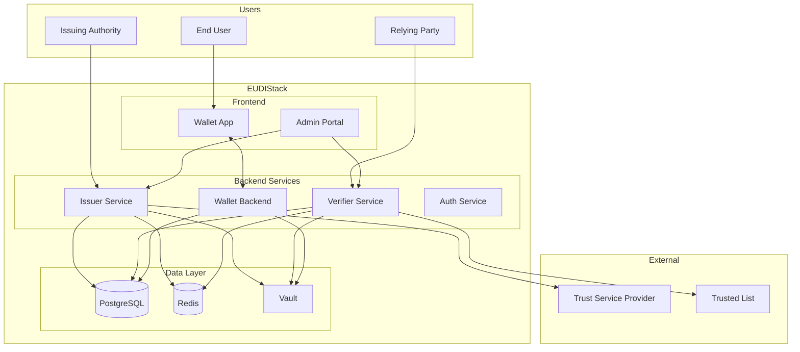

# Architecture

This section describes the EUDIStack system architecture, its main components, and how they interact with each other.

-   :material-eye:{ .lg .middle } **Overview**

    ---

    High-level view of the system architecture

    [:octicons-arrow-right-24: View](vision-general.md)

-   :material-puzzle:{ .lg .middle } **Components**

    ---

    Detailed description of each component

    [:octicons-arrow-right-24: View](componentes.md)

-   :material-arrow-decision:{ .lg .middle } **Flows**

    ---

    Workflows and operation sequences

    [:octicons-arrow-right-24: View](flujos.md)

## Quick Overview

EUDIStack is designed following a microservices architecture that implements the roles defined in the ARF (Architecture and Reference Framework) from the European Commission.

## Design Principles

### Security by Default

- Encrypted communications (TLS 1.3)
- Cryptographic keys in secure hardware (HSM) or Vault
- Authentication and authorization at all layers
- Complete operation auditing

### Interoperability

- eIDAS 2.0 and ARF compliance
- OpenID4VC protocols (OpenID4VCI, OpenID4VP)
- Standard formats (JWT-VC, SD-JWT, mDOC)

### Scalability

- Microservices architecture
- Docker/Kubernetes containers
- Horizontally scalable databases
- Distributed cache

### Privacy

- Selective attribute disclosure
- Data minimization
- No correlation between issuers and verifiers
- User control over their data

## Technology Stack

| Layer | Technology |
|-------|------------|
| **Frontend** | React Native (Mobile), React (Web) |
| **Backend** | Java (Spring Boot), Kotlin |
| **Database** | PostgreSQL |
| **Cache** | Redis |
| **Secrets** | HashiCorp Vault |
| **Containers** | Docker, Kubernetes |
| **CI/CD** | GitHub Actions |

## Environments

| Environment | Purpose | URL |
|-------------|---------|-----|
| **Development** | Local development | `localhost` |
| **Staging** | Integration testing | `staging.eudistack.example.com` |
| **Production** | Production environment | `eudistack.example.com` |

## Next Steps

- [:material-eye: Detailed overview](vision-general.md)
- [:material-puzzle: System components](componentes.md)
- [:material-arrow-decision: Workflows](flujos.md)
