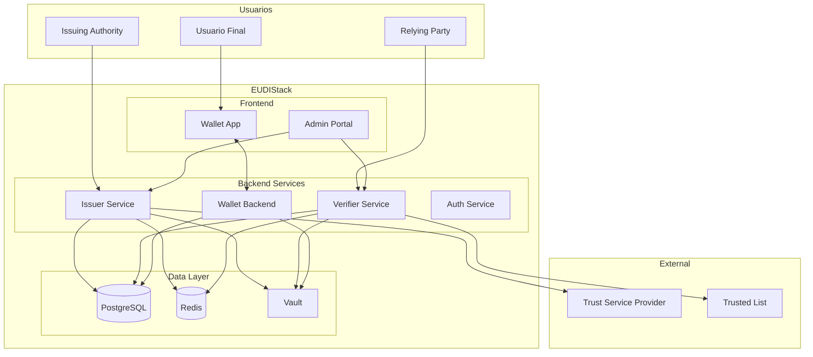

# Arquitectura

Esta seccion describe la arquitectura del sistema EUDIStack, sus componentes principales y como interactuan entre si.

-   :material-eye:{ .lg .middle } **Vision General**

    ---

    Vista de alto nivel de la arquitectura del sistema

    [:octicons-arrow-right-24: Ver](vision-general.md)

-   :material-puzzle:{ .lg .middle } **Componentes**

    ---

    Descripcion detallada de cada componente

    [:octicons-arrow-right-24: Ver](componentes.md)

-   :material-arrow-decision:{ .lg .middle } **Flujos**

    ---

    Flujos de trabajo y secuencias de operacion

    [:octicons-arrow-right-24: Ver](flujos.md)

## Vision rapida

EUDIStack esta disenado siguiendo una arquitectura de microservicios que implementa los roles definidos en el ARF (Architecture and Reference Framework) de la Comision Europea.

## Principios de diseno

### Seguridad por defecto

- Comunicaciones cifradas (TLS 1.3)
- Claves criptograficas en hardware seguro (HSM) o Vault
- Autenticacion y autorizacion en todas las capas
- Auditoria completa de operaciones

### Interoperabilidad

- Cumplimiento con eIDAS 2.0 y ARF
- Protocolos OpenID4VC (OpenID4VCI, OpenID4VP)
- Formatos estandar (JWT-VC, SD-JWT, mDOC)

### Escalabilidad

- Arquitectura de microservicios
- Contenedores Docker/Kubernetes
- Bases de datos escalables horizontalmente
- Cache distribuida

### Privacidad

- Divulgacion selectiva de atributos
- Minimizacion de datos
- Sin correlacion entre emisores y verificadores
- Control del usuario sobre sus datos

## Stack tecnologico

| Capa | Tecnologia |
|------|------------|
| **Frontend** | React Native (Mobile), React (Web) |
| **Backend** | Java (Spring Boot), Kotlin |
| **Base de datos** | PostgreSQL |
| **Cache** | Redis |
| **Secretos** | HashiCorp Vault |
| **Contenedores** | Docker, Kubernetes |
| **CI/CD** | GitHub Actions |

## Entornos

| Entorno | Proposito | URL |
|---------|-----------|-----|
| **Desarrollo** | Desarrollo local | `localhost` |
| **Staging** | Pruebas de integracion | `staging.eudistack.example.com` |
| **Produccion** | Entorno productivo | `eudistack.example.com` |

## Siguientes pasos

- [:material-eye: Vision general detallada](vision-general.md)
- [:material-puzzle: Componentes del sistema](componentes.md)
- [:material-arrow-decision: Flujos de trabajo](flujos.md)
