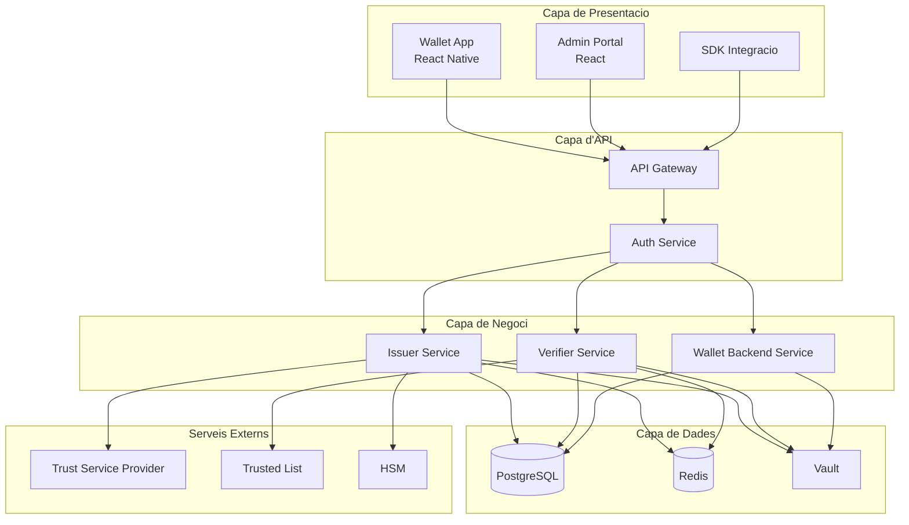
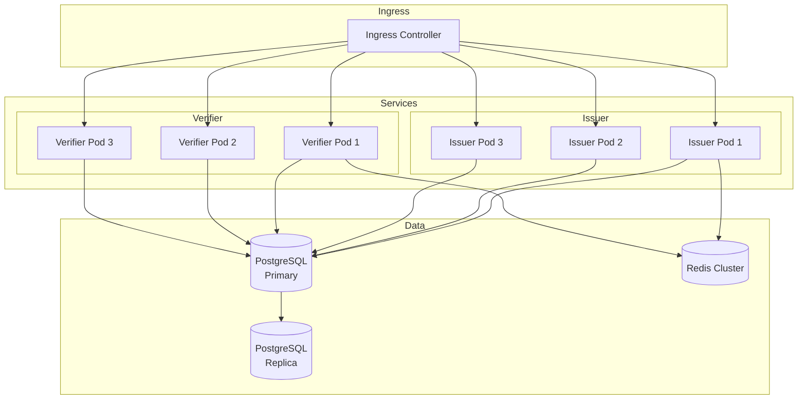
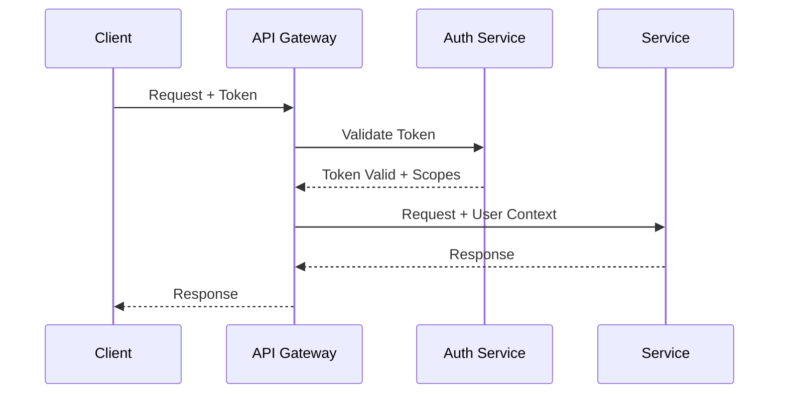

# Visio General

Aquesta pagina proporciona una vista d'alt nivell de l'arquitectura d'EUDIStack i com s'alinea amb l'ecosistema EUDI Wallet europeu.

## Rols de l'ecosistema

EUDIStack implementa els tres rols principals definits a l'ARF:

```mermaid
flowchart LR
    subgraph Issuer["Emissor (Issuer)"]
        direction TB
        I1[Autoritat emissora]
        I2[Genera credencials]
        I3[Signa amb clau privada]
    end

    subgraph Holder["Titular (Holder)"]
        direction TB
        H1[Usuari amb wallet]
        H2[Emmagatzema credencials]
        H3[Controla presentacio]
    end

    subgraph Verifier["Verificador (Verifier)"]
        direction TB
        V1[Servei/aplicacio]
        V2[Sollicita credencials]
        V3[Valida presentacions]
    end

    Issuer -->|Emet VC| Holder
    Holder -->|Presenta VP| Verifier
```



### Emissor (Issuer)

Entitat autoritzada per emetre credencials verificables:

- **Governs**: Documents d'identitat (PID)
- **Universitats**: Titols academics
- **Empreses**: Certificats professionals
- **Organismes publics**: Atestacions

### Titular (Holder)

Usuari que posseeix i controla les seves credencials:

- Emmagatzema credencials al seu wallet
- Decideix quins atributs compartir
- Autoritza cada presentacio

### Verificador (Verifier)

Entitat que sollicita i verifica credencials:

- Serveis online (Relying Parties)
- Aplicacions mobils
- Punts de control fisics

## Capes de l'arquitectura



### Capa de presentacio

- **Wallet App**: Aplicacio mobil per a usuaris finals
- **Admin Portal**: Panell d'administracio per a emissors
- **SDK**: Kit de desenvolupament per a integradors

### Capa d'API

- **API Gateway**: Punt d'entrada unificat, routing, rate limiting
- **Auth Service**: Autenticacio OAuth 2.0 / OpenID Connect

### Capa de negoci

- **Issuer Service**: Emissio i gestio de credencials
- **Verifier Service**: Verificacio de presentacions
- **Wallet Backend**: Sincronitzacio i backup del wallet

### Capa de dades

- **PostgreSQL**: Emmagatzematge persistent
- **Redis**: Cache i sessions
- **Vault**: Gestio de secrets i claus

## Model de desplegament

### Docker Compose (Desenvolupament)

```yaml
services:
  issuer:
    image: eudistack/issuer:latest
    ports:
      - "8081:8080"
    environment:
      - DB_HOST=postgres
      - VAULT_ADDR=http://vault:8200

  verifier:
    image: eudistack/verifier:latest
    ports:
      - "8082:8080"
    environment:
      - DB_HOST=postgres
      - VAULT_ADDR=http://vault:8200

  postgres:
    image: postgres:15
    volumes:
      - pgdata:/var/lib/postgresql/data

  redis:
    image: redis:7-alpine

  vault:
    image: vault:1.15
```

### Kubernetes (Produccio)



## Seguretat

### Seguretat en transit

- TLS 1.3 obligatori per a totes les comunicacions
- Certificats gestionats automaticament (Let's Encrypt / cert-manager)
- mTLS entre serveis interns

### Seguretat en repos

- Xifrat de base de dades (AES-256)
- Claus criptografiques en HSM o Vault
- Backups xifrats

### Autenticacio i autoritzacio



## Alta disponibilitat

| Component | Estrategia |
|-----------|------------|
| **API Gateway** | Multiples repliques + Load Balancer |
| **Serveis** | 3+ repliques per servei |
| **PostgreSQL** | Primary + Read Replicas |
| **Redis** | Cluster mode |
| **Vault** | HA mode amb Raft |

## Seguent pas

[:material-puzzle: Veure components detallats](componentes.md){ .md-button }
