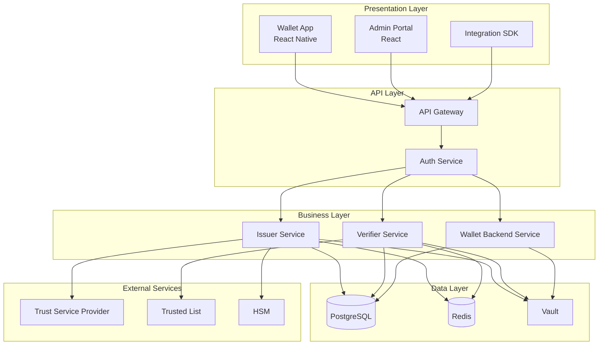
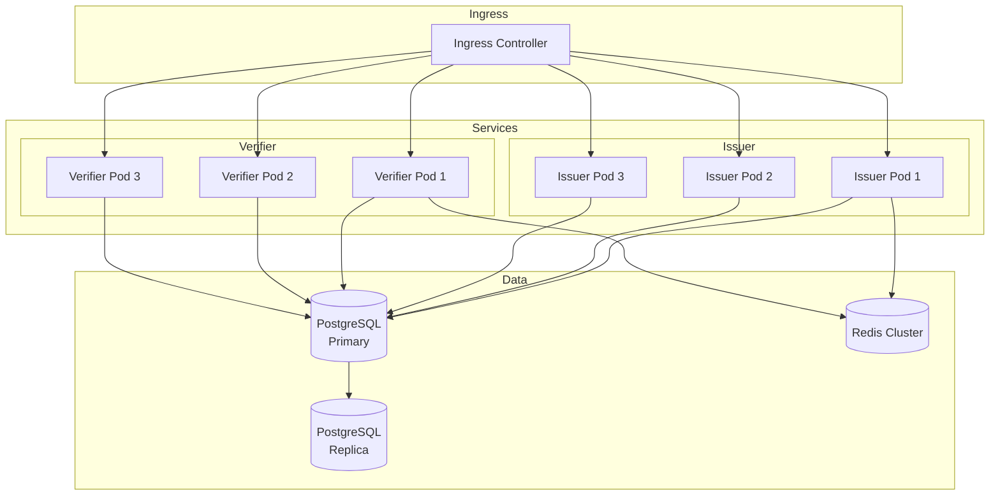
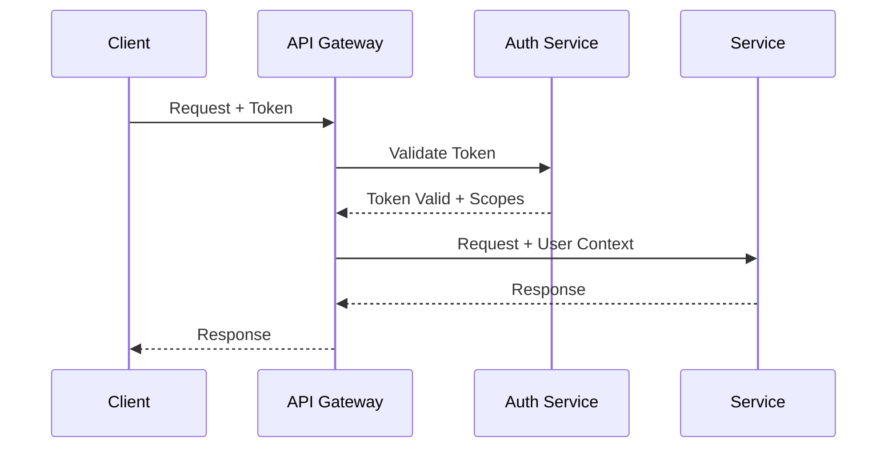

# Overview

This page provides a high-level view of the EUDIStack architecture and how it aligns with the European EUDI Wallet ecosystem.

## Ecosystem Roles

EUDIStack implements the three main roles defined in the ARF:

```mermaid
flowchart LR
    subgraph Issuer["Issuer"]
        direction TB
        I1[Issuing authority]
        I2[Generates credentials]
        I3[Signs with private key]
    end

    subgraph Holder["Holder"]
        direction TB
        H1[User with wallet]
        H2[Stores credentials]
        H3[Controls presentation]
    end

    subgraph Verifier["Verifier"]
        direction TB
        V1[Service/application]
        V2[Requests credentials]
        V3[Validates presentations]
    end

    Issuer -->|Issues VC| Holder
    Holder -->|Presents VP| Verifier
```



### Issuer

Entity authorized to issue verifiable credentials:

- **Governments**: Identity documents (PID)
- **Universities**: Academic degrees
- **Companies**: Professional certificates
- **Public bodies**: Attestations

### Holder

User who owns and controls their credentials:

- Stores credentials in their wallet
- Decides which attributes to share
- Authorizes each presentation

### Verifier

Entity that requests and verifies credentials:

- Online services (Relying Parties)
- Mobile applications
- Physical checkpoints

## Architecture Layers



### Presentation Layer

- **Wallet App**: Mobile application for end users
- **Admin Portal**: Administration panel for issuers
- **SDK**: Development kit for integrators

### API Layer

- **API Gateway**: Unified entry point, routing, rate limiting
- **Auth Service**: OAuth 2.0 / OpenID Connect authentication

### Business Layer

- **Issuer Service**: Credential issuance and management
- **Verifier Service**: Presentation verification
- **Wallet Backend**: Wallet synchronization and backup

### Data Layer

- **PostgreSQL**: Persistent storage
- **Redis**: Cache and sessions
- **Vault**: Secrets and key management

## Deployment Model

### Docker Compose (Development)

```yaml
services:
  issuer:
    image: eudistack/issuer:latest
    ports:
      - "8081:8080"
    environment:
      - DB_HOST=postgres
      - VAULT_ADDR=http://vault:8200

  verifier:
    image: eudistack/verifier:latest
    ports:
      - "8082:8080"
    environment:
      - DB_HOST=postgres
      - VAULT_ADDR=http://vault:8200

  postgres:
    image: postgres:15
    volumes:
      - pgdata:/var/lib/postgresql/data

  redis:
    image: redis:7-alpine

  vault:
    image: vault:1.15
```

### Kubernetes (Production)



## Security

### Security in Transit

- TLS 1.3 required for all communications
- Automatically managed certificates (Let's Encrypt / cert-manager)
- mTLS between internal services

### Security at Rest

- Database encryption (AES-256)
- Cryptographic keys in HSM or Vault
- Encrypted backups

### Authentication and Authorization



## High Availability

| Component | Strategy |
|-----------|----------|
| **API Gateway** | Multiple replicas + Load Balancer |
| **Services** | 3+ replicas per service |
| **PostgreSQL** | Primary + Read Replicas |
| **Redis** | Cluster mode |
| **Vault** | HA mode with Raft |

## Next Step

[:material-puzzle: View detailed components](componentes.md){ .md-button }
