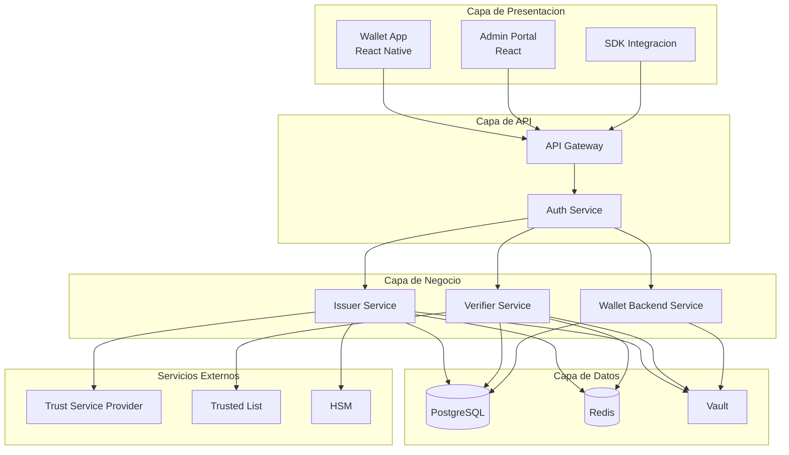
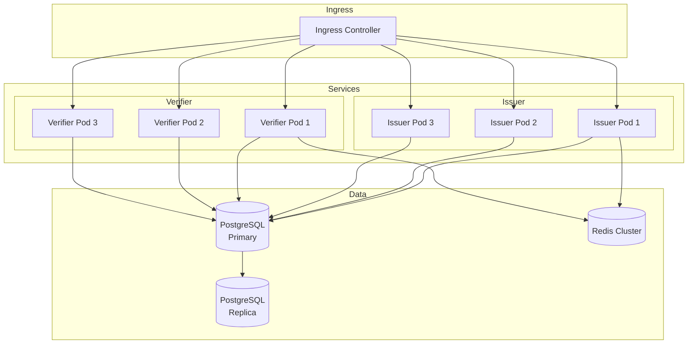
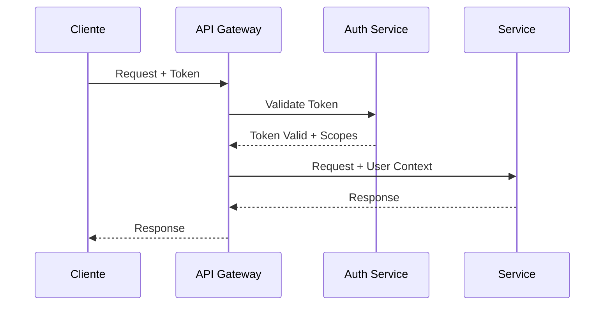

# Vision General

Esta pagina proporciona una vista de alto nivel de la arquitectura de EUDIStack y como se alinea con el ecosistema EUDI Wallet europeo.

## Que es EUDIStack

**EUDIStack** es una plataforma de identidad digital europea que permite a organizaciones **emitir, gestionar y verificar credenciales digitales** para sus empleados, colaboradores, clientes o ciudadanos, cumpliendo con la normativa europea (eIDAS 2).

| Componente | Descripcion | Repositorio |
|------------|-------------|-------------|
| **Issuer** | Emisor de credenciales verificables | in2-issuer-api, in2-issuer-ui |
| **Wallet** | Cartera de identidad digital | in2-wallet-api, in2-wallet-ui |
| **Verifier** | Verificador de credenciales | in2-verifier-api |

### Estandares implementados

EUDIStack implementa los principales estandares de identidad digital:

- **eIDAS 2**: Regulacion europea de identidad digital
- **ARF (EUDIW)**: Architecture Reference Framework
- **OID4VCI**: OpenID for Verifiable Credential Issuance
- **OID4VP**: OpenID for Verifiable Presentations
- **W3C VC**: Verifiable Credentials Data Model 2.0
- **SD-JWT VC**: Selective Disclosure JWT
- **ISO/IEC 18013-5**: Mobile Driving License (mDL)

## Roles del ecosistema

EUDIStack implementa los tres roles principales definidos en el ARF:



```mermaid
flowchart LR
    subgraph Issuer["Emisor (Issuer)"]
        direction TB
        I1[Autoridad emisora]
        I2[Genera credenciales]
        I3[Firma con clave privada]
    end

    subgraph Holder["Titular (Holder)"]
        direction TB
        H1[Usuario con wallet]
        H2[Almacena credenciales]
        H3[Controla presentacion]
    end

    subgraph Verifier["Verificador (Verifier)"]
        direction TB
        V1[Servicio/aplicacion]
        V2[Solicita credenciales]
        V3[Valida presentaciones]
    end

    Issuer -->|Emite VC| Holder
    Holder -->|Presenta VP| Verifier
```

### Emisor (Issuer)

Entidad autorizada para emitir credenciales verificables:

- **Gobiernos**: Documentos de identidad (PID)
- **Universidades**: Titulos academicos
- **Empresas**: Certificados profesionales
- **Organismos publicos**: Atestaciones

### Titular (Holder)

Usuario que posee y controla sus credenciales:

- Almacena credenciales en su wallet
- Decide que atributos compartir
- Autoriza cada presentacion

### Verificador (Verifier)

Entidad que solicita y verifica credenciales:

- Servicios online (Relying Parties)
- Aplicaciones moviles
- Puntos de control fisicos

## Capas de la arquitectura



### Capa de presentacion

- **Wallet App**: Aplicacion movil para usuarios finales
- **Admin Portal**: Panel de administracion para emisores
- **SDK**: Kit de desarrollo para integradores

### Capa de API

- **API Gateway**: Punto de entrada unificado, routing, rate limiting
- **Auth Service**: Autenticacion OAuth 2.0 / OpenID Connect

### Capa de negocio

- **Issuer Service**: Emision y gestion de credenciales
- **Verifier Service**: Verificacion de presentaciones
- **Wallet Backend**: Sincronizacion y backup del wallet

### Capa de datos

- **PostgreSQL**: Almacenamiento persistente
- **Redis**: Cache y sesiones
- **Vault**: Gestion de secretos y claves

## Modelo de despliegue

### Docker Compose (Desarrollo)

```yaml
services:
  issuer:
    image: eudistack/issuer:latest
    ports:
      - "8081:8080"
    environment:
      - DB_HOST=postgres
      - VAULT_ADDR=http://vault:8200

  verifier:
    image: eudistack/verifier:latest
    ports:
      - "8082:8080"
    environment:
      - DB_HOST=postgres
      - VAULT_ADDR=http://vault:8200

  postgres:
    image: postgres:15
    volumes:
      - pgdata:/var/lib/postgresql/data

  redis:
    image: redis:7-alpine

  vault:
    image: vault:1.15
```

### Kubernetes (Produccion)



## Seguridad

### Seguridad en transito

- TLS 1.3 obligatorio para todas las comunicaciones
- Certificados gestionados automaticamente (Let's Encrypt / cert-manager)
- mTLS entre servicios internos

### Seguridad en reposo

- Cifrado de base de datos (AES-256)
- Claves criptograficas en HSM o Vault
- Backups cifrados

### Autenticacion y autorizacion



## Alta disponibilidad

| Componente | Estrategia |
|------------|------------|
| **API Gateway** | Multiple replicas + Load Balancer |
| **Servicios** | 3+ replicas por servicio |
| **PostgreSQL** | Primary + Read Replicas |
| **Redis** | Cluster mode |
| **Vault** | HA mode con Raft |

## Siguiente paso

[:material-puzzle: Ver componentes detallados](componentes.md){ .md-button }
