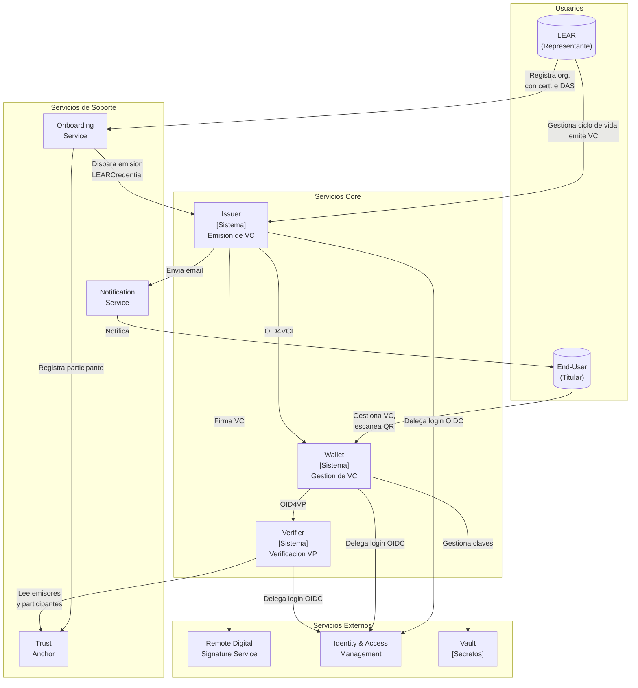
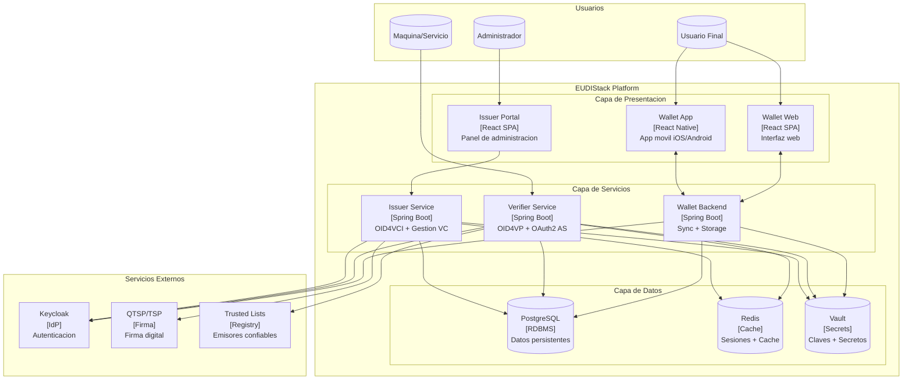
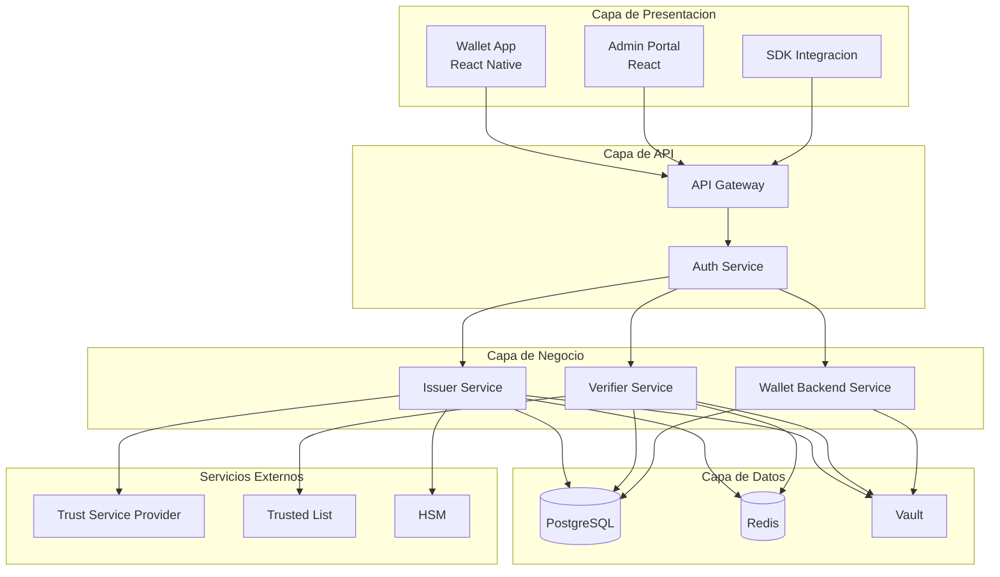
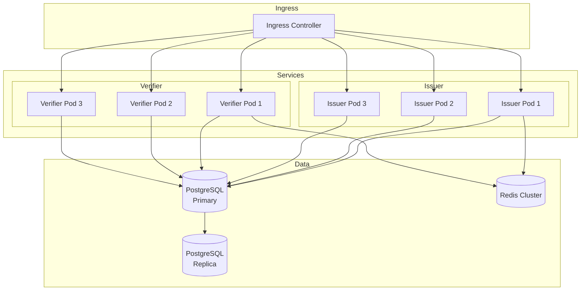
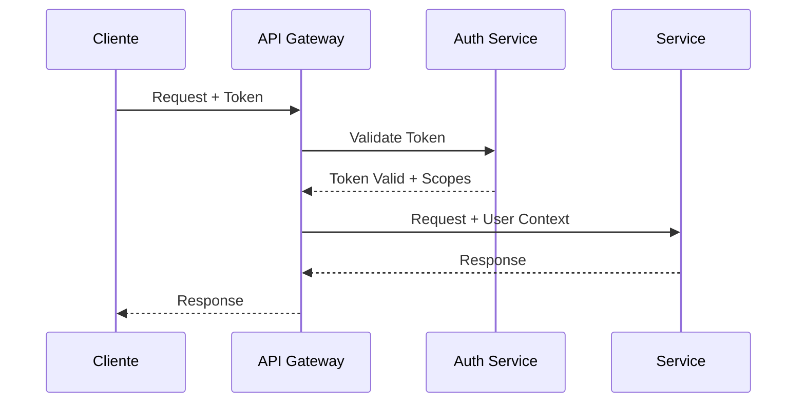

# Vision General

Esta pagina proporciona una vista de alto nivel de la arquitectura de EUDIStack siguiendo el modelo C4.

## Que es EUDIStack

**EUDIStack** es una implementacion del **European Business Wallet** que permite a organizaciones **emitir, gestionar y verificar credenciales digitales** para sus empleados, colaboradores y socios de negocio, cumpliendo con la normativa europea (eIDAS 2).

| Componente | Descripcion | Repositorio |
|------------|-------------|-------------|
| **Issuer** | Emisor de credenciales verificables | in2-issuer-api, in2-issuer-ui |
| **Wallet** | Cartera de identidad digital | in2-wallet-api, in2-wallet-ui |
| **Verifier** | Verificador de credenciales | in2-verifier-api |

### Estandares implementados

EUDIStack implementa los principales estandares de identidad digital:

| Estandar | Descripcion | Uso en EUDIStack |
|----------|-------------|------------------|
| **eIDAS 2** | Regulacion europea de identidad digital | Marco normativo general |
| **ARF (EUDIW)** | Architecture Reference Framework | Arquitectura de referencia |
| **OID4VCI** | OpenID for Verifiable Credential Issuance | Protocolo de emision |
| **OID4VP** | OpenID for Verifiable Presentations | Protocolo de presentacion |
| **W3C VC** | Verifiable Credentials Data Model 2.0 | Formato de credenciales |
| **SD-JWT VC** | Selective Disclosure JWT | Divulgacion selectiva |
| **ISO/IEC 18013-5** | Mobile Driving License (mDL) | Credenciales moviles |

## Diagramas C4

La arquitectura de EUDIStack se documenta siguiendo el modelo C4 (Context, Containers, Components, Code), que proporciona diferentes niveles de abstraccion para distintas audiencias.

### C1: Diagrama de Contexto

El diagrama de contexto muestra los sistemas principales de EUDIStack y sus relaciones con usuarios y servicios externos.



**Actores principales:**

| Actor | Descripcion | Interaccion |
|-------|-------------|-------------|
| **LEAR** | Legal Entity Appointed Representative | Gestiona ciclo de vida de VC, registra organizacion con certificado eIDAS |
| **End-User** | Titular de credenciales (empleado, colaborador) | Gestiona VC almacenadas, escanea QR, configura preferencias |

**Sistemas Core:**

| Sistema | Descripcion | Protocolos |
|---------|-------------|------------|
| **Issuer** | Emite y gestiona credenciales verificables | OID4VCI |
| **Wallet** | Almacena y presenta credenciales | OID4VCI, OID4VP |
| **Verifier** | Verifica presentaciones de credenciales | OID4VP |

**Servicios de Soporte:**

| Servicio | Descripcion |
|----------|-------------|
| **Onboarding Service** | Registro de organizaciones con certificados eIDAS, dispara emision de LEARCredential |
| **Trust Anchor** | Registro de emisores y participantes confiables |
| **Notification Service** | Envio de emails a usuarios |

**Servicios Externos:**

| Servicio | Descripcion |
|----------|-------------|
| **Remote Digital Signature Service** | Firma cualificada de credenciales (QTSP) |
| **Identity & Access Management** | Autenticacion OIDC (Keycloak) |
| **Vault** | Gestion de claves y secretos |

### C2: Diagrama de Contenedores

El diagrama de contenedores muestra los principales contenedores (aplicaciones, servicios, bases de datos) que componen EUDIStack.



**Contenedores principales:**

| Contenedor | Tecnologia | Responsabilidad |
|------------|------------|-----------------|
| **Wallet App** | React Native | Aplicacion movil para titulares |
| **Wallet Web** | React SPA | Interfaz web del wallet |
| **Issuer Portal** | React SPA | Panel de administracion para emisores |
| **Issuer Service** | Spring Boot | Emision de credenciales (OID4VCI) |
| **Verifier Service** | Spring Boot | Verificacion de credenciales (OID4VP) + Authorization Server |
| **Wallet Backend** | Spring Boot | Sincronizacion y almacenamiento de credenciales |
| **PostgreSQL** | RDBMS | Almacenamiento persistente |
| **Redis** | Cache | Cache distribuida y sesiones |
| **Vault** | HashiCorp Vault | Gestion de secretos y claves |

## Roles del ecosistema

EUDIStack implementa los tres roles principales definidos en el ARF (Architecture Reference Framework):

```mermaid
flowchart LR
    subgraph Issuer["Emisor (Issuer)"]
        direction TB
        I1[Autoridad emisora]
        I2[Genera credenciales]
        I3[Firma con clave privada]
    end

    subgraph Holder["Titular (Holder)"]
        direction TB
        H1[Usuario con wallet]
        H2[Almacena credenciales]
        H3[Controla presentacion]
    end

    subgraph Verifier["Verificador (Verifier)"]
        direction TB
        V1[Servicio/aplicacion]
        V2[Solicita credenciales]
        V3[Valida presentaciones]
    end

    Issuer -->|Emite VC| Holder
    Holder -->|Presenta VP| Verifier
```



### Emisor (Issuer)

Entidad autorizada para emitir credenciales verificables:

- **Gobiernos**: Documentos de identidad (PID)
- **Universidades**: Titulos academicos
- **Empresas**: Certificados profesionales
- **Organismos publicos**: Atestaciones

### Titular (Holder)

Usuario que posee y controla sus credenciales:

- Almacena credenciales en su wallet
- Decide que atributos compartir
- Autoriza cada presentacion

### Verificador (Verifier)

Entidad que solicita y verifica credenciales:

- Servicios online (Relying Parties)
- Aplicaciones moviles
- Puntos de control fisicos

## Capas de la arquitectura



### Capa de presentacion

- **Wallet App**: Aplicacion movil para usuarios finales
- **Admin Portal**: Panel de administracion para emisores
- **SDK**: Kit de desarrollo para integradores

### Capa de API

- **API Gateway**: Punto de entrada unificado, routing, rate limiting
- **Auth Service**: Autenticacion OAuth 2.0 / OpenID Connect

### Capa de negocio

- **Issuer Service**: Emision y gestion de credenciales
- **Verifier Service**: Verificacion de presentaciones
- **Wallet Backend**: Sincronizacion y backup del wallet

### Capa de datos

- **PostgreSQL**: Almacenamiento persistente
- **Redis**: Cache y sesiones
- **Vault**: Gestion de secretos y claves

## Modelo de despliegue

### Docker Compose (Desarrollo)

```yaml
services:
  issuer:
    image: eudistack/issuer:latest
    ports:
      - "8081:8080"
    environment:
      - DB_HOST=postgres
      - VAULT_ADDR=http://vault:8200

  verifier:
    image: eudistack/verifier:latest
    ports:
      - "8082:8080"
    environment:
      - DB_HOST=postgres
      - VAULT_ADDR=http://vault:8200

  postgres:
    image: postgres:15
    volumes:
      - pgdata:/var/lib/postgresql/data

  redis:
    image: redis:7-alpine

  vault:
    image: vault:1.15
```

### Kubernetes (Produccion)



## Seguridad

### Seguridad en transito

- TLS 1.3 obligatorio para todas las comunicaciones
- Certificados gestionados automaticamente (Let's Encrypt / cert-manager)
- mTLS entre servicios internos

### Seguridad en reposo

- Cifrado de base de datos (AES-256)
- Claves criptograficas en HSM o Vault
- Backups cifrados

### Autenticacion y autorizacion



## Alta disponibilidad

| Componente | Estrategia |
|------------|------------|
| **API Gateway** | Multiple replicas + Load Balancer |
| **Servicios** | 3+ replicas por servicio |
| **PostgreSQL** | Primary + Read Replicas |
| **Redis** | Cluster mode |
| **Vault** | HA mode con Raft |

## Siguiente paso

[:material-puzzle: Ver componentes detallados](componentes.md){ .md-button }
