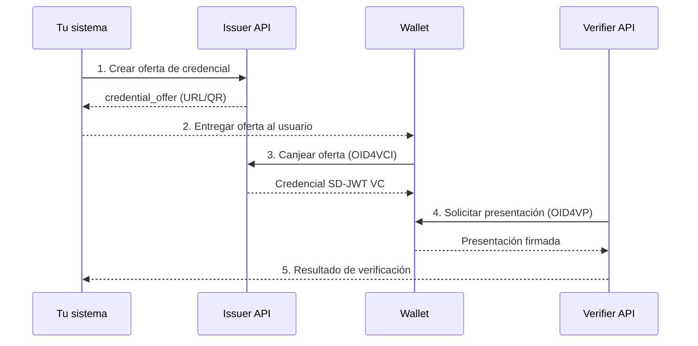

# Tu primera integración

<!-- TODO: completar con ejemplos curl reales contra sandbox -->

Esta guía te lleva paso a paso por un flujo completo: emitir una credencial, recibirla en un wallet de prueba y presentarla a un Verifier.

## Esquema del flujo

## Pasos

1. **Crea una oferta** en el Issuer (POST `/credential-offer`).
2. **Entrega la URL/QR** al usuario.
3. **El usuario canjea** desde su wallet (OID4VCI pre-autorizado).
4. **Inicia una verificación** desde el Verifier (POST `/authorization-request`).
5. **Recoge el resultado** vía callback o polling.

<!-- TODO: ejemplos curl completos para cada paso, contra sandbox -->

## Próximos pasos

- [Conceptos: OID4VCI](../concepts/oid4vci.md)
- [Conceptos: OID4VP](../concepts/oid4vp.md)
- [Referencia API](../api-reference/index.md)
