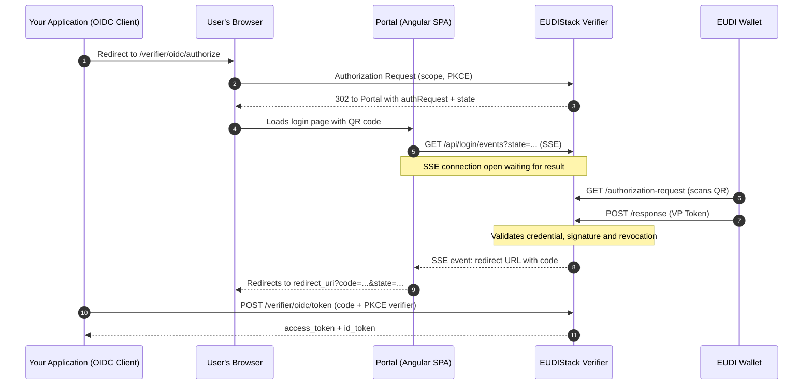

# OIDC IdP — Login with Verifiable Credential

The EUDIStack Verifier acts as a standard OIDC Identity Provider (IdP) that integrates verifiable credentials. Instead of managing usernames and passwords, your users can authenticate by presenting a verifiable credential (SD-JWT VC) from their EUDI wallet.

??? tip "When to use this guide"
    - Your application already supports OIDC (Spring Security, Auth.js, Keycloak, NextAuth, etc.)
    - You want to replace username/password authentication with verifiable credentials (eIDAS 2.0)
    - You don't want to implement OID4VP directly in your backend

---

## Initial Setup

=== "Discovery URL"
    The Verifier exposes a standard OpenID configuration endpoint. The domain is configured per tenant:

    ```
    https://<your-tenant>.eudistack.net/verifier/.well-known/openid-configuration
    ```

    Configure your OIDC client to use this URL. The system derives the issuer dynamically from the request domain, allowing tenant isolation by subdomain without additional configuration.

=== "PKCE for public clients"
    PKCE with the **S256** method is mandatory for public clients (SPAs, mobile applications). The **plain** method will be rejected.

    - Always use `code_challenge_method=S256`
    - Include `code_challenge` in the authorization request
    - Send the `code_verifier` when exchanging the token

    Confidential clients using `private_key_jwt` (such as Keycloak acting as a broker) are not subject to this restriction.

---

## The Authentication Flow

The flow is standard OIDC Authorization Code from your application's perspective. What changes is the intermediate layer: instead of a username and password form, the Verifier orchestrates a credential presentation with the user's wallet through OID4VP.



=== "Step 1: Authorization Request"
    Your application redirects the user's browser to the Authorization Endpoint, specifying what type of credential you need via the **scope** parameter. Always include **openid**:

    ```http
    GET /verifier/oidc/authorize?
      response_type=code&
      client_id=my-app&
      scope=openid learcredential.employee&
      state=xyz789&
      redirect_uri=https://my-app.com/callback&
      code_challenge=E9Melhoa2OwvFrEMTJguCHaoeK1t8URWbuGJSstw-c&
      code_challenge_method=S256
    ```

    The Verifier redirects the user to the Portal (Angular SPA), which displays the login QR code. Meanwhile, the Portal opens an SSE connection to the Verifier to receive a notification when the wallet completes the presentation.

    The Verifier translates the **learcredential.employee** scope into a DCQL query that is included in the OID4VP JWT downloaded by the wallet when it scans the QR code.

=== "Step 2: Token Request"
    Once the user scans the QR code and presents the credential from their wallet, the Verifier notifies the Portal via SSE with the redirect URL containing the **code**. The Portal redirects the user's browser to your `redirect_uri`. Your backend receives the **code** and must exchange it at **/verifier/oidc/token**:

    ```http
    POST /verifier/oidc/token
    Content-Type: application/x-www-form-urlencoded

    grant_type=authorization_code&
    client_id=my-app&
    code=SplxlOBeZQQYbYS6WxSbIA&
    redirect_uri=https://my-app.com/callback&
    code_verifier=dBjftJeZ4CVP-mB92K27uhbUJU1p1r_wW1gFWFOEjXk
    ```

    You will receive an `access_token` and an `id_token` containing the data extracted from the verifiable credential.

---

## id_token Contents

??? note "Claims and data transformation in the identity token"
    The Verifier extracts data from the verifiable credential and converts it into standard OIDC claims using Schema Profiles: JSON files that define the transformation rules for each credential type.

    === "Data Transformation"
        The Verifier can extract data from the credential in several ways:

        - **Direct path:** Extracts a specific field
        - **Concatenation:** Combines multiple fields
        - **Constant:** Adds fixed values
        - **Full object:** Embeds entire JSON branches inside a claim

    === "JSON Example"
        If the user presents a **learcredential.employee** credential, the `id_token` will look like this:

        ```json
        {
          "iss": "https://company.eudistack.net/verifier",
          "sub": "john.doe@company.com",
          "aud": "my-app",
          "iat": 1715000000,
          "exp": 1715000060,
          "auth_time": 1715000000,
          "acr": "http://eidas.europa.eu/LoA/substantial",

          "given_name": "John",
          "family_name": "Doe",
          "email": "john.doe@company.com",
          "name": "John Doe",

          "mandator": {
            "organization": "Company Ltd.",
            "organizationIdentifier": "VATES-12345678",
            "country": "ES"
          },

          "credential_type": "learcredential.employee.w3c.4",
          "vc_json": "{\"type\": [\"VerifiableCredential\", \"LEARCredentialEmployee\"], ...}"
        }
        ```

        The `vc_json` claim contains the full raw credential, useful for auditing or if you need to access fields that are not mapped into the token.

        > **ACR values and eIDAS 2.0:** The `acr` claim indicates the Level of Assurance (LoA) with which the user authenticated. EUDIStack uses the URIs defined in the eIDAS 2.0 Regulation:
        >
        > | `acr` value | Level of Assurance |
        > |---|---|
        > | `http://eidas.europa.eu/LoA/low` | Low |
        > | `http://eidas.europa.eu/LoA/substantial` | Substantial (default value with EUDI Wallet) |
        > | `http://eidas.europa.eu/LoA/high` | High |
        >
        > The effective level depends on the type of credential presented and the Verifier configuration. The numeric value `"0"` is not emitted in production; that value would indicate no level of assurance and is not valid in eIDAS contexts.

---

## Important Considerations

=== "Timeouts"
    The login flow (from when the QR code is displayed until the user confirms in their wallet) has a default time limit of 120 seconds. If exceeded, the SSE connection expires and the user must restart the flow.

=== "Single-Use Codes"
    Both the authorization **code** and the OID4VP request JWT (downloaded by the wallet when it scans the QR code) are single-use. This prevents replay attacks if someone intercepts the URL.

=== "Revocation Validation"
    The revocation check occurs at the moment the wallet presents the credential (`POST /oid4vp/auth-response`), before the authorization code is issued. If the credential is revoked, the flow is cut off at that point and the Portal receives an error notification via SSE. Your application never receives a `code`.

---

## More than one application under the same tenant?

If you have more than one client application integrated with this same tenant, you can avoid asking the user to present their credential again in each one: see the [SSO across applications in the same tenant](sso-multi-app.en.md) guide.