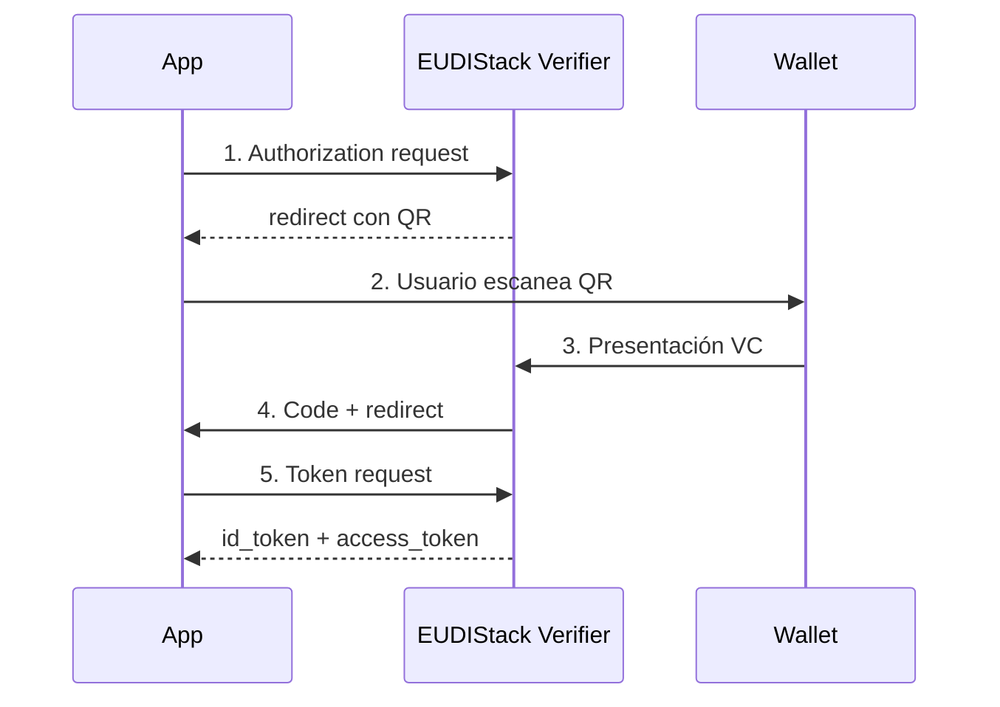

# OIDC IdP — login con credencial verificable

<!-- TODO: ejemplos concretos con cliente OIDC genérico (Spring Security, Auth.js, etc.) -->

EUDIStack expone un **endpoint OIDC compatible** que tu aplicación puede usar como IdP. El usuario hace login presentando una credencial verificable a través del wallet en lugar de teclear usuario+contraseña.

## Cuándo usar esta guía

- Tienes una aplicación que ya soporta OIDC (Spring Security, Auth.js, Keycloak federado, etc.).
- Quieres reemplazar el login tradicional por login con credencial.
- No necesitas implementar OID4VP en tu backend — el Verifier de EUDIStack hace de pasarela.

## Configuración

1. **Solicita un client_id** al equipo de EUDIStack para tu aplicación.
2. **Configura el discovery URL**: `https://verifier.<tenant>.eudistack.net/.well-known/openid-configuration`.
3. **Define los scopes** que quieres mapear a atributos de la credencial.

## Flujo

<!-- TODO: ejemplos request/response paso a paso -->

## Mapping de claims

Los atributos de la credencial se exponen como claims en el `id_token`. La asignación se configura en el alta del cliente.
