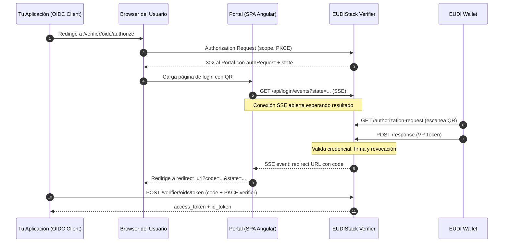

# OIDC IdP — Login con Credencial Verificable

El Verifier de EUDIStack actúa como un Identity Provider (IdP) OIDC estándar que integra credenciales verificables. En lugar de manejar usuarios y contraseñas, tus usuarios pueden autenticarse presentando una credencial verificable (SD-JWT VC) desde su wallet EUDI.

??? tip "¿Cuándo usar esta guía?"
    - Tu aplicación ya soporta OIDC (Spring Security, Auth.js, Keycloak, NextAuth, etc.)
    - Quieres reemplazar autenticación con usuario/contraseña por credenciales verificables (eIDAS 2.0)
    - No quieres implementar OID4VP directamente en tu backend

---

## Configuración Inicial

=== "Discovery URL"
    El Verifier expone un endpoint de configuración OpenID estándar. El dominio se configura por tenant:

    ```
    https://<tu-tenant>.eudistack.net/verifier/.well-known/openid-configuration
    ```

    Configura tu cliente OIDC para que use esta URL. El sistema deriva el issuer dinámicamente del dominio de la petición, lo que permite aislar tenants por subdominio sin configuración adicional.

=== "PKCE para clientes públicos"
    PKCE con el método **S256** es obligatorio para clientes públicos (SPAs, aplicaciones móviles). El método **plain** será rechazado.

    - Usa siempre `code_challenge_method=S256`
    - Incluye `code_challenge` en la petición de autorización
    - Envía el `code_verifier` en el canje del token

    Los clientes confidenciales que usan `private_key_jwt` (como Keycloak actuando como broker) no están sujetos a esta restricción.

---

## El Flujo de Autenticación

El flujo es OIDC Authorization Code estándar desde el punto de vista de tu aplicación. Lo que cambia es la capa intermedia: en lugar de un formulario de usuario y contraseña, el Verifier orquesta una presentación de credencial con el wallet del usuario a través de OID4VP.


```mermaid
sequenceDiagram
    autonumber
    participant App as Tu Aplicación (OIDC Client)
    participant Browser as Browser del Usuario
    participant Portal as Portal (SPA Angular)
    participant Verifier as EUDIStack Verifier
    participant Wallet as EUDI Wallet

    App->>Browser: Redirige a /verifier/oidc/authorize
    Browser->>Verifier: Authorization Request (scope, PKCE)
    Verifier-->>Browser: 302 al Portal con authRequest + state
    Browser->>Portal: Carga página de login con QR

    Portal->>Verifier: GET /api/login/events?state=... (SSE)
    Note over Portal,Verifier: Conexión SSE abierta esperando resultado

    Wallet->>Verifier: GET /authorization-request (escanea QR)
    Wallet->>Verifier: POST /response (VP Token)
    Note over Verifier: Valida credencial, firma y revocación

    Verifier-->>Portal: SSE event: redirect URL con code
    Portal-->>Browser: Redirige a redirect_uri?code=...&state=...

    App->>Verifier: POST /verifier/oidc/token (code + PKCE verifier)
    Verifier-->>App: access_token + id_token
```

=== "Paso 1: Authorization Request"
    Tu aplicación redirige el browser del usuario al Authorization Endpoint indicando qué tipo de credencial necesitas mediante el parámetro **scope**. Siempre incluye **openid**:

    ```http
    GET /verifier/oidc/authorize?
      response_type=code&
      client_id=mi-app&
      scope=openid learcredential.employee&
      state=xyz789&
      redirect_uri=https://mi-app.com/callback&
      code_challenge=E9Melhoa2OwvFrEMTJguCHaoeK1t8URWbuGJSstw-c&
      code_challenge_method=S256
    ```

    El Verifier redirige al usuario al Portal (SPA Angular), que muestra el QR de login. Mientras tanto, el Portal abre una conexión SSE contra el Verifier para recibir notificación cuando el wallet complete la presentación.

    El Verifier traduce el scope **learcredential.employee** en una consulta DCQL que se incluye en el JWT OID4VP que descarga el wallet al escanear el QR.

=== "Paso 2: Token Request"
    Una vez que el usuario escanea el QR y presenta la credencial desde su wallet, el Verifier notifica al Portal vía SSE con la URL de redirección que incluye el **code**. El Portal redirige el browser del usuario a tu `redirect_uri`. Tu backend recibe el **code** y debe canjearlo en **/verifier/oidc/token**:

    ```http
    POST /verifier/oidc/token
    Content-Type: application/x-www-form-urlencoded

    grant_type=authorization_code&
    client_id=mi-app&
    code=SplxlOBeZQQYbYS6WxSbIA&
    redirect_uri=https://mi-app.com/callback&
    code_verifier=dBjftJeZ4CVP-mB92K27uhbUJU1p1r_wW1gFWFOEjXk
    ```

    Recibirás un `access_token` y un `id_token` con los datos extraídos de la credencial verificable.

---

## Contenido del id_token

??? note "Claims y transformación de datos del token de identidad"
    El Verifier extrae los datos de la credencial verificable y los convierte en claims OIDC estándar usando Schema Profiles: ficheros JSON que definen las reglas de transformación para cada tipo de credencial.

    === "Transformación de datos"
        El Verifier puede extraer datos de la credencial de varias formas:

        - **Path directo:** Extrae un campo específico
        - **Concatenación:** Combina múltiples campos
        - **Constante:** Añade valores fijos
        - **Objeto completo:** Incluye ramas JSON enteras dentro de un claim

    === "Ejemplo JSON"
        Si el usuario presenta una credencial **learcredential.employee**, el `id_token` tendrá este aspecto:

        ```json
        {
          "iss": "https://empresa.eudistack.net/verifier",
          "sub": "juan.garcia@empresa.com",
          "aud": "mi-app",
          "iat": 1715000000,
          "exp": 1715000060,
          "auth_time": 1715000000,
          "acr": "http://eidas.europa.eu/LoA/substantial",

          "given_name": "Juan",
          "family_name": "García",
          "email": "juan.garcia@empresa.com",
          "name": "Juan García",

          "mandator": {
            "organization": "Empresa S.A.",
            "organizationIdentifier": "VATES-12345678",
            "country": "ES"
          },

          "credential_type": "learcredential.employee.w3c.4",
          "vc_json": "{\"type\": [\"VerifiableCredential\", \"LEARCredentialEmployee\"], ...}"
        }
        ```

        El claim `vc_json` contiene la credencial completa en crudo, útil para auditoría o si necesitas acceder a campos que no están mapeados en el token.

        > **Valores ACR y eIDAS 2.0:** El claim `acr` indica el nivel de garantía (LoA) con el que se autenticó el usuario. EUDIStack utiliza los URIs definidos en el Reglamento eIDAS 2.0:
        >
        > | Valor `acr` | Nivel de garantía |
        > |---|---|
        > | `http://eidas.europa.eu/LoA/low` | Bajo |
        > | `http://eidas.europa.eu/LoA/substantial` | Sustancial (valor por defecto con EUDI Wallet) |
        > | `http://eidas.europa.eu/LoA/high` | Alto |
        >
        > El nivel efectivo depende del tipo de credencial presentada y de la configuración del Verifier. No se emite el valor numérico `"0"` en producción; ese valor indicaría ausencia de nivel de garantía y no es válido en contextos eIDAS.

---

## Consideraciones Importantes

=== "Timeouts"
    El flujo de login (desde que se muestra el QR hasta que el usuario confirma en su wallet) tiene un tiempo límite de 120 segundos por defecto.
    Si se supera, la conexión SSE expira y el usuario debe iniciar el flujo de nuevo.

=== "Códigos de Un Solo Uso"
    Tanto el **code** de autorización como el JWT de la petición OID4VP (que descarga el wallet al escanear el QR) son de un único uso. Esto previene ataques de repetición si alguien intercepta la URL.

=== "Validación de Revocación"
    La comprobación de revocación ocurre en el momento en que el wallet presenta la credencial (`POST /oid4vp/auth-response`), antes de que se emita el código de autorización. Si la credencial está revocada, el flujo se corta en ese punto y el Portal recibe una notificación de error vía SSE. Tu aplicación nunca llega a recibir un `code`.

---

## ¿Varias aplicaciones bajo el mismo tenant?

Si tienes más de una aplicación cliente integrada con este mismo tenant, puedes evitar que el usuario presente su credencial en cada una: consulta la guía de [SSO entre aplicaciones del mismo tenant](sso-multi-app.md).