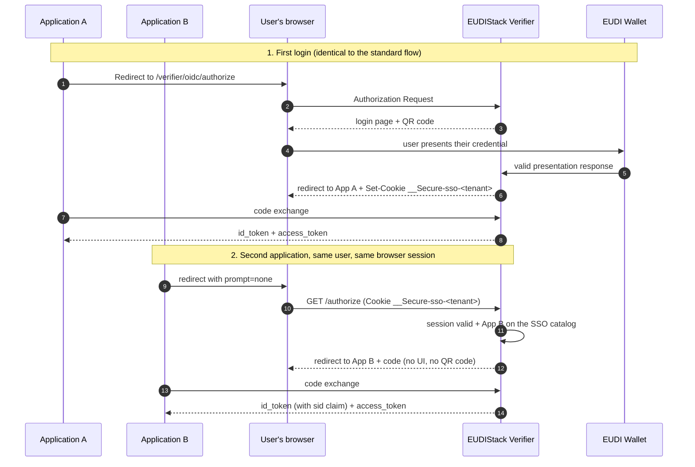

# SSO across applications in the same tenant

If your organization has **several client applications** integrated with the same EUDIStack tenant (for example, a management portal and a billing portal), the Verifier can maintain a **tenant-level authentication session**: the user presents their credential once, and the other applications reuse that session instead of asking them to scan the QR code again.

This guide assumes you are already familiar with the basic [OIDC IdP — login with verifiable credential](oidc-idp.en.md) flow. Multi-application SSO is an extension of that same Authorization Server: it does not change the OIDC contract you already integrated, it adds an additional request mode (`prompt=none`).

??? tip "When to use this guide"
    - You already integrated one application with the Verifier as an OIDC IdP and want to add a second one (or more) under the same tenant.
    - You want to avoid asking the user to present their credential again in every application during the same working session.
    - You need to understand what `login_required` and `interaction_required` mean when your application sends a silent request.

!!! info "Requires activation per tenant"
    Multi-application SSO is not enabled by default. It requires the EUDIStack team to enable `ssoEnabled` for your tenant and configure a **common root domain** (`rootDomain`) that all your applications hang off — the session cookie is only shared between applications under that domain. [Contact support](../../support.en.md) to request activation in your test environment.

---

## How it works

Each tenant with SSO enabled maintains, in addition to the individual OIDC sessions of each application, **a tenant-level authentication session** (an "OP-level session", in OIDC Core terminology). It is materialized as an opaque cookie that the user's browser presents to any application hanging off the same root domain.



The first application does not need to do anything special: the SSO session is established automatically as soon as the tenant has it enabled. What changes is what the **second application onward** does.

---

## Integrating silent reuse

=== "Step 1: request `prompt=none`"
    Your application sends the authorization request exactly as in the standard flow, adding `prompt=none`:

    ```http
    GET /verifier/oidc/authorize?
      response_type=code&
      client_id=my-second-app&
      scope=openid learcredential.employee&
      prompt=none&
      state=abc123&
      redirect_uri=https://my-second-app.com/callback&
      code_challenge=E9Melhoa2OwvFrEMTJguCHaoeK1t8URWbuGJSstw-c&
      code_challenge_method=S256
    ```

    With `prompt=none` the Verifier never renders any UI or QR code: it either resolves the request immediately (with or without a session), or returns an error right away.

=== "Step 2: handle the response"
    There are three possible outcomes in the redirect to your `redirect_uri`:

    | Outcome | What it means | What your application should do |
    |---|---|---|
    | `?code=...` | There was a valid SSO session and your application is in the tenant's catalog. | Exchange the `code` as in the standard flow. |
    | `?error=login_required` | There is no usable SSO session (never established, expired, or belongs to a different tenant). | Repeat the request **without** `prompt=none` so the user completes a full login with their credential. |
    | `?error=interaction_required` | There is a valid SSO session, but your `client_id` is not in the tenant's eligible applications catalog. | Same as above: fall back to a full login. Also, let your tenant administrator know — your application is probably missing from the SSO catalog (see the [administration guide](../../admin/verifier-sso.en.md)). |

    In practice, your application typically **tries `prompt=none` first** and, on receiving either error, automatically falls back to the full flow (without `prompt=none`) — the user won't perceive anything different, except that in that case they will need to present their credential.

    !!! warning "Don't treat both errors the same way in your logs"
        `login_required` and `interaction_required` are semantically different (OIDC Core §3.1.2.6). The former is expected (new user, expired session); the latter usually indicates a catalog configuration issue worth investigating if it happens systematically.

---

## id_token contents

When silent reuse succeeds, the `id_token` includes one additional claim compared to a standard login:

```json
{
  "iss": "https://company.eudistack.net/verifier",
  "sub": "john.doe@company.com",
  "aud": "my-second-app",
  "sid": "f3a1c9e2b6d84f0a",
  "auth_time": 1715000000,
  "acr": "http://eidas.europa.eu/LoA/substantial"
}
```

`sid` identifies the shared OP-level session. Every application that reuses the same session receives the same `sid` in its `id_token`. It is the same identifier the Verifier uses internally to invalidate the session on logout — don't treat it as a secret (it travels inside a signed JWT), but don't expose it unnecessarily in URLs or access logs either.

---

## Forcing a fresh authentication

If your application needs the user to present their credential again **even though a valid SSO session exists** (for example, before a sensitive operation), you have two standard OIDC options:

=== "`prompt=login`"
    Any `prompt` value other than `none` skips silent reuse entirely and always shows the presentation QR code, regardless of whether an SSO session exists.

=== "`max_age`"
    Send `max_age=<seconds>` in the authorization request (with or without `prompt=none`). If the existing SSO session is older than the requested `max_age`, the Verifier treats it as unusable and requires a fresh presentation — with `prompt=none` this results in `login_required` instead of a silent reuse.

---

## Session TTL and expiry

The SSO session has a bounded lifetime along two dimensions, with default values your tenant can adjust within a range (see the [administration guide](../../admin/verifier-sso.en.md)):

| Dimension | System default | Configurable range |
|---|---|---|
| Absolute TTL | 8 hours from establishment | 1 h – 24 h |
| Idle TTL | 30 minutes without use | 5 min – 60 min |

A session stops being usable as soon as **either** limit is reached, whichever comes first. A `prompt=none` request after expiry receives `login_required`: your application must be prepared to fall back to a full login at any time, not only on the first attempt of the day.

---

## Security considerations

=== "Session cookie"
    The SSO session travels in a `__Secure-sso-<tenant>` cookie with `Secure`, `HttpOnly`, `SameSite=Lax` and `Domain=<tenant root domain>`. It is an opaque 256-bit identifier, not a JWT: it contains no credential claims or user data. Your application never reads or manipulates this cookie directly — only the Verifier manages it.

=== "Tenant isolation"
    An SSO session established in one tenant is never reused in another, even if they share a browser. The Verifier cuts off the request and treats it as if no session existed (`login_required`), even if the cookie technically reached the wrong surface.

=== "A failed integration doesn't invalidate other apps' session"
    If your application is not in the SSO catalog or sends a malformed request, the user's SSO session remains intact for the rest of the applications — `interaction_required` neither invalidates nor degrades the existing session.

---

## Frequently asked questions

??? question "Do I need to change anything in the first application I already integrated?"
    No. The SSO session is established automatically after a successful login, as long as the tenant has it enabled. The first application keeps working exactly as it did before.

??? question "Can I test the full flow (two applications, same tenant) in sandbox?"
    Yes, but you need the EUDIStack team to enable SSO for your tenant and register both `client_id`s in the eligible applications catalog. [Contact support](../../support.en.md) with the `client_id`s of the applications you want to test.

??? question "What happens if two different users share the same browser session?"
    The SSO session is per (tenant, user). When a different user completes a new credential presentation, a new session is established that replaces the previous one — two active sessions of the same tenant never coexist in the same browser.
