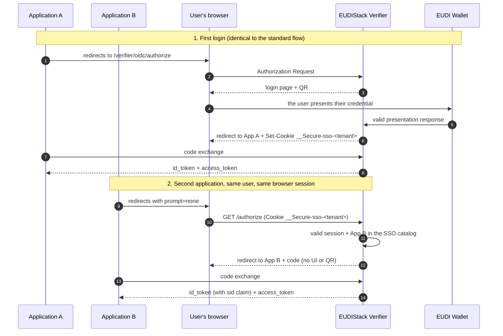

# SSO across applications in the same tenant

If several client applications are integrated with the Verifier of the same EUDIStack tenant —your own or third parties', such as your own management portal and a supplier's portal—, the Verifier can maintain a **tenant-level authentication session**: the user presents their credential once, and the other applications reuse that session instead of asking them to scan the QR code again. For this, each application must be added to the tenant's eligible applications catalog.

This guide assumes your application is already integrated with the Verifier as an OIDC IdP (credential login). SSO does not change the OIDC contract you already integrated: it adds a silent request mode (`prompt=none`) and coordinated logout across applications.

!!! abstract "In short"
    1. **Meet the [requirements](#requirements):** SSO enabled for the tenant and your `client_id` in the eligible applications catalog.
    2. **[Ask for a silent login first](#integrating-silent-login)** with `prompt=none` and, if you get an error, fall back to the normal QR login.
    3. **[Log out through the Verifier](#logging-out-single-logout)** and, if you can, listen for logout notifications from the other applications.

---

## Requirements

| Requirement | Managed by | Details |
|---|---|---|
| SSO enabled for the tenant | EUDIStack team | `ssoEnabled` is turned on and the tenant's **root domain** (`rootDomain`) is configured: the session cookie is scoped to it, and it must cover the host the tenant's Verifier is served from. |
| Application registered as an OIDC client of the tenant | EUDIStack team | The same registration you need for credential login. |
| `client_id` in the eligible applications catalog | EUDIStack team | Added at your request. Without this step, your application always receives `interaction_required`. |
| Logout URIs *(recommended)* | EUDIStack team | `post_logout_redirect_uri` and `backchannel_logout_uri`, for [logout](#logging-out-single-logout). |

To request activation or the registration of an application, contact the EUDIStack team with the tenant and the `client_id`s involved.

!!! warning "Adding an application means trusting it with the user's session"
    While the SSO session is valid, any `client_id` in the catalog obtains an `id_token` for the user without them presenting their credential again or seeing any screen. This applies equally to third-party applications: only add those you trust as much as your own, and remove them from the catalog as soon as they no longer need access.

---

## How it works

Each tenant with SSO enabled maintains, in addition to each application's OIDC sessions, **a tenant-level authentication session** (an "OP-level session" in OIDC Core terminology). It is stored in an opaque cookie, scoped to the tenant's root domain, that the user's browser presents to the Verifier on every authorization request, whichever application it comes from.


```mermaid
sequenceDiagram
    autonumber
    participant App1 as Application A
    participant App2 as Application B
    participant Browser as User's browser
    participant Verifier as EUDIStack Verifier
    participant Wallet as EUDI Wallet

    Note over App1,Wallet: 1. First login (identical to the standard flow)
    App1->>Browser: redirects to /verifier/oidc/authorize
    Browser->>Verifier: Authorization Request
    Verifier-->>Browser: login page + QR
    Browser->>Wallet: the user presents their credential
    Wallet->>Verifier: valid presentation response
    Verifier-->>Browser: redirect to App A + Set-Cookie __Secure-sso-<tenant>
    App1->>Verifier: code exchange
    Verifier-->>App1: id_token + access_token

    Note over App2,Verifier: 2. Second application, same user, same browser session
    App2->>Browser: redirects with prompt=none
    Browser->>Verifier: GET /authorize (Cookie __Secure-sso-<tenant>)
    Verifier->>Verifier: valid session + App B in the SSO catalog
    Verifier-->>Browser: redirect to App B + code (no UI or QR)
    App2->>Verifier: code exchange
    Verifier-->>App2: id_token (with sid claim) + access_token
```

The SSO session is established automatically after any credential login in a tenant with SSO enabled, whichever application it happens in. Which application comes "first" depends on where the user starts, so **every application** must ask for a silent login first to be able to reuse a session opened in another one.

---

## Integrating silent login

=== "Step 1: ask with `prompt=none`"
    Send the authorization request exactly as in the standard flow, adding `prompt=none`:

    ```http
    GET /verifier/oidc/authorize?
      response_type=code&
      client_id=my-second-app&
      scope=openid learcredential.employee&
      prompt=none&
      state=abc123&
      redirect_uri=https://my-second-app.com/callback&
      code_challenge=E9Melhoa2OwvFrEMTJguCHaoeK1t8URWbuGJSstw-c&
      code_challenge_method=S256
    ```

    With `prompt=none` the Verifier never shows screens or the QR code: it resolves the request on the spot or returns an error immediately.

=== "Step 2: handle the response"
    The redirect to your `redirect_uri` carries one of these three results:

    | Result | What it means | What your application does |
    |---|---|---|
    | `?code=...` | There is a valid SSO session and your application is in the catalog. | Exchange the `code` as in the normal flow. |
    | `?error=login_required` | No usable SSO session: it was never established, it expired, or it belongs to another tenant. | Repeat the request **without** `prompt=none`: normal QR login. |
    | `?error=interaction_required` | There is a valid SSO session, but your `client_id` is not in the catalog. | Normal QR login, and check the [requirements](#requirements). |

    The usual approach is to always try `prompt=none` first and fall back to the normal login on either error. The user notices no difference, except that in that case they will need to present their credential.

!!! tip "Tell the two errors apart in your logs"
    `login_required` and `interaction_required` mean different things (OIDC Core §3.1.2.6). The former is expected (new user, expired session). The latter points to a catalog configuration issue worth investigating if it keeps happening.

---

## Logging out (Single Logout)

To understand logout you need to tell apart two sessions, each controlled by a different party:

| | Your application's session | Tenant SSO session |
|---|---|---|
| **Controlled by** | Your application | The Verifier |
| **What it is for** | Knowing whether the user is signed in to your application | Knowing whether the user can enter other applications without scanning the QR code |
| **When it ends** | When your application closes it or it expires, per your configuration | On logout in any application, or on expiry (see [Session lifetime](#session-lifetime)) |

The Verifier **cannot close your application's session**: it only decides whether the next login needs the QR code. That is why logout has two parts: ending the SSO session through the Verifier and, when the logout starts in another application, your application closing its own session when it receives the notification.

=== "Your application starts the logout"
    Redirect the user to the Verifier's logout endpoint (OIDC RP-Initiated Logout 1.0):

    ```http
    GET /verifier/oidc/logout?
      id_token_hint=<id_token you received>&
      post_logout_redirect_uri=https://my-second-app.com/
    ```

    The Verifier invalidates the SSO session immediately, notifies the other applications and sends the user back to your `post_logout_redirect_uri`, which must be registered for your `client_id`.

    !!! warning "Clearing only your local session does not end SSO"
        If your application only deletes its own session, the SSO session stays valid and the next `prompt=none` request will let the user back in without asking for their credential.

=== "Another application starts the logout"
    The Verifier notifies your application via OIDC Back-Channel Logout 1.0: a server-to-server `POST` to your `backchannel_logout_uri`, with `Content-Type: application/x-www-form-urlencoded` and a `logout_token` parameter (a JWT signed by the Verifier). Your endpoint must:

    1. **Validate the token:** signature with the keys at the Verifier's `jwks_uri`, `typ=logout+jwt`, `iss`, `aud` (your `client_id`) and that `events` contains `http://schemas.openid.net/event/backchannel-logout`.
    2. **Close the local session** tied to the token's `sid`. It is the same `sid` you received in the `id_token`, so store it at sign-in.
    3. **Respond `200 OK` within 5 seconds.** Any other response is treated as a failure and the Verifier retries the delivery.

    The application that started the logout does not receive this notification.

!!! warning "If your application does not listen for the notification, the user stays signed in"
    The `backchannel_logout_uri` is optional (HTTPS required), but without it your application does not learn about logouts made in the others. If the user logs out of another application of the tenant:

    - **They stay signed in to your application** until your local session expires or they log out of it too.
    - When your local session expires, `prompt=none` will receive `login_required` and they will have to scan the QR code again: the logout does reach your application, but late.
    - **Tokens already issued are not revoked.** Your `access_token` stays valid until it expires, so it cannot be used to detect the logout either.

    The risk is that someone else using the same device, after the user believes they logged out, still has access to your application. If your application handles sensitive data, publish the `backchannel_logout_uri`.

---

## Reference

### id_token contents

When silent reuse succeeds, the `id_token` includes one additional claim compared to a standard login:

```json
{
  "iss": "https://company.eudistack.net/verifier",
  "sub": "juan.garcia@company.com",
  "aud": "my-second-app",
  "sid": "f3a1c9e2b6d84f0a",
  "auth_time": 1715000000,
  "acr": "http://eidas.europa.eu/LoA/substantial"
}
```

`sid` identifies the shared SSO session: every application reusing it receives the same value, and it is the one that arrives in the `logout_token`. It is not a secret (it travels in a signed JWT), but avoid exposing it in URLs or access logs.

### Session lifetime

The SSO session expires as soon as **either** of these two limits is reached. The defaults can be adjusted per tenant within the range, on request to the EUDIStack team:

| Limit | Default | Configurable range |
|---|---|---|
| Absolute lifetime | 8 hours from login | 1 h – 24 h |
| Inactivity | 30 minutes without use | 5 min – 60 min |

After expiry, `prompt=none` receives `login_required`: your application must be ready to fall back to the normal login at any time, not only on the first access of the day.

### Security

- **Session cookie.** It is named `__Secure-sso-<tenant>` and issued with `Secure`, `HttpOnly`, `SameSite=Lax` and `Domain=<tenant root domain>`. It is an opaque 256-bit identifier, not a JWT: it contains no user or credential data. Only the Verifier manages it; your application never reads or modifies it.
- **Tenant isolation.** An SSO session from one tenant is never reused in another, even if they share a browser: the Verifier responds `login_required`.
- **One application's errors do not affect the others.** If your application is not in the catalog or sends a malformed request, the user's SSO session stays intact for the rest.
