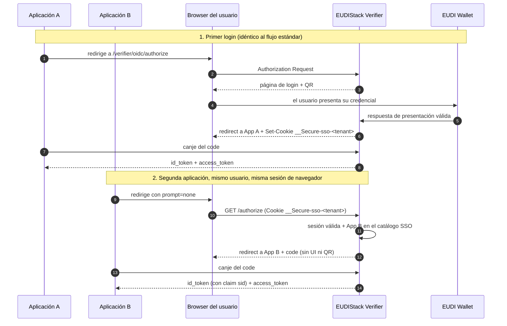

# SSO entre aplicaciones del mismo tenant

Si tu organización tiene **varias aplicaciones cliente** integradas con el mismo tenant de EUDIStack (por ejemplo, un portal de gestión y un portal de facturación), el Verifier puede mantener una **sesión de autenticación a nivel de tenant**: el usuario presenta su credencial una sola vez y las demás aplicaciones reutilizan esa sesión sin pedirle que vuelva a escanear el QR.

Esta guía asume que ya conoces el flujo básico de [OIDC IdP — login con credencial](oidc-idp.md). El SSO multi-aplicación es una extensión de ese mismo Authorization Server: no cambia el contrato OIDC que ya integraste, añade un modo de petición adicional (`prompt=none`).

??? tip "¿Cuándo usar esta guía?"
    - Ya integraste una aplicación con el Verifier como OIDC IdP y quieres añadir una segunda (o más) bajo el mismo tenant.
    - Quieres evitar que el usuario tenga que volver a presentar su credencial en cada aplicación durante el mismo día de trabajo.
    - Necesitas entender qué significan `login_required` e `interaction_required` cuando tu aplicación lanza una petición silenciosa.

!!! info "Requiere activación por tenant"
    El SSO multi-aplicación no está activo por defecto. Requiere que el equipo de EUDIStack habilite `ssoEnabled` para tu tenant y configure un **dominio raíz común** (`rootDomain`) del que cuelguen todas tus aplicaciones — la cookie de sesión solo se comparte entre aplicaciones bajo ese dominio. [Contacta con soporte](../../support.md) para solicitar la activación en tu entorno de pruebas.

---

## Cómo funciona

Cada tenant con SSO habilitado mantiene, además de las sesiones OIDC individuales de cada aplicación, **una sesión de autenticación propia del tenant** ("OP-level session", en la terminología de OIDC Core). Se materializa como una cookie opaca que el navegador del usuario presenta a cualquier aplicación que cuelgue del mismo dominio raíz.



La primera aplicación no necesita hacer nada especial: el establecimiento de la sesión SSO es automático en cuanto el tenant la tiene habilitada. Lo único que cambia es lo que hace la **segunda aplicación en adelante**.

---

## Integrar la reutilización silenciosa

=== "Paso 1: pide `prompt=none`"
    Tu aplicación lanza la petición de autorización exactamente igual que en el flujo estándar, añadiendo `prompt=none`:

    ```http
    GET /verifier/oidc/authorize?
      response_type=code&
      client_id=mi-segunda-app&
      scope=openid learcredential.employee&
      prompt=none&
      state=abc123&
      redirect_uri=https://mi-segunda-app.com/callback&
      code_challenge=E9Melhoa2OwvFrEMTJguCHaoeK1t8URWbuGJSstw-c&
      code_challenge_method=S256
    ```

    Con `prompt=none` el Verifier nunca renderiza UI ni QR: o resuelve la petición en el momento (con o sin sesión), o devuelve un error de inmediato.

=== "Paso 2: gestiona la respuesta"
    Hay tres resultados posibles en la redirección a tu `redirect_uri`:

    | Resultado | Qué significa | Qué debe hacer tu aplicación |
    |---|---|---|
    | `?code=...` | Había sesión SSO vigente y tu aplicación está en el catálogo del tenant. | Canjea el `code` como en el flujo normal. |
    | `?error=login_required` | No hay sesión SSO utilizable (nunca se estableció, expiró, o pertenece a otro tenant). | Repite la petición **sin** `prompt=none` para que el usuario haga login completo con su credencial. |
    | `?error=interaction_required` | Hay sesión SSO vigente, pero tu `client_id` no está en el catálogo de aplicaciones elegibles del tenant. | Igual que arriba: cae a login completo. Además, avisa a tu administrador de tenant — probablemente falta dar de alta tu aplicación en el catálogo SSO (ver [guía de administración](../../admin/verifier-sso.md)). |

    En la práctica, tu aplicación normalmente **primero intenta `prompt=none`** y, si recibe cualquiera de los dos errores, cae automáticamente al flujo completo (sin `prompt=none`) sin que el usuario perciba nada distinto salvo que, en ese caso, sí tendrá que presentar su credencial.

    !!! warning "No trates ambos errores igual en tus logs"
        `login_required` e `interaction_required` son semánticamente distintos (OIDC Core §3.1.2.6). El primero es esperable (usuario nuevo, sesión caducada); el segundo normalmente indica un problema de configuración de catálogo que conviene investigar si se repite de forma sistemática.

---

## Contenido del id_token

Cuando la reutilización silenciosa tiene éxito, el `id_token` incluye un claim adicional respecto al login estándar:

```json
{
  "iss": "https://empresa.eudistack.net/verifier",
  "sub": "juan.garcia@empresa.com",
  "aud": "mi-segunda-app",
  "sid": "f3a1c9e2b6d84f0a",
  "auth_time": 1715000000,
  "acr": "http://eidas.europa.eu/LoA/substantial"
}
```

`sid` identifica la sesión OP-level compartida. Todas las aplicaciones que reutilizan la misma sesión reciben el mismo `sid` en su `id_token`. Es el mismo identificador que usa el Verifier internamente para invalidar la sesión en un logout — no lo trates como un secreto (viaja en un JWT firmado), pero tampoco lo expongas innecesariamente en URLs o logs de acceso.

---

## Forzar una autenticación fresca

Si tu aplicación necesita que el usuario vuelva a presentar su credencial **aunque exista una sesión SSO vigente** (por ejemplo, antes de una operación sensible), tienes dos opciones estándar de OIDC:

=== "`prompt=login`"
    Cualquier valor de `prompt` distinto de `none` se salta por completo la reutilización silenciosa y siempre muestra el QR de presentación, independientemente de si hay sesión SSO o no.

=== "`max_age`"
    Envía `max_age=<segundos>` en la petición de autorización (con o sin `prompt=none`). Si la sesión SSO existente es más antigua que el `max_age` solicitado, el Verifier la trata como no utilizable y exige una nueva presentación — con `prompt=none` esto se traduce en `login_required` en lugar de una reutilización silenciosa.

---

## TTL y expiración de la sesión

La sesión SSO tiene un tiempo de vida acotado en dos dimensiones, con valores por defecto que tu tenant puede ajustar dentro de un rango (ver [guía de administración](../../admin/verifier-sso.md)):

| Dimensión | Default | Rango configurable |
|---|---|---|
| TTL absoluto | 8 horas desde el establecimiento | 1 h – 24 h |
| TTL de inactividad | 30 minutos sin uso | 5 min – 60 min |

Una sesión deja de ser utilizable en cuanto se cumple **cualquiera** de los dos límites, lo que ocurra primero. Una petición `prompt=none` posterior a la expiración recibe `login_required`: tu aplicación debe estar preparada para caer al login completo en cualquier momento, no solo en el primer intento del día.

---

## Consideraciones de seguridad

=== "Cookie de sesión"
    La sesión SSO viaja en una cookie `__Secure-sso-<tenant>` con `Secure`, `HttpOnly`, `SameSite=Lax` y `Domain=<dominio raíz del tenant>`. Es un identificador opaco de 256 bits, no un JWT: no contiene claims de la credencial ni datos del usuario. Tu aplicación nunca lee ni manipula esta cookie directamente — solo el Verifier la gestiona.

=== "Aislamiento por tenant"
    Una sesión SSO establecida en un tenant nunca se reutiliza en otro, aunque compartan navegador. El Verifier corta la petición y la trata como si no existiera sesión (`login_required`), incluso si técnicamente la cookie llegara a presentarse en la superficie equivocada.

=== "Un fallo de tu integración no invalida la sesión de otras apps"
    Si tu aplicación no está en el catálogo SSO o envía una petición mal formada, la sesión SSO del usuario sigue intacta para el resto de aplicaciones — `interaction_required` no invalida ni degrada la sesión existente.

---

## Preguntas frecuentes

??? question "¿Necesito cambiar algo en la primera aplicación que ya integré?"
    No. El establecimiento de la sesión SSO es automático tras un login exitoso, siempre que el tenant lo tenga habilitado. La primera aplicación sigue funcionando exactamente igual que antes.

??? question "¿Puedo probar el flujo completo (dos aplicaciones, mismo tenant) en sandbox?"
    Sí, pero necesitas que el equipo de EUDIStack habilite SSO para tu tenant y registre ambos `client_id` en el catálogo de aplicaciones elegibles. [Contacta con soporte](../../support.md) indicando los `client_id` de las aplicaciones que quieres probar.

??? question "¿Qué pasa si dos usuarios distintos usan la misma sesión de navegador?"
    La sesión SSO es por (tenant, usuario). Cuando un usuario distinto completa una nueva presentación de credencial, se establece una sesión nueva que sustituye a la anterior — nunca conviven dos sesiones activas del mismo tenant en el mismo navegador.
