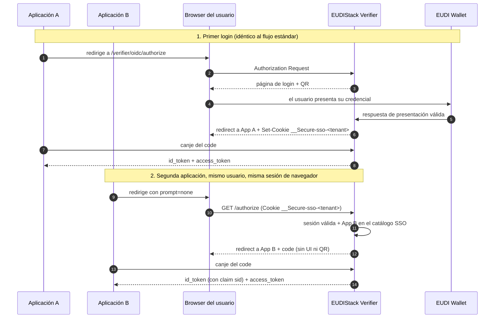

# SSO entre aplicaciones del mismo tenant

Si varias aplicaciones cliente están integradas con el Verifier de un mismo tenant de EUDIStack —tuyas o de terceros, como un portal de gestión propio y el portal de un proveedor—, el Verifier puede mantener una **sesión de autenticación a nivel de tenant**: el usuario presenta su credencial una sola vez y las demás aplicaciones reutilizan esa sesión sin pedirle que vuelva a escanear el QR. Para ello, cada aplicación debe estar dada de alta en el catálogo de aplicaciones elegibles del tenant.

Esta guía parte del flujo básico de [OIDC IdP — login con credencial](oidc-idp.md). El SSO no cambia el contrato OIDC que ya integraste: añade un modo de petición silenciosa (`prompt=none`) y el cierre de sesión coordinado entre aplicaciones.

!!! abstract "En resumen"
    1. **Cumple los [requisitos](#requisitos):** SSO activado en el tenant y tu `client_id` en el catálogo de aplicaciones elegibles.
    2. **[Pide primero el login en silencio](#integrar-el-login-silencioso)** con `prompt=none` y, si recibes un error, cae al login normal con QR.
    3. **[Cierra sesión a través del Verifier](#cerrar-sesion-single-logout)** y, si puedes, escucha los avisos de logout de las demás aplicaciones.

---

## Requisitos

| Requisito | Quién lo gestiona | Detalle |
|---|---|---|
| SSO activado en el tenant | Equipo de EUDIStack | Se habilita `ssoEnabled` y se configura el **dominio raíz** (`rootDomain`) del tenant, al que se asocia la cookie de sesión y que debe abarcar el host en el que se sirve su Verifier. |
| Aplicación registrada como cliente OIDC del tenant | Equipo de EUDIStack | Es el mismo alta que necesitas para el [login con credencial](oidc-idp.md). |
| `client_id` en el catálogo de aplicaciones elegibles | Equipo de EUDIStack | Se da de alta a petición tuya. Sin este paso, tu aplicación recibe siempre `interaction_required`. |
| URIs de logout *(recomendado)* | Equipo de EUDIStack | `post_logout_redirect_uri` y `backchannel_logout_uri`, para el [cierre de sesión](#cerrar-sesion-single-logout). |

Para solicitar la activación o el alta de una aplicación, [contacta con soporte](../../support.md) indicando el tenant y los `client_id` implicados.

!!! warning "Dar de alta una aplicación es confiarle la sesión del usuario"
    Mientras la sesión SSO esté vigente, cualquier `client_id` del catálogo obtiene un `id_token` del usuario sin que este vuelva a presentar su credencial ni vea ninguna pantalla. Esto aplica igual a las aplicaciones de terceros: da de alta solo aquellas en las que confíes como en las tuyas, y retíralas del catálogo en cuanto dejen de necesitar el acceso.

---

## Cómo funciona

Cada tenant con SSO activado mantiene, además de las sesiones OIDC de cada aplicación, **una sesión de autenticación propia del tenant** ("OP-level session" en la terminología de OIDC Core). Se guarda en una cookie opaca, asociada al dominio raíz del tenant, que el navegador del usuario presenta al Verifier en cada petición de autorización, venga de la aplicación que venga.


```mermaid
sequenceDiagram
    autonumber
    participant App1 as Aplicación A
    participant App2 as Aplicación B
    participant Browser as Browser del usuario
    participant Verifier as EUDIStack Verifier
    participant Wallet as EUDI Wallet

    Note over App1,Wallet: 1. Primer login (idéntico al flujo estándar)
    App1->>Browser: redirige a /verifier/oidc/authorize
    Browser->>Verifier: Authorization Request
    Verifier-->>Browser: página de login + QR
    Browser->>Wallet: el usuario presenta su credencial
    Wallet->>Verifier: respuesta de presentación válida
    Verifier-->>Browser: redirect a App A + Set-Cookie __Secure-sso-<tenant>
    App1->>Verifier: canje del code
    Verifier-->>App1: id_token + access_token

    Note over App2,Verifier: 2. Segunda aplicación, mismo usuario, misma sesión de navegador
    App2->>Browser: redirige con prompt=none
    Browser->>Verifier: GET /authorize (Cookie __Secure-sso-<tenant>)
    Verifier->>Verifier: sesión válida + App B en el catálogo SSO
    Verifier-->>Browser: redirect a App B + code (sin UI ni QR)
    App2->>Verifier: canje del code
    Verifier-->>App2: id_token (con claim sid) + access_token
```

La sesión SSO se establece automáticamente tras cualquier login con credencial en un tenant con SSO activado: la primera aplicación no tiene que hacer nada especial. Lo que cambia es cómo piden el login las **siguientes aplicaciones**.

---

## Integrar el login silencioso

=== "Paso 1: pide `prompt=none`"
    Lanza la petición de autorización exactamente igual que en el flujo estándar, añadiendo `prompt=none`:

    ```http
    GET /verifier/oidc/authorize?
      response_type=code&
      client_id=mi-segunda-app&
      scope=openid learcredential.employee&
      prompt=none&
      state=abc123&
      redirect_uri=https://mi-segunda-app.com/callback&
      code_challenge=E9Melhoa2OwvFrEMTJguCHaoeK1t8URWbuGJSstw-c&
      code_challenge_method=S256
    ```

    Con `prompt=none` el Verifier nunca muestra pantallas ni QR: resuelve la petición en el momento o devuelve un error de inmediato.

=== "Paso 2: gestiona la respuesta"
    La redirección a tu `redirect_uri` trae uno de estos tres resultados:

    | Resultado | Qué significa | Qué hace tu aplicación |
    |---|---|---|
    | `?code=...` | Hay sesión SSO vigente y tu aplicación está en el catálogo. | Canjea el `code` como en el flujo normal. |
    | `?error=login_required` | No hay sesión SSO utilizable: nunca se estableció, caducó o es de otro tenant. | Repite la petición **sin** `prompt=none`: login normal con QR. |
    | `?error=interaction_required` | Hay sesión SSO vigente, pero tu `client_id` no está en el catálogo. | Login normal con QR, y revisa los [requisitos](#requisitos). |

    Lo habitual es intentar siempre primero `prompt=none` y caer al login normal ante cualquiera de los dos errores. El usuario no nota la diferencia, salvo que en ese caso sí tendrá que presentar su credencial.

!!! tip "Distingue los dos errores en tus logs"
    `login_required` e `interaction_required` significan cosas distintas (OIDC Core §3.1.2.6). El primero es esperable (usuario nuevo, sesión caducada). El segundo indica un problema de configuración del catálogo que conviene investigar si se repite.

---

## Cerrar sesión (Single Logout)

Con SSO, el logout es del tenant, no de una sola aplicación: cuando el usuario cierra sesión en cualquier aplicación, el Verifier cierra la sesión SSO y avisa a las demás aplicaciones que la estaban usando.

=== "Tu aplicación inicia el logout"
    Redirige al usuario al endpoint de logout del Verifier (OIDC RP-Initiated Logout 1.0):

    ```http
    GET /verifier/oidc/logout?
      id_token_hint=<id_token que recibiste>&
      post_logout_redirect_uri=https://mi-segunda-app.com/
    ```

    El Verifier invalida la sesión SSO al instante, avisa a las demás aplicaciones y devuelve al usuario a tu `post_logout_redirect_uri`, que debe estar registrado para tu `client_id`.

    !!! warning "Borrar solo tu sesión local no cierra el SSO"
        Si tu aplicación solo elimina su propia sesión, la sesión SSO sigue vigente y la siguiente petición `prompt=none` volverá a dar acceso al usuario sin pedirle la credencial.

=== "Otra aplicación inicia el logout"
    El Verifier avisa a tu aplicación mediante OIDC Back-Channel Logout 1.0: un `POST` servidor a servidor a tu `backchannel_logout_uri`, con `Content-Type: application/x-www-form-urlencoded` y un parámetro `logout_token` (un JWT firmado por el Verifier). Tu endpoint debe:

    1. **Validar el token:** firma con las claves del `jwks_uri` del Verifier, `typ=logout+jwt`, `iss`, `aud` (tu `client_id`) y que `events` contiene `http://schemas.openid.net/event/backchannel-logout`.
    2. **Cerrar la sesión local** asociada al `sid` del token. Es el mismo `sid` que recibiste en el `id_token`, así que guárdalo al iniciar sesión.
    3. **Responder `200 OK` en menos de 5 segundos.** Cualquier otra respuesta se trata como fallo y el Verifier reintenta la entrega.

    La aplicación que inició el logout no recibe este aviso.

El `backchannel_logout_uri` es opcional (HTTPS obligatorio). Sin él todo sigue funcionando, pero tu aplicación no se entera de los logouts hechos en otras y el usuario seguirá dentro de la tuya hasta que caduque tu sesión local.

---

## Forzar una autenticación fresca

Si necesitas que el usuario vuelva a presentar su credencial **aunque haya una sesión SSO vigente** (por ejemplo, antes de una operación sensible), tienes dos opciones estándar de OIDC:

| Opción | Efecto |
|---|---|
| `prompt=login` | Cualquier valor de `prompt` distinto de `none` se salta la reutilización y muestra siempre el QR. |
| `max_age=<segundos>` | Si la sesión SSO es más antigua que `max_age`, el Verifier exige una nueva presentación. Con `prompt=none`, la respuesta es `login_required`. |

---

## Referencia

### Contenido del id_token

Cuando la reutilización silenciosa tiene éxito, el `id_token` incluye un claim adicional respecto al login estándar:

```json
{
  "iss": "https://empresa.eudistack.net/verifier",
  "sub": "juan.garcia@empresa.com",
  "aud": "mi-segunda-app",
  "sid": "f3a1c9e2b6d84f0a",
  "auth_time": 1715000000,
  "acr": "http://eidas.europa.eu/LoA/substantial"
}
```

`sid` identifica la sesión SSO compartida: todas las aplicaciones que la reutilizan reciben el mismo valor, y es el que llega en el `logout_token`. No es un secreto (viaja en un JWT firmado), pero evita exponerlo en URLs o logs de acceso.

### Duración de la sesión

La sesión SSO caduca en cuanto se cumple **cualquiera** de estos dos límites. Los valores por defecto se pueden ajustar por tenant dentro del rango (ver [guía de administración](../../admin/verifier-sso.md)):

| Límite | Por defecto | Rango configurable |
|---|---|---|
| Tiempo de vida absoluto | 8 horas desde el login | 1 h – 24 h |
| Inactividad | 30 minutos sin uso | 5 min – 60 min |

Tras la caducidad, `prompt=none` recibe `login_required`: tu aplicación debe estar preparada para caer al login normal en cualquier momento, no solo en el primer acceso del día.

### Seguridad

- **Cookie de sesión.** Se llama `__Secure-sso-<tenant>` y se emite con `Secure`, `HttpOnly`, `SameSite=Lax` y `Domain=<dominio raíz del tenant>`. Es un identificador opaco de 256 bits, no un JWT: no contiene datos del usuario ni de la credencial. Solo la gestiona el Verifier; tu aplicación nunca la lee ni la modifica.
- **Aislamiento por tenant.** Una sesión SSO de un tenant nunca se reutiliza en otro, aunque compartan navegador: el Verifier responde `login_required`.
- **Los errores de una aplicación no afectan a las demás.** Si tu aplicación no está en el catálogo o envía una petición mal formada, la sesión SSO del usuario sigue intacta para el resto.

---

## Preguntas frecuentes

??? question "¿Necesito cambiar algo en la primera aplicación que ya integré?"
    No para el login: la sesión SSO se establece automáticamente tras un login con credencial, siempre que el tenant tenga el SSO activado. Sí conviene revisar su [cierre de sesión](#cerrar-sesion-single-logout) para que cierre también la sesión SSO.

??? question "¿Mi aplicación tiene que estar en el mismo dominio que el resto de aplicaciones del tenant?"
    No. El dominio raíz del tenant afecta a la cookie de sesión, que gestiona el Verifier; tu aplicación puede estar en cualquier dominio. Lo que necesitas es que tu `client_id` esté en el catálogo de aplicaciones elegibles del tenant.

??? question "¿Puedo probar el flujo completo en sandbox?"
    Sí. Pide a [soporte](../../support.md) que active el SSO en tu tenant de pruebas y que dé de alta en el catálogo los `client_id` de las aplicaciones que quieres probar.

??? question "¿Qué pasa si dos usuarios distintos usan el mismo navegador?"
    La sesión SSO es por tenant y usuario. Cuando otro usuario presenta su credencial, se establece una sesión nueva que sustituye a la anterior: nunca conviven dos sesiones activas del mismo tenant en el mismo navegador.
