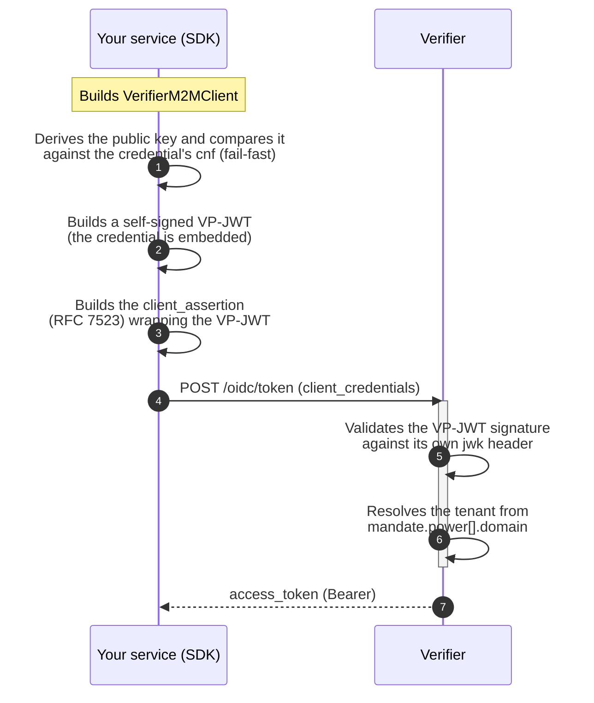

# Java SDK — M2M Authentication Against the Verifier

EUDIStack publishes a Java SDK so your backend service (with no human user involved) can authenticate against an OID4VP-compatible Verifier and obtain an OAuth2 `access_token`, proving possession of a private key bound to a machine credential (e.g. `LEARCredentialMachine`).

[:material-language-java: **`eudistack-verifier-client-java`** on Maven Central](https://central.sonatype.com/artifact/net.eudistack/eudistack-verifier-client-java){ .md-button .md-button--primary }
[:material-github: Source code](https://github.com/in2workspace/eudistack-verifier-client-java){ .md-button }

??? tip "When to use this guide?"
    Use this SDK if your integration is:

    - **Machine-to-machine** — a backend service authenticating on its own, with no user present in the flow.
    - Against **any Verifier** compatible with this M2M profile — not tied to a specific EUDIStack implementation.
    - In **Java**, without wanting to depend on Spring or a reactive stack — the SDK brings neither.

    If your integration has a human user presenting a credential (login, SSO), see [OIDC IdP](oidc-idp.en.md) or [SSO across applications](sso-multi-app.en.md) instead.

??? info "Prerequisites"
    - An **EC P-256 private key** — as JWK JSON or as a hex-encoded scalar (`0x...`), depending on the format your issuer hands out.
    - A **machine credential** (e.g. `LEARCredentialMachine`) binding that key as its `cnf` (confirmation key).
    - The URL of the Verifier you're authenticating against.
    - Java 21 or later.

---

## The protocol, in short

The SDK implements `private_key_jwt` (RFC 7523) with a self-signed Verifiable Presentation as proof of possession — no client pre-registration needed at the Verifier.



The private key **never leaves** your process except embedded in the VP-JWT you sign — the SDK never sends the private key itself anywhere.

---

## Installation

=== "Gradle"

    ```groovy
    dependencies {
        implementation 'net.eudistack:eudistack-verifier-client-java:0.2.0'
    }
    ```

=== "Maven"

    ```xml
    <dependency>
        <groupId>net.eudistack</groupId>
        <artifactId>eudistack-verifier-client-java</artifactId>
        <version>0.2.0</version>
    </dependency>
    ```

> Check the [artifact page on Maven Central](https://central.sonatype.com/artifact/net.eudistack/eudistack-verifier-client-java) for the latest version.

---

## Basic usage

You configure **3 values** — your private key, your machine credential, and the Verifier's URL. Tenant and `client_id` are derived automatically from the credential.

=== "Programmatic"

    ```java
    VerifierM2MClient client = VerifierM2MClient.builder()
        .verifierUrl("https://verifier.example.org")
        .privateKey(privateKey)              // JWK JSON or a hex scalar — see below
        .credentialJwt(machineCredentialJwt)
        .build();

    AccessToken token = client.authenticate();
    System.out.println(token.accessToken());
    ```

    `build()` **immediately** validates that your private key matches the credential's `cnf` — a misconfigured key/credential pair fails at startup, not on the first real request.

=== "From a config file"

    ```java
    VerifierM2MClient client = VerifierM2MClient.fromConfig("verifier-client.yaml");
    AccessToken token = client.authenticate();
    ```

    ```yaml title="verifier-client.yaml"
    verifier:
      url: https://verifier.example.org
      client:
        private-key-path: key.jwk.json
        credential-jwt-path: credential.jwt
    ```

    `.properties` is also supported. See the [SDK's README](https://github.com/in2workspace/eudistack-verifier-client-java#configuration-reference) for the full key reference.

---

## Accepted private key formats

The same parameter accepts either format interchangeably — the SDK detects which one you passed:

=== "JWK JSON"

    ```json
    {"kty":"EC","crv":"P-256","x":"...","y":"...","d":"..."}
    ```

=== "Hex scalar"

    ```text
    0xb8c069add118093e5c0d192a8edd64b426a898c933089703e63b595f74b3edd6
    ```

    With or without the `0x` prefix, with or without zero-padding to the full 32 bytes. Some issuers hand out the key this way instead of as a JWK — the SDK derives the corresponding public key automatically, with no extra step on your side.

---

## Error handling

| Exception | Thrown when |
|---|---|
| `InvalidConfigurationException` | A required value is missing, the key/credential is invalid, or the config file is malformed |
| `CredentialKeyMismatchException` | The configured private key does not correspond to the credential's `cnf` |
| `TokenRequestFailedException` | The Verifier rejected the request or was unreachable — exposes `httpStatus()` and `responseBody()` |

All extend `VerifierClientException`.

??? question "Troubleshooting"

    | Symptom | Likely cause | Resolution |
    |---|---|---|
    | `CredentialKeyMismatchException` at client construction | The private key doesn't correspond to the credential's `cnf` | Verify you're using the right key/credential pair — the failure is intentionally immediate, not at `authenticate()` |
    | `InvalidConfigurationException: verifierUrl must use https` | You're pointing at a non-TLS Verifier | The SDK requires `https` by default; use `.allowInsecureHttp()` only for local testing, never in production |
    | `TokenRequestFailedException` with `invalid_client` | Tenant mismatch | The Verifier derives the tenant from the credential's `mandate.power[].domain` — it must match the target tenant |
    | Exception loading `.yaml` | `org.yaml:snakeyaml` is missing from the classpath | YAML support is an optional dependency — add it, or use a `.properties` file |

??? warning "Security considerations"
    - The SDK requires `https` by default — the `client_assertion` it sends is a reusable credential for a short window, and sending it in cleartext would let a network observer capture and replay it.
    - Never enable `.allowInsecureHttp()` against a production Verifier.
    - If you load the private key inline from a `.yaml` file, quote the value (`private-key: '0xb8c0...'`) — an unquoted value that looks numeric may be parsed as a number by the YAML parser instead of as text.

---

## Full reference

For the exhaustive configuration reference, further examples, and the protocol details, see the SDK repository's [`README`](https://github.com/in2workspace/eudistack-verifier-client-java#readme).
