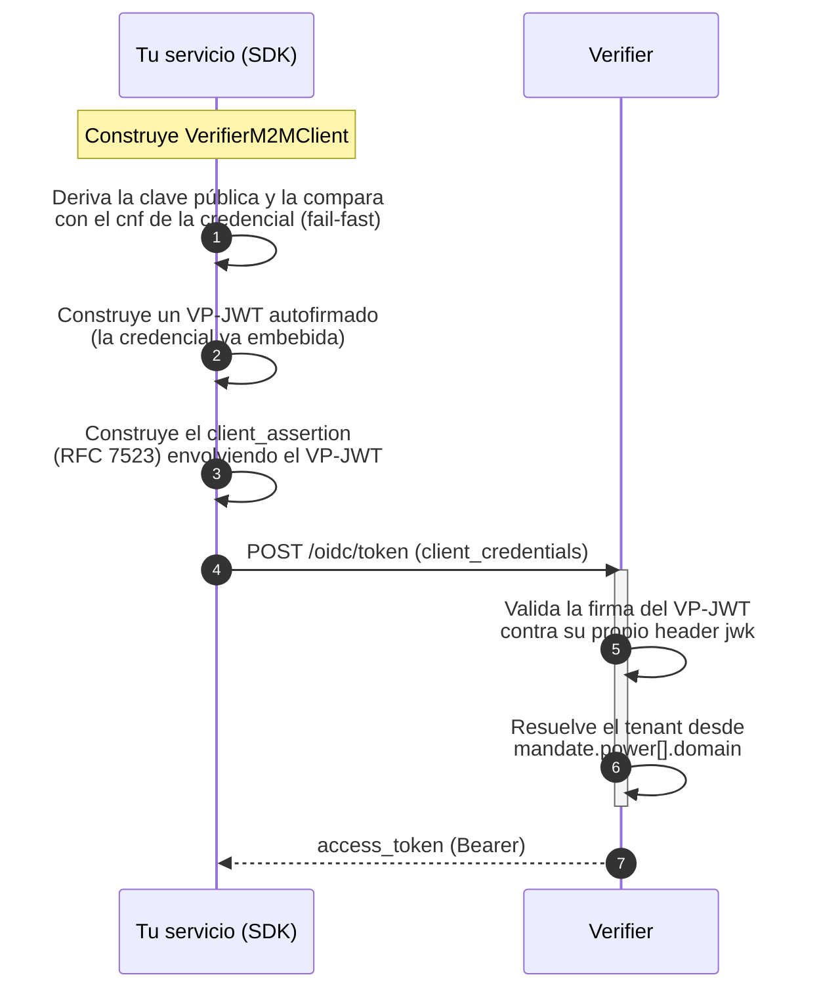

# SDK Java — Autenticación M2M contra el Verifier

EUDIStack publica un SDK Java para que tu servicio backend (sin usuario humano de por medio) pueda autenticarse contra un Verifier compatible con OID4VP y obtener un `access_token` OAuth2, demostrando posesión de una clave privada vinculada a una credencial de máquina (p. ej. `LEARCredentialMachine`).

[:material-language-java: **`eudistack-verifier-client-java`** en Maven Central](https://central.sonatype.com/artifact/net.eudistack/eudistack-verifier-client-java){ .md-button .md-button--primary }
[:material-github: Código fuente](https://github.com/in2workspace/eudistack-verifier-client-java){ .md-button }

??? tip "¿Cuándo usar esta guía?"
    Utiliza este SDK si tu integración es:

    - **Machine-to-machine** — un servicio backend que se autentica por sí mismo, sin un usuario presente en el flujo.
    - Contra **cualquier Verifier** compatible con este perfil M2M — no está atado a una implementación concreta de EUDIStack.
    - En **Java**, sin querer depender de Spring ni de un stack reactivo — el SDK no trae ninguno de los dos.

    Si tu integración sí tiene un usuario humano presentando una credencial (login, SSO), consulta en su lugar [OIDC IdP](oidc-idp.md) o [SSO entre aplicaciones](sso-multi-app.md).

??? info "Requisitos previos"
    - Una **clave privada EC P-256** — como JWK JSON o como escalar hexadecimal (`0x...`), según el formato que te entregue tu emisor.
    - Una **credencial de máquina** (p. ej. `LEARCredentialMachine`) que vincule esa clave como su `cnf` (confirmation key).
    - La URL del Verifier contra el que te vas a autenticar.
    - Java 21 o superior.

---

## El protocolo, en resumen

El SDK implementa `private_key_jwt` (RFC 7523) con una Verifiable Presentation autofirmada como prueba de posesión — no requiere registro previo de cliente en el Verifier.



La clave pública **nunca sale** de tu proceso salvo embebida en el propio VP-JWT que firmas — el SDK no envía la clave privada a ningún sitio.

---

## Instalación

=== "Gradle"

    ```groovy
    dependencies {
        implementation 'net.eudistack:eudistack-verifier-client-java:0.2.0'
    }
    ```

=== "Maven"

    ```xml
    <dependency>
        <groupId>net.eudistack</groupId>
        <artifactId>eudistack-verifier-client-java</artifactId>
        <version>0.2.0</version>
    </dependency>
    ```

> Consulta la [página del artefacto en Maven Central](https://central.sonatype.com/artifact/net.eudistack/eudistack-verifier-client-java) para la versión más reciente.

---

## Uso básico

Configuras **3 valores** — tu clave privada, tu credencial de máquina, y la URL del Verifier. El tenant y el `client_id` se derivan automáticamente de la credencial.

=== "Programático"

    ```java
    VerifierM2MClient client = VerifierM2MClient.builder()
        .verifierUrl("https://verifier.example.org")
        .privateKey(privateKey)              // JWK JSON o escalar hex — ver abajo
        .credentialJwt(machineCredentialJwt)
        .build();

    AccessToken token = client.authenticate();
    System.out.println(token.accessToken());
    ```

    `build()` valida **inmediatamente** que tu clave privada coincide con el `cnf` de la credencial — un par clave/credencial mal configurado falla en el arranque, no en la primera petición real.

=== "Desde fichero de configuración"

    ```java
    VerifierM2MClient client = VerifierM2MClient.fromConfig("verifier-client.yaml");
    AccessToken token = client.authenticate();
    ```

    ```yaml title="verifier-client.yaml"
    verifier:
      url: https://verifier.example.org
      client:
        private-key-path: key.jwk.json
        credential-jwt-path: credential.jwt
    ```

    También soporta `.properties`. Consulta el [README del SDK](https://github.com/in2workspace/eudistack-verifier-client-java#configuration-reference) para la referencia completa de claves.

---

## Formatos de clave privada aceptados

El mismo parámetro acepta indistintamente dos formatos — el SDK detecta cuál le has pasado:

=== "JWK JSON"

    ```json
    {"kty":"EC","crv":"P-256","x":"...","y":"...","d":"..."}
    ```

=== "Escalar hexadecimal"

    ```text
    0xb8c069add118093e5c0d192a8edd64b426a898c933089703e63b595f74b3edd6
    ```

    Con o sin el prefijo `0x`, con o sin padding a los 32 bytes completos. Algunos emisores entregan la clave así en lugar de como JWK — el SDK deriva la clave pública correspondiente automáticamente, sin ningún paso adicional por tu parte.

---

## Manejo de errores

| Excepción | Cuándo se lanza |
|---|---|
| `InvalidConfigurationException` | Falta un valor obligatorio, la clave/credencial es inválida, o el fichero de config es incorrecto |
| `CredentialKeyMismatchException` | La clave privada configurada no corresponde al `cnf` de la credencial |
| `TokenRequestFailedException` | El Verifier rechazó la petición o no fue alcanzable — expone `httpStatus()` y `responseBody()` |

Todas extienden `VerifierClientException`.

??? question "Troubleshooting"

    | Síntoma | Causa probable | Resolución |
    |---|---|---|
    | `CredentialKeyMismatchException` al construir el cliente | La clave privada no corresponde al `cnf` de la credencial | Verifica que usas el par clave/credencial correcto — el fallo es intencionadamente inmediato, no en `authenticate()` |
    | `InvalidConfigurationException: verifierUrl must use https` | Estás apuntando a un Verifier sin TLS | El SDK exige `https` por defecto; usa `.allowInsecureHttp()` solo para pruebas locales, nunca en producción |
    | `TokenRequestFailedException` con `invalid_client` | Mismatch de tenant | El Verifier deriva el tenant del campo `mandate.power[].domain` de la credencial — debe coincidir con el tenant destino |
    | Excepción al cargar `.yaml` | Falta `org.yaml:snakeyaml` en el classpath | El soporte YAML es una dependencia opcional — añádela, o usa un fichero `.properties` |

??? warning "Consideraciones de seguridad"
    - El SDK exige `https` por defecto — el `client_assertion` que envía es una credencial reutilizable durante una ventana corta, y enviarla en claro permitiría a un observador de red capturarla y repetirla.
    - Nunca actives `.allowInsecureHttp()` contra un Verifier de producción.
    - Si cargas la clave privada desde un fichero `.yaml`, cita el valor si lo pones inline (`private-key: '0xb8c0...'`) — un valor numérico sin comillas puede ser interpretado como número por el parser YAML en lugar de como texto.

---

## Referencia completa

Para la referencia exhaustiva de configuración, ejemplos adicionales y el detalle del protocolo implementado, consulta el [`README`](https://github.com/in2workspace/eudistack-verifier-client-java#readme) del repositorio del SDK.
