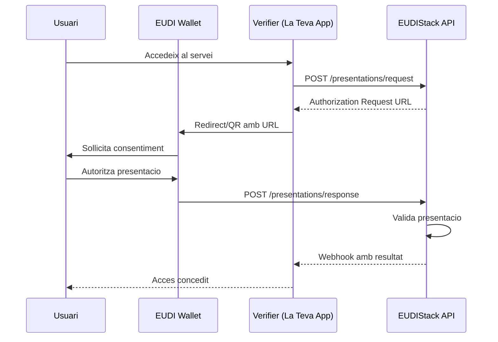
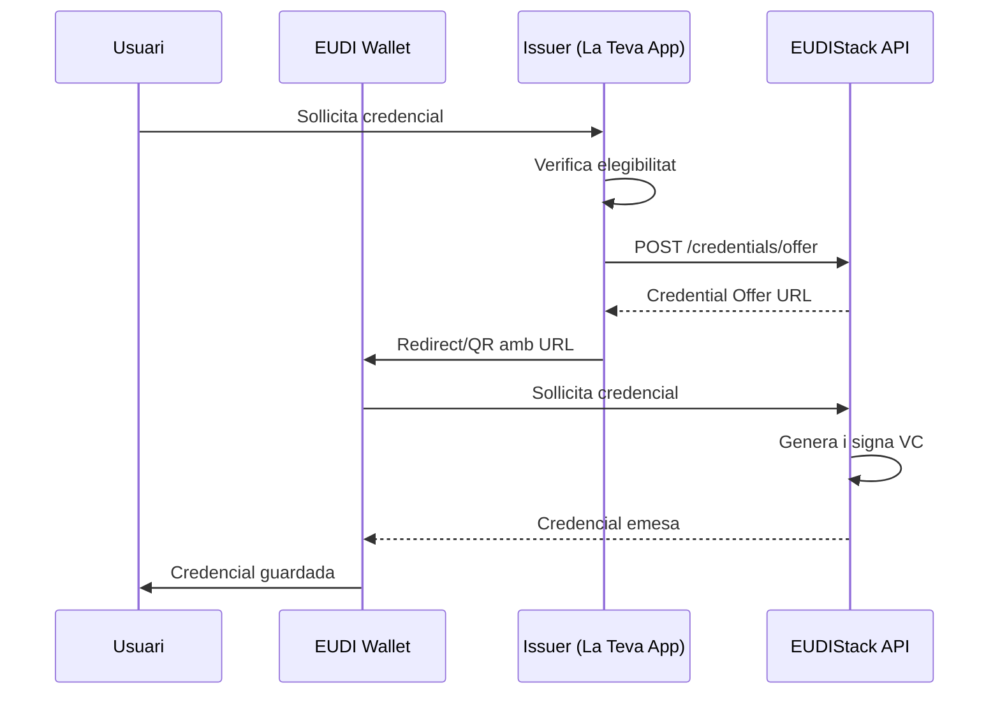

# Autenticacio

Aquesta guia explica com implementar fluxos d'autenticacio utilitzant EUDIStack i l'EUDI Wallet.

## Protocols suportats

EUDIStack implementa els seguents protocols d'autenticacio:

| Protocol | Descripcio | Cas d'us |
|----------|------------|----------|
| **OpenID4VP** | OpenID for Verifiable Presentations | Verificacio de credencials |
| **OpenID4VCI** | OpenID for Verifiable Credential Issuance | Emissio de credencials |
| **SIOPv2** | Self-Issued OpenID Provider v2 | Autenticacio descentralitzada |

## Flux de verificacio (OpenID4VP)

El flux de verificacio permet a un servei sollicitar i verificar credencials del wallet de l'usuari.



### Implementacio

#### 1. Crear sollicitud de presentacio

```bash
curl -X POST https://api.example.com/api/v1/presentations/request \
  -H "Authorization: Bearer ${ACCESS_TOKEN}" \
  -H "Content-Type: application/json" \
  -d '{
    "presentation_definition": {
      "id": "identity_verification",
      "input_descriptors": [
        {
          "id": "id_card",
          "name": "ID Card",
          "purpose": "Verificar identitat de l usuari",
          "constraints": {
            "fields": [
              {
                "path": ["$.credentialSubject.given_name"],
                "filter": { "type": "string" }
              },
              {
                "path": ["$.credentialSubject.family_name"],
                "filter": { "type": "string" }
              },
              {
                "path": ["$.credentialSubject.birth_date"],
                "filter": { "type": "string", "format": "date" }
              }
            ]
          }
        }
      ]
    },
    "callback_url": "https://your-app.com/callback"
  }'
```

Resposta:

```json
{
  "request_id": "req_abc123",
  "authorization_url": "openid4vp://authorize?request_uri=...",
  "qr_code_url": "https://api.example.com/qr/req_abc123.png",
  "expires_at": "2024-01-15T10:30:00Z"
}
```

#### 2. Mostrar QR o redirect

=== "QR Code"

    ```html
    
    ```

=== "Deep Link"

    ```javascript
    // A mobil, redirect directe al wallet
    window.location.href = authorizationUrl;
    ```

#### 3. Rebre callback

Configura un endpoint per rebre el resultat:

```python
from flask import Flask, request

app = Flask(__name__)

@app.route('/callback', methods=['POST'])
def verification_callback():
    data = request.json

    if data['status'] == 'success':
        # Credencials verificades correctament
        claims = data['verified_claims']
        user_name = claims['given_name']
        # Processar autenticacio exitosa
        return {'status': 'ok'}
    else:
        # Error en la verificacio
        error = data['error']
        return {'status': 'error', 'message': error}, 400
```

## Flux d'emissio (OpenID4VCI)

El flux d'emissio permet a la teva aplicacio emetre credencials al wallet de l'usuari.



### Implementacio

#### 1. Crear oferta de credencial

```bash
curl -X POST https://api.example.com/api/v1/credentials/offer \
  -H "Authorization: Bearer ${ACCESS_TOKEN}" \
  -H "Content-Type: application/json" \
  -d '{
    "credential_type": "VerifiableId",
    "claims": {
      "given_name": "Maria",
      "family_name": "Lopez",
      "birth_date": "1985-03-20",
      "nationality": "ES"
    },
    "pin_required": true
  }'
```

Resposta:

```json
{
  "offer_id": "offer_xyz789",
  "credential_offer_uri": "openid-credential-offer://...",
  "qr_code_url": "https://api.example.com/qr/offer_xyz789.png",
  "pin": "1234",
  "expires_at": "2024-01-15T10:30:00Z"
}
```

## Seguretat

### Validacio de tokens

!!! warning "Important"
    Sempre valida els tokens d'acces abans de processar sollicituds.

```python
import jwt
from functools import wraps

def require_auth(f):
    @wraps(f)
    def decorated(*args, **kwargs):
        token = request.headers.get('Authorization', '').replace('Bearer ', '')

        try:
            payload = jwt.decode(
                token,
                PUBLIC_KEY,
                algorithms=['RS256'],
                audience='your-api'
            )
            request.user = payload
        except jwt.InvalidTokenError:
            return {'error': 'Invalid token'}, 401

        return f(*args, **kwargs)
    return decorated
```

### Llista d'emissors confiables

Configura els emissors les credencials dels quals acceptaras:

```yaml
trusted_issuers:
  - did: did:web:government.example.com
    name: "Govern d'Espanya"
    credential_types:
      - VerifiableId
      - DriverLicense

  - did: did:web:university.example.com
    name: "Universitat de Barcelona"
    credential_types:
      - VerifiableDiploma
```

## Seguent pas

[:material-api: Explorar l'API completa](../referencia-api/index.md){ .md-button }
