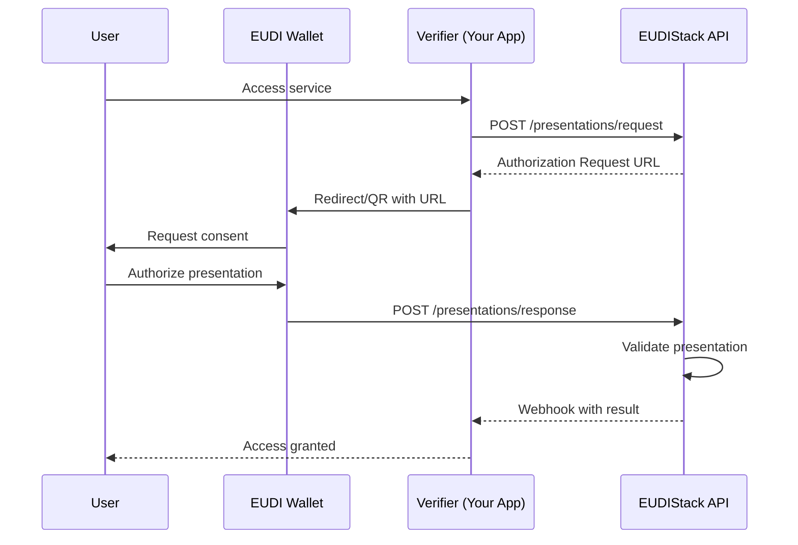
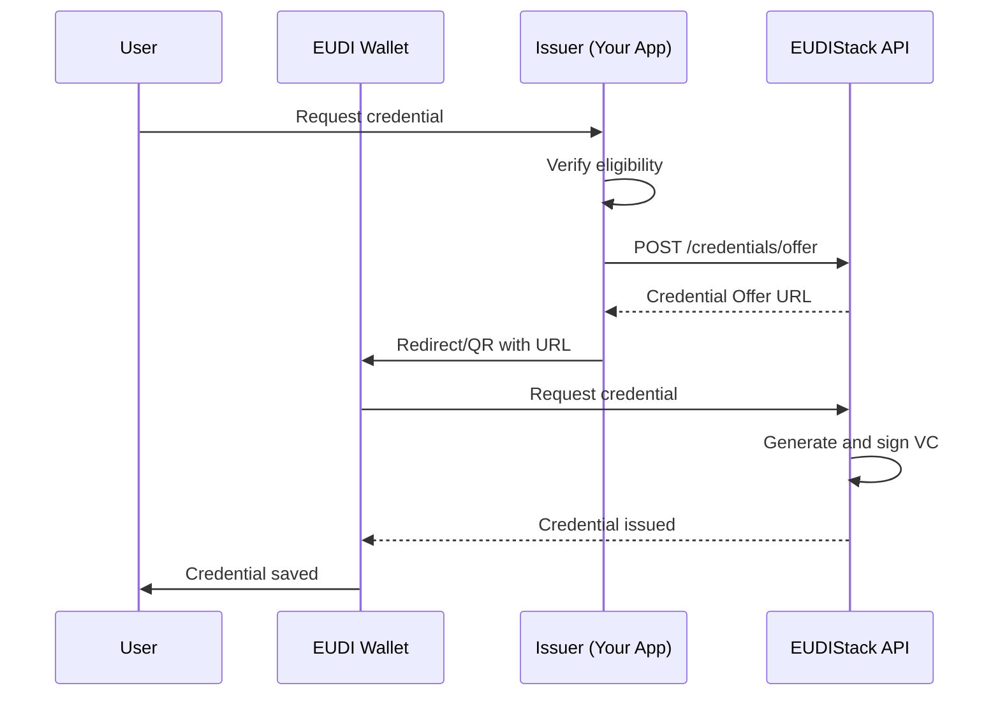

# Authentication

This guide explains how to implement authentication flows using EUDIStack and the EUDI Wallet.

## Supported Protocols

EUDIStack implements the following authentication protocols:

| Protocol | Description | Use Case |
|----------|-------------|----------|
| **OpenID4VP** | OpenID for Verifiable Presentations | Credential verification |
| **OpenID4VCI** | OpenID for Verifiable Credential Issuance | Credential issuance |
| **SIOPv2** | Self-Issued OpenID Provider v2 | Decentralized authentication |

## Verification Flow (OpenID4VP)

The verification flow allows a service to request and verify credentials from the user's wallet.



### Implementation

#### 1. Create Presentation Request

```bash
curl -X POST https://api.example.com/api/v1/presentations/request \
  -H "Authorization: Bearer ${ACCESS_TOKEN}" \
  -H "Content-Type: application/json" \
  -d '{
    "presentation_definition": {
      "id": "identity_verification",
      "input_descriptors": [
        {
          "id": "id_card",
          "name": "ID Card",
          "purpose": "Verify user identity",
          "constraints": {
            "fields": [
              {
                "path": ["$.credentialSubject.given_name"],
                "filter": { "type": "string" }
              },
              {
                "path": ["$.credentialSubject.family_name"],
                "filter": { "type": "string" }
              },
              {
                "path": ["$.credentialSubject.birth_date"],
                "filter": { "type": "string", "format": "date" }
              }
            ]
          }
        }
      ]
    },
    "callback_url": "https://your-app.com/callback"
  }'
```

Response:

```json
{
  "request_id": "req_abc123",
  "authorization_url": "openid4vp://authorize?request_uri=...",
  "qr_code_url": "https://api.example.com/qr/req_abc123.png",
  "expires_at": "2024-01-15T10:30:00Z"
}
```

#### 2. Display QR or Redirect

=== "QR Code"

    ```html
    
    ```

=== "Deep Link"

    ```javascript
    // On mobile, direct redirect to wallet
    window.location.href = authorizationUrl;
    ```

#### 3. Receive Callback

Configure an endpoint to receive the result:

```python
from flask import Flask, request

app = Flask(__name__)

@app.route('/callback', methods=['POST'])
def verification_callback():
    data = request.json

    if data['status'] == 'success':
        # Credentials verified successfully
        claims = data['verified_claims']
        user_name = claims['given_name']
        # Process successful authentication
        return {'status': 'ok'}
    else:
        # Verification error
        error = data['error']
        return {'status': 'error', 'message': error}, 400
```

## Issuance Flow (OpenID4VCI)

The issuance flow allows your application to issue credentials to the user's wallet.



### Implementation

#### 1. Create Credential Offer

```bash
curl -X POST https://api.example.com/api/v1/credentials/offer \
  -H "Authorization: Bearer ${ACCESS_TOKEN}" \
  -H "Content-Type: application/json" \
  -d '{
    "credential_type": "VerifiableId",
    "claims": {
      "given_name": "Maria",
      "family_name": "Lopez",
      "birth_date": "1985-03-20",
      "nationality": "ES"
    },
    "pin_required": true
  }'
```

Response:

```json
{
  "offer_id": "offer_xyz789",
  "credential_offer_uri": "openid-credential-offer://...",
  "qr_code_url": "https://api.example.com/qr/offer_xyz789.png",
  "pin": "1234",
  "expires_at": "2024-01-15T10:30:00Z"
}
```

## Security

### Token Validation

!!! warning "Important"
    Always validate access tokens before processing requests.

```python
import jwt
from functools import wraps

def require_auth(f):
    @wraps(f)
    def decorated(*args, **kwargs):
        token = request.headers.get('Authorization', '').replace('Bearer ', '')

        try:
            payload = jwt.decode(
                token,
                PUBLIC_KEY,
                algorithms=['RS256'],
                audience='your-api'
            )
            request.user = payload
        except jwt.InvalidTokenError:
            return {'error': 'Invalid token'}, 401

        return f(*args, **kwargs)
    return decorated
```

### Trusted Issuers List

Configure the issuers whose credentials you will accept:

```yaml
trusted_issuers:
  - did: did:web:government.example.com
    name: "Government of Spain"
    credential_types:
      - VerifiableId
      - DriverLicense

  - did: did:web:university.example.com
    name: "University of Barcelona"
    credential_types:
      - VerifiableDiploma
```

## Next Step

[:material-api: Explore the full API](../referencia-api/index.md){ .md-button }
