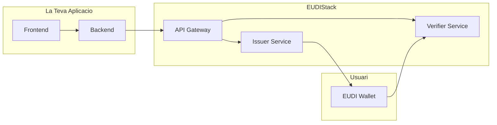

# Guies d'Integracio

Aquesta seccio proporciona guies detallades per integrar EUDIStack a la teva aplicacio.

-   :material-flash:{ .lg .middle } **Inici Rapid**

    ---

    Configura el teu entorn i executa la teva primera integracio en minuts

    [:octicons-arrow-right-24: Anar](inicio-rapido.md)

-   :material-cog:{ .lg .middle } **Configuracio**

    ---

    Opcions de configuracio avancades per personalitzar EUDIStack

    [:octicons-arrow-right-24: Anar](configuracion.md)

-   :material-shield-key:{ .lg .middle } **Autenticacio**

    ---

    Implementa fluxos d'autenticacio amb EUDI Wallet

    [:octicons-arrow-right-24: Anar](autenticacion.md)

## Prerequisits

Abans de comenar, assegura't de tenir:

- [ ] Docker installat (versio 20.10+)
- [ ] Git installat
- [ ] Coneixement basic d'OAuth 2.0 / OpenID Connect
- [ ] Acces a les credencials de configuracio (si aplica)

## Arquitectura d'integracio

El seguent diagrama mostra com la teva aplicacio s'integra amb EUDIStack:

## Flux tipic d'integracio

1. **Configurar EUDIStack** - Desplega els serveis necessaris
2. **Registrar la teva aplicacio** - Obte credencials de client
3. **Implementar fluxos** - Integra emissio o verificacio de credencials
4. **Provar** - Valida la integracio en entorn de proves
5. **Desplegar** - Passa a produccio

## Suport

Si trobes problemes durant la integracio:

- :material-github: [Obre un issue a GitHub](https://github.com/in2workspace/eudistack/issues)
- :material-book: Consulta la [Referencia API](../referencia-api/index.md)
