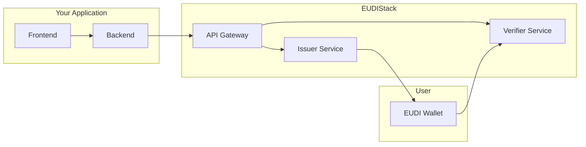

# Integration Guides

This section provides detailed guides for integrating EUDIStack into your application.

-   :material-flash:{ .lg .middle } **Quick Start**

    ---

    Set up your environment and run your first integration in minutes

    [:octicons-arrow-right-24: Go](inicio-rapido.md)

-   :material-cog:{ .lg .middle } **Configuration**

    ---

    Advanced configuration options to customize EUDIStack

    [:octicons-arrow-right-24: Go](configuracion.md)

-   :material-shield-key:{ .lg .middle } **Authentication**

    ---

    Implement authentication flows with EUDI Wallet

    [:octicons-arrow-right-24: Go](autenticacion.md)

## Prerequisites

Before getting started, make sure you have:

- [ ] Docker installed (version 20.10+)
- [ ] Git installed
- [ ] Basic knowledge of OAuth 2.0 / OpenID Connect
- [ ] Access to configuration credentials (if applicable)

## Integration Architecture

The following diagram shows how your application integrates with EUDIStack:

## Typical Integration Flow

1. **Configure EUDIStack** - Deploy the necessary services
2. **Register your application** - Obtain client credentials
3. **Implement flows** - Integrate credential issuance or verification
4. **Test** - Validate the integration in a test environment
5. **Deploy** - Move to production

## Support

If you encounter issues during integration:

- :material-github: [Open an issue on GitHub](https://github.com/in2workspace/eudistack/issues)
- :material-book: Check the [API Reference](../referencia-api/index.md)
