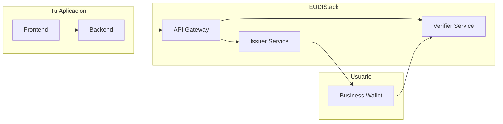

# Guias de Integracion

Esta seccion proporciona guias detalladas para integrar EUDIStack en tu aplicacion.

-   :material-flash:{ .lg .middle } **Inicio Rapido**

    ---

    Configura tu entorno y ejecuta tu primera integracion en minutos

    [:octicons-arrow-right-24: Ir](inicio-rapido.md)

-   :material-cog:{ .lg .middle } **Configuracion**

    ---

    Opciones de configuracion avanzadas para personalizar EUDIStack

    [:octicons-arrow-right-24: Ir](configuracion.md)

-   :material-shield-key:{ .lg .middle } **Autenticacion**

    ---

    Implementa flujos de autenticacion con Business Wallet

    [:octicons-arrow-right-24: Ir](autenticacion.md)

-   :material-server:{ .lg .middle } **Verifier M2M**

    ---

    Integracion machine-to-machine con LEARCredentialMachine

    [:octicons-arrow-right-24: Ir](verifier-m2m.md)

-   :material-cellphone-key:{ .lg .middle } **Verifier PKCE**

    ---

    Integracion para clientes publicos (apps web/movil) con PKCE

    [:octicons-arrow-right-24: Ir](verifier-pkce.md)

-   :material-lock:{ .lg .middle } **Cliente Confidencial**

    ---

    Integracion para backends con client_secret_jwt

    [:octicons-arrow-right-24: Ir](verifier-confidencial.md)

## Prerequisitos

Antes de comenzar, asegurate de tener:

- [ ] Docker instalado (version 20.10+)
- [ ] Git instalado
- [ ] Conocimiento basico de OAuth 2.0 / OpenID Connect
- [ ] Acceso a las credenciales de configuracion (si aplica)

## Arquitectura de integracion

El siguiente diagrama muestra como tu aplicacion se integra con EUDIStack:

## Flujo tipico de integracion

1. **Configurar EUDIStack** - Despliega los servicios necesarios
2. **Registrar tu aplicacion** - Obtiene credenciales de cliente
3. **Implementar flujos** - Integra emision o verificacion de credenciales
4. **Probar** - Valida la integracion en entorno de pruebas
5. **Desplegar** - Pasa a produccion

## Soporte

Si encuentras problemas durante la integracion:

- :material-github: [Abre un issue en GitHub](https://github.com/in2workspace/eudistack/issues)
- :material-book: Consulta la [Referencia API](../referencia-api/index.md)
