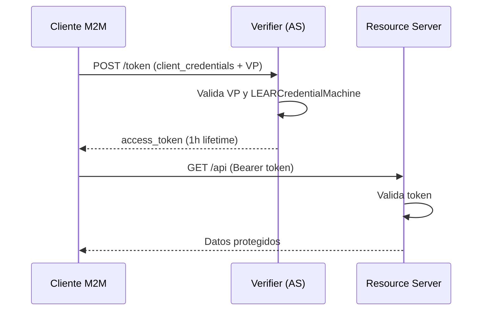

# Integracion Verifier M2M

Esta guia describe como los servicios backend pueden integrarse con el Verifier como Authorization Server (AS) en escenarios machine-to-machine (M2M).

## Introduccion

### Proposito

Esta guia explica como un servicio backend puede integrarse con el Verifier en modo M2M. Proporciona los pasos completos: desde preparar credenciales hasta llamar al Token Endpoint con una LEARCredentialMachine y usar tokens de acceso para consumir APIs protegidas.

### Alcance

- Integracion de servicios backend con el Verifier usando autenticacion M2M
- Uso de LEARCredentialMachine dentro de una Verifiable Presentation (VP)
- OAuth 2.1 client_credentials con Private Key JWT
- Adquisicion y uso de tokens para APIs protegidas

### Audiencia

- Desarrolladores construyendo componentes/servicios en el ecosistema
- Integradores tecnicos conectando sistemas al Verifier
- Ingenieros de seguridad validando compliance

## Arquitectura



## Flujo de alto nivel

1. El cliente solicita un access token autenticandose con el Verifier y presentando la autorizacion
2. El Verifier autentica al cliente, valida la autorizacion y emite un access token
3. El cliente solicita el recurso protegido presentando el access token
4. El Resource Server valida el token y devuelve los datos solicitados

## Pasos de integracion

### Prerrequisitos

- La entidad legal ha completado el onboarding en el ecosistema
- El LEAR puede acceder al servicio Issuer y emitir una LEARCredentialMachine
- Metodo DID soportado: `did:key`
- Acceso a documentacion y URLs del entorno de pruebas

---

### Paso 1: Emision de credencial de maquina

1. La entidad legal accede al servicio Issuer y emite una LEARCredentialMachine a su maquina
2. El servicio genera un par de claves vinculado a la LEARCredentialMachine
3. La maquina obtiene un identificador DID (resultado de usar la clave publica en formato did:key)
4. La LEARCredentialMachine es un JWT VC

!!! warning "Seguridad"
    Mantener la clave privada segura. Nunca compartirla ni exponerla.

**Resultado**: La maquina posee una LEARCredentialMachine valida vinculada a su DID.

---

### Paso 2: Configuracion del cliente

**Tipo de cliente**: Confidencial

Almacenar LEARCredentialMachine y clave privada de forma segura (Vault, HSM).

**Resultado**: El cliente esta listo para autenticarse.

---

### Paso 3: Adquirir token

Para adquirir un token, el cliente debe:

1. Construir una Verifiable Presentation (VP) que contenga la LEARCredentialMachine
2. Firmar esta VP como JWT con la clave privada de la maquina
3. Incrustarla dentro de un client assertion JWT
4. Hacer POST al Token Endpoint del Verifier

#### Construir el VP JWT (vp_token)

Objeto VP:

```json
{
    "@context": ["https://www.w3.org/2018/credentials/v1"],
    "type": ["VerifiablePresentation"],
    "verifiableCredential": ["eyJhb...ssw5c"]
}
```

Claims del VP JWT (firmado con la clave privada de la maquina):

| Claim | Descripcion |
|-------|-------------|
| `iss` | DID de la maquina (mismo que 'sub' en LEARCredentialMachine) |
| `sub` | DID de la maquina |
| `aud` | URL del Token Endpoint del Verifier |
| `iat` | Tiempo actual (segundos) |
| `nbf` | Igual que iat |
| `exp` | Expiracion corta (ej: iat + 10s) |
| `jti` | UUID (unico) |
| `vp` | Objeto VP |

Ejemplo de payload:

```json
{
    "iss": "did:key:zDna...",
    "sub": "did:key:zDna...",
    "jti": "urn:uuid:3978344f-8596-4c3a-a978-8fcaba3903c5",
    "aud": "https://verifier.eudistack.com/token",
    "nbf": 1541493724,
    "iat": 1541493724,
    "exp": 1541493734,
    "vp": {
        "@context": ["https://www.w3.org/2018/credentials/v1"],
        "type": ["VerifiablePresentation"],
        "verifiableCredential": ["eyJhb...ssw5c"]
    }
}
```

#### Construir el client assertion JWT

Claims del perfil:

| Claim | Descripcion |
|-------|-------------|
| `iss` | DID de la maquina |
| `sub` | DID de la maquina |
| `aud` | URL del Token Endpoint del Verifier |
| `jti` | UUID v4 (uso unico) |
| `iat` | Tiempo actual en segundos |
| `exp` | iat + 10 segundos |
| `vp_token` | Codificacion base64url del VP JWT |

!!! info "Reglas de correccion"
    - Usar NumericDate en segundos para iat/exp
    - Usar base64url (RFC7515) para `vp_token`, no Base64 estandar
    - No incluir `presentation_submission`
    - Firmar con clave privada de la maquina (Header: `alg` = `ES256`, `kid` = `did:key`)

### Hacer la peticion

**Endpoint**: POST /token

**Content-Type**: application/x-www-form-urlencoded

**Parametros**:

| Parametro | Valor | Requerido |
|-----------|-------|-----------|
| `grant_type` | `client_credentials` | Si |
| `client_id` | DID o client id configurado | Si |
| `client_assertion_type` | `urn:ietf:params:oauth:client-assertion-type:jwt-bearer` | Si |
| `client_assertion` | JWT | Si |

Ejemplo de peticion:

```http
POST /token HTTP/1.1
Host: verifier.eudistack.com
Content-Type: application/x-www-form-urlencoded

grant_type=client_credentials&
client_assertion_type=urn%3Aietf%3Aparams%3Aoauth%3Aclient-assertion-type%3Ajwt-bearer&
client_assertion=eyJhbGciOiJFUzI1NiIsImtpZCI6ImRpZDprZXk6ekRuYS4uLiJ9...
```

### Obtener la respuesta

Si la peticion es valida, el Verifier emite un access token:

```json
{
    "access_token": "eyJraWQiOiJkaWQ6a2V5OnpEb...k9aYcDBWcGww",
    "token_type": "Bearer",
    "expires_in": 3600
}
```

!!! note "Notas importantes"
    - `Cache-Control: no-store` debe incluirse en la respuesta
    - Los refresh tokens no estan soportados en M2M

---

## Errores comunes a evitar

| Error | Descripcion |
|-------|-------------|
| Milisegundos vs segundos | Usar segundos en claims de tiempo |
| Base64 vs Base64URL | Usar Base64URL, no Base64 estandar |
| Valores iss/sub incorrectos | Deben ser el DID |
| VP con multiples credenciales | Solo debe contener una LEARCredentialMachine |
| Ataques de replay | Usar `jti` unico dentro de la ventana de expiracion |

## Siguiente paso

[:material-shield-key: Ver autenticacion PKCE](verifier-pkce.md){ .md-button }
