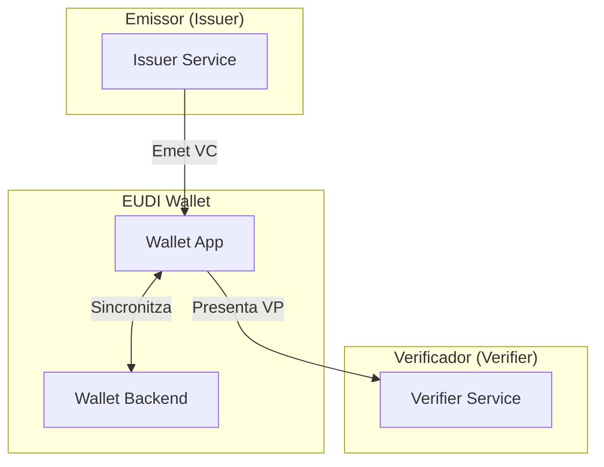

# Benvingut a EUDIStack

**EUDIStack** es una implementacio de referencia de l'European Digital Identity Wallet (EUDI Wallet) seguint les especificacions de l'Architecture and Reference Framework (ARF) de la Comissio Europea.

<div class="grid cards" markdown>

-   :material-rocket-launch:{ .lg .middle } **Guies d'Integracio**

    ---

    Apren a integrar EUDIStack a la teva aplicacio pas a pas

    [:octicons-arrow-right-24: Comenar](guias-integracion/index.md)

-   :material-certificate:{ .lg .middle } **Model de Credencials**

    ---

    Explora l'ontologia i esquemes de credencials verificables

    [:octicons-arrow-right-24: Veure model](modelo-credenciales/index.md)

-   :material-api:{ .lg .middle } **Referencia API**

    ---

    Documentacio completa dels endpoints i metodes disponibles

    [:octicons-arrow-right-24: Explorar API](referencia-api/index.md)

-   :material-sitemap:{ .lg .middle } **Arquitectura**

    ---

    Compren l'arquitectura del sistema i els seus components

    [:octicons-arrow-right-24: Veure arquitectura](arquitectura/index.md)

</div>

## Que es EUDIStack?

EUDIStack proporciona els components necessaris per implementar solucions d'identitat digital basades en el marc europeu EUDI Wallet. Esta dissenyat per facilitar:

- **Emissio de credencials verificables** (Verifiable Credentials)
- **Verificacio de presentacions** (Verifiable Presentations)
- **Gestio d'identitat digital** conforme a eIDAS 2.0

### Caracteristiques principals

| Caracteristica | Descripcio |
|----------------|------------|
| :white_check_mark: Compatible eIDAS 2.0 | Compleix amb la regulacio europea d'identitat digital |
| :white_check_mark: OpenID4VC | Implementa els protocols OpenID for Verifiable Credentials |
| :white_check_mark: Modular | Arquitectura extensible i configurable |
| :white_check_mark: Open Source | Codi obert sota llicencia Apache 2.0 |

## Inici rapid

```bash
# Clonar el repositori
git clone https://github.com/in2workspace/eudistack.git

# Navegar al directori
cd eudistack

# Iniciar amb Docker
docker-compose up -d
```

[:material-arrow-right: Anar a la guia d'inici rapid](guias-integracion/inicio-rapido.md){ .md-button .md-button--primary }

## Ecosistema EUDI Wallet

EUDIStack s'integra amb l'ecosistema mes ampli d'EUDI Wallet:



## Recursos addicionals

- [Architecture and Reference Framework (ARF)](https://eudi.dev) - Documentacio oficial de la CE
- [OpenID4VC Specifications](https://openid.net/developers/specs/) - Especificacions OpenID Foundation
- [GitHub Repository](https://github.com/in2workspace) - Codi font i exemples
