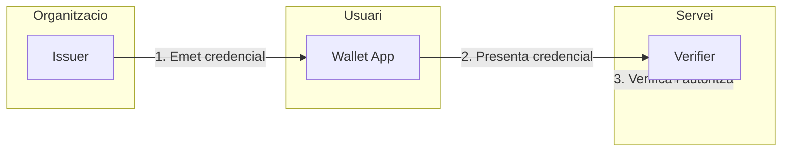

# Benvingut a EUDIStack

**EUDIStack** es una plataforma que permet a les organitzacions **emetre, gestionar i verificar credencials digitals** per als seus empleats, col·laboradors i socis de negoci, complint amb la normativa europea d'identitat digital (eIDAS 2).

<div class="grid cards" markdown>

-   :material-rocket-launch:{ .lg .middle } **Guies d'Integracio**

    ---

    Apren a integrar EUDIStack a la teva aplicacio pas a pas

    [:octicons-arrow-right-24: Comencar](guias-integracion/index.md)

-   :material-certificate:{ .lg .middle } **Model de Credencials**

    ---

    Explora l'ontologia i esquemes de credencials verificables

    [:octicons-arrow-right-24: Veure model](modelo-credenciales/index.md)

-   :material-api:{ .lg .middle } **Referencia API**

    ---

    Documentacio completa dels endpoints i metodes disponibles

    [:octicons-arrow-right-24: Explorar API](referencia-api/index.md)

-   :material-sitemap:{ .lg .middle } **Arquitectura**

    ---

    Compren l'arquitectura del sistema i els seus components

    [:octicons-arrow-right-24: Veure arquitectura](arquitectura/index.md)

</div>

## Que es EUDIStack?

EUDIStack es una plataforma d'identitat digital que proporciona els serveis necessaris per **emetre, emmagatzemar, presentar i verificar credencials verificables (VCs)** d'acord amb els principals estandards internacionals.

### Components principals

```
┌─────────────────────────────────────────────────────────────────┐
│                      EUDIStack Platform                         │
├─────────────────┬─────────────────┬─────────────────────────────┤
│     ISSUER      │     WALLET      │         VERIFIER            │
│   (Per org.)    │  (Per usuari)   │        (Per org.)           │
├─────────────────┼─────────────────┼─────────────────────────────┤
│ • Panel admin   │ • App mobil     │ • Widget/SDK verificacio    │
│ • APIs emissio  │ • iOS + Android │ • APIs validacio            │
│ • Integracions  │ • White-label   │ • Integracio SSO            │
└─────────────────┴─────────────────┴─────────────────────────────┘
```

| Component | Descripcio |
|-----------|------------|
| **Issuer** | Sistema per crear i gestionar credencials. Inclou panel d'administracio, APIs i emissio individual o massiva. |
| **Wallet** | Aplicacio mobil on els usuaris guarden i presenten les seves credencials. Disponible per iOS i Android. |
| **Verifier** | Servei per verificar credencials. Inclou APIs, widget incrustable i integracio amb sistemes de login. |

### Quin problema resol?

| Problema actual | Solucio EUDIStack |
|-----------------|-------------------|
| Carnets i certificats en paper/PDF facils de falsificar | Credencials amb signatura criptografica, verificables a l'instant |
| Multiples contrasenyes i sistemes | Autenticacio amb credencial des del mobil (passwordless) |
| Onboarding/offboarding manual | Automatitzacio d'emissio i revocacio via APIs |
| Verificacio de tercers costosa | Verificacio instantania i automatica |
| Compliment normatiu complex | Dissenyat nativament per eIDAS 2, GDPR |

## Inici rapid

```bash
# Clonar el repositori
git clone https://github.com/in2workspace/eudistack.git

# Navegar al directori
cd eudistack

# Iniciar amb Docker
docker compose up -d
```

[:material-arrow-right: Anar a la guia d'inici rapid](guias-integracion/inicio-rapido.md){ .md-button .md-button--primary }

## Flux tipic



1. **L'organitzacio emet** una credencial a l'usuari (empleat, col·laborador, etc.)
2. **L'usuari rep** la credencial a la seva wallet mobil
3. **L'usuari presenta** la credencial quan necessita accedir a un servei
4. **El servei verifica** la credencial i autoritza l'acces

## Estandards implementats

EUDIStack implementa els principals estandards d'identitat digital:

| Estandard | Descripcio |
|-----------|------------|
| **eIDAS 2** | Regulacio europea d'identitat digital |
| **OID4VCI** | OpenID for Verifiable Credential Issuance |
| **OID4VP** | OpenID for Verifiable Presentations |
| **W3C VC** | Verifiable Credentials Data Model 2.0 |
| **SD-JWT VC** | Selective Disclosure JWT |
| **DID** | Decentralized Identifiers |

## Recursos addicionals

- [:material-github: Repositori GitHub](https://github.com/in2workspace) - Codi font
- [:material-book: Documentacio ARF](https://eu-digital-identity-wallet.github.io/eudi-doc-architecture-and-reference-framework/) - Architecture Reference Framework
- [:material-link: OpenID4VC](https://openid.net/sg/openid4vc/) - Especificacions OpenID Foundation
