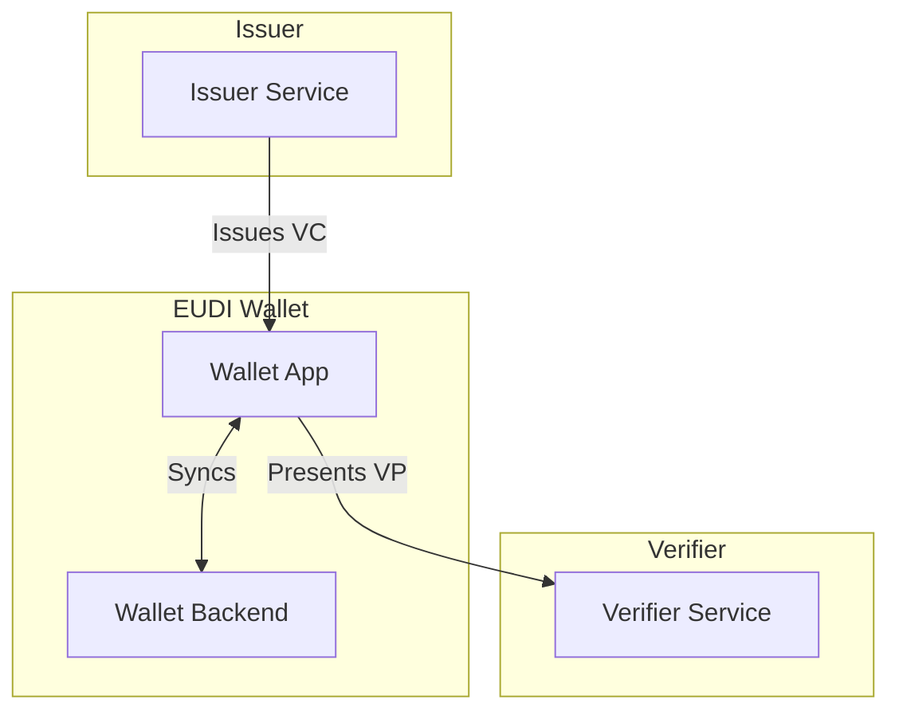

# Welcome to EUDIStack

**EUDIStack** is a reference implementation of the European Digital Identity Wallet (EUDI Wallet) following the Architecture and Reference Framework (ARF) specifications from the European Commission.

<div class="grid cards" markdown>

-   :material-rocket-launch:{ .lg .middle } **Integration Guides**

    ---

    Learn how to integrate EUDIStack into your application step by step

    [:octicons-arrow-right-24: Get Started](guias-integracion/index.md)

-   :material-certificate:{ .lg .middle } **Credential Model**

    ---

    Explore the ontology and verifiable credential schemas

    [:octicons-arrow-right-24: View Model](modelo-credenciales/index.md)

-   :material-api:{ .lg .middle } **API Reference**

    ---

    Complete documentation of available endpoints and methods

    [:octicons-arrow-right-24: Explore API](referencia-api/index.md)

-   :material-sitemap:{ .lg .middle } **Architecture**

    ---

    Understand the system architecture and its components

    [:octicons-arrow-right-24: View Architecture](arquitectura/index.md)

</div>

## What is EUDIStack?

EUDIStack provides the necessary components to implement digital identity solutions based on the European EUDI Wallet framework. It is designed to facilitate:

- **Verifiable Credentials issuance**
- **Verifiable Presentations verification**
- **Digital identity management** compliant with eIDAS 2.0

### Key Features

| Feature | Description |
|---------|-------------|
| :white_check_mark: eIDAS 2.0 Compliant | Meets European digital identity regulation |
| :white_check_mark: OpenID4VC | Implements OpenID for Verifiable Credentials protocols |
| :white_check_mark: Modular | Extensible and configurable architecture |
| :white_check_mark: Open Source | Open source under Apache 2.0 license |

## Quick Start

```bash
# Clone the repository
git clone https://github.com/in2workspace/eudistack.git

# Navigate to directory
cd eudistack

# Start with Docker
docker-compose up -d
```

[:material-arrow-right: Go to Quick Start Guide](guias-integracion/inicio-rapido.md){ .md-button .md-button--primary }

## EUDI Wallet Ecosystem

EUDIStack integrates with the broader EUDI Wallet ecosystem:



## Additional Resources

- [Architecture and Reference Framework (ARF)](https://eudi.dev) - Official EC documentation
- [OpenID4VC Specifications](https://openid.net/developers/specs/) - OpenID Foundation specifications
- [GitHub Repository](https://github.com/in2workspace) - Source code and examples
