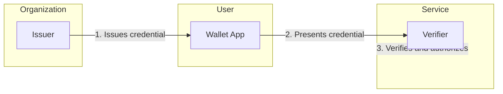

# Welcome to EUDIStack

**EUDIStack** is a platform that enables organizations to **issue, manage, and verify digital credentials** for their employees, collaborators, and business partners, complying with European digital identity regulations (eIDAS 2).

<div class="grid cards" markdown>

-   :material-rocket-launch:{ .lg .middle } **Integration Guides**

    ---

    Learn how to integrate EUDIStack into your application step by step

    [:octicons-arrow-right-24: Get Started](guias-integracion/index.md)

-   :material-certificate:{ .lg .middle } **Credential Model**

    ---

    Explore the ontology and verifiable credential schemas

    [:octicons-arrow-right-24: View Model](modelo-credenciales/index.md)

-   :material-api:{ .lg .middle } **API Reference**

    ---

    Complete documentation of available endpoints and methods

    [:octicons-arrow-right-24: Explore API](referencia-api/index.md)

-   :material-sitemap:{ .lg .middle } **Architecture**

    ---

    Understand the system architecture and its components

    [:octicons-arrow-right-24: View Architecture](arquitectura/index.md)

</div>

## What is EUDIStack?

EUDIStack is a digital identity platform that provides the necessary services to **issue, store, present, and verify verifiable credentials (VCs)** according to major international standards.

### Main Components

```
┌─────────────────────────────────────────────────────────────────┐
│                      EUDIStack Platform                         │
├─────────────────┬─────────────────┬─────────────────────────────┤
│     ISSUER      │     WALLET      │         VERIFIER            │
│   (For orgs.)   │   (For users)   │        (For orgs.)          │
├─────────────────┼─────────────────┼─────────────────────────────┤
│ • Admin panel   │ • Mobile app    │ • Verification widget/SDK   │
│ • Issuance APIs │ • iOS + Android │ • Validation APIs           │
│ • Integrations  │ • White-label   │ • SSO integration           │
└─────────────────┴─────────────────┴─────────────────────────────┘
```

| Component | Description |
|-----------|-------------|
| **Issuer** | System for creating and managing credentials. Includes admin panel, APIs, and individual or bulk issuance. |
| **Wallet** | Mobile application where users store and present their credentials. Available for iOS and Android. |
| **Verifier** | Service for verifying credentials. Includes APIs, embeddable widget, and login system integration. |

### What problem does it solve?

| Current Problem | EUDIStack Solution |
|-----------------|-------------------|
| Paper/PDF cards and certificates easy to forge | Cryptographically signed credentials, instantly verifiable |
| Multiple passwords and systems | Credential-based authentication from mobile (passwordless) |
| Manual onboarding/offboarding | Automation of issuance and revocation via APIs |
| Costly third-party verification | Instant and automatic verification |
| Complex regulatory compliance | Natively designed for eIDAS 2, GDPR |

## Quick Start

```bash
# Clone the repository
git clone https://github.com/in2workspace/eudistack.git

# Navigate to directory
cd eudistack

# Start with Docker
docker compose up -d
```

[:material-arrow-right: Go to Quick Start Guide](guias-integracion/inicio-rapido.md){ .md-button .md-button--primary }

## Typical Flow



1. **The organization issues** a credential to the user (employee, collaborator, etc.)
2. **The user receives** the credential in their mobile wallet
3. **The user presents** the credential when they need to access a service
4. **The service verifies** the credential and authorizes access

## Implemented Standards

EUDIStack implements the main digital identity standards:

| Standard | Description |
|----------|-------------|
| **eIDAS 2** | European digital identity regulation |
| **OID4VCI** | OpenID for Verifiable Credential Issuance |
| **OID4VP** | OpenID for Verifiable Presentations |
| **W3C VC** | Verifiable Credentials Data Model 2.0 |
| **SD-JWT VC** | Selective Disclosure JWT |
| **DID** | Decentralized Identifiers |

## Additional Resources

- [:material-github: GitHub Repository](https://github.com/in2workspace) - Source code
- [:material-book: ARF Documentation](https://eu-digital-identity-wallet.github.io/eudi-doc-architecture-and-reference-framework/) - Architecture Reference Framework
- [:material-link: OpenID4VC](https://openid.net/sg/openid4vc/) - OpenID Foundation specifications
