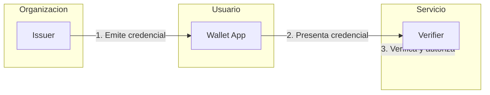

# Bienvenido a EUDIStack

**EUDIStack** es una plataforma que permite a organizaciones **emitir, gestionar y verificar credenciales digitales** para sus empleados, colaboradores y socios de negocio, cumpliendo con la normativa europea de identidad digital (eIDAS 2).

<div class="grid cards" markdown>

-   :material-rocket-launch:{ .lg .middle } **Guias de Integracion**

    ---

    Aprende a integrar EUDIStack en tu aplicacion paso a paso

    [:octicons-arrow-right-24: Comenzar](guias-integracion/index.md)

-   :material-certificate:{ .lg .middle } **Modelo de Credenciales**

    ---

    Explora la ontologia y esquemas de credenciales verificables

    [:octicons-arrow-right-24: Ver modelo](modelo-credenciales/index.md)

-   :material-api:{ .lg .middle } **Referencia API**

    ---

    Documentacion completa de los endpoints y metodos disponibles

    [:octicons-arrow-right-24: Explorar API](referencia-api/index.md)

-   :material-sitemap:{ .lg .middle } **Arquitectura**

    ---

    Comprende la arquitectura del sistema y sus componentes

    [:octicons-arrow-right-24: Ver arquitectura](arquitectura/index.md)

</div>

## Que es EUDIStack?

EUDIStack es una plataforma de identidad digital que proporciona los servicios necesarios para **emitir, almacenar, presentar y verificar credenciales verificables (VCs)** conforme a los principales estandares internacionales.

### Componentes principales

```
┌─────────────────────────────────────────────────────────────────┐
│                      EUDIStack Platform                         │
├─────────────────┬─────────────────┬─────────────────────────────┤
│     ISSUER      │     WALLET      │         VERIFIER            │
│   (Para org.)   │  (Para usuario) │        (Para org.)          │
├─────────────────┼─────────────────┼─────────────────────────────┤
│ • Panel admin   │ • App movil     │ • Widget/SDK verificacion   │
│ • APIs emision  │ • iOS + Android │ • APIs validacion           │
│ • Integraciones │ • White-label   │ • Integracion SSO           │
└─────────────────┴─────────────────┴─────────────────────────────┘
```

| Componente | Descripcion |
|------------|-------------|
| **Issuer** | Sistema para crear y gestionar credenciales. Incluye panel de administracion, APIs y emision individual o masiva. |
| **Wallet** | Aplicacion movil donde los usuarios guardan y presentan sus credenciales. Disponible para iOS y Android. |
| **Verifier** | Servicio para verificar credenciales. Incluye APIs, widget embebible e integracion con sistemas de login. |

### Que problema resuelve?

| Problema actual | Solucion EUDIStack |
|-----------------|-------------------|
| Carnets y certificados en papel/PDF faciles de falsificar | Credenciales con firma criptografica, verificables al instante |
| Multiples contrasenas y sistemas | Autenticacion con credencial desde el movil (passwordless) |
| Onboarding/offboarding manual | Automatizacion de emision y revocacion via APIs |
| Verificacion de terceros costosa | Verificacion instantanea y automatica |
| Cumplimiento normativo complejo | Disenado nativamente para eIDAS 2, GDPR |

## Inicio rapido

```bash
# Clonar el repositorio
git clone https://github.com/in2workspace/eudistack.git

# Navegar al directorio
cd eudistack

# Iniciar con Docker
docker compose up -d
```

[:material-arrow-right: Ir a la guia de inicio rapido](guias-integracion/inicio-rapido.md){ .md-button .md-button--primary }

## Flujo tipico



1. **La organizacion emite** una credencial al usuario (empleado, colaborador, etc.)
2. **El usuario recibe** la credencial en su wallet movil
3. **El usuario presenta** la credencial cuando necesita acceder a un servicio
4. **El servicio verifica** la credencial y autoriza el acceso

## Estandares implementados

EUDIStack implementa los principales estandares de identidad digital:

| Estandar | Descripcion |
|----------|-------------|
| **eIDAS 2** | Regulacion europea de identidad digital |
| **OID4VCI** | OpenID for Verifiable Credential Issuance |
| **OID4VP** | OpenID for Verifiable Presentations |
| **W3C VC** | Verifiable Credentials Data Model 2.0 |
| **SD-JWT VC** | Selective Disclosure JWT |
| **DID** | Decentralized Identifiers |

## Recursos adicionales

- [:material-github: Repositorio GitHub](https://github.com/in2workspace) - Codigo fuente
- [:material-book: ARF Documentation](https://eu-digital-identity-wallet.github.io/eudi-doc-architecture-and-reference-framework/) - Architecture Reference Framework
- [:material-link: OpenID4VC](https://openid.net/sg/openid4vc/) - Especificaciones OpenID Foundation
