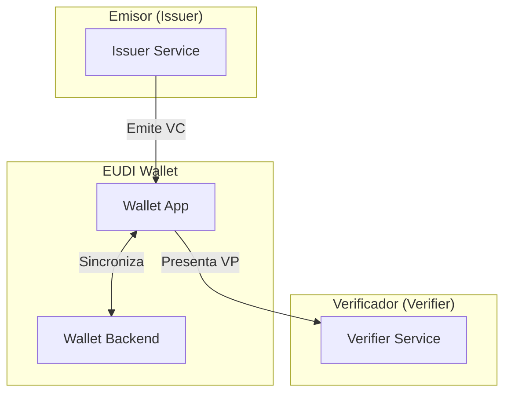

# Bienvenido a EUDIStack

**EUDIStack** es una implementacion de referencia del European Digital Identity Wallet (EUDI Wallet) siguiendo las especificaciones del Architecture and Reference Framework (ARF) de la Comision Europea.

<div class="grid cards" markdown>

-   :material-rocket-launch:{ .lg .middle } **Guias de Integracion**

    ---

    Aprende a integrar EUDIStack en tu aplicacion paso a paso

    [:octicons-arrow-right-24: Comenzar](guias-integracion/index.md)

-   :material-certificate:{ .lg .middle } **Modelo de Credenciales**

    ---

    Explora la ontologia y esquemas de credenciales verificables

    [:octicons-arrow-right-24: Ver modelo](modelo-credenciales/index.md)

-   :material-api:{ .lg .middle } **Referencia API**

    ---

    Documentacion completa de los endpoints y metodos disponibles

    [:octicons-arrow-right-24: Explorar API](referencia-api/index.md)

-   :material-sitemap:{ .lg .middle } **Arquitectura**

    ---

    Comprende la arquitectura del sistema y sus componentes

    [:octicons-arrow-right-24: Ver arquitectura](arquitectura/index.md)

</div>

## Que es EUDIStack?

EUDIStack proporciona los componentes necesarios para implementar soluciones de identidad digital basadas en el marco europeo EUDI Wallet. Esta disenado para facilitar:

- **Emision de credenciales verificables** (Verifiable Credentials)
- **Verificacion de presentaciones** (Verifiable Presentations)
- **Gestion de identidad digital** conforme a eIDAS 2.0

### Caracteristicas principales

| Caracteristica | Descripcion |
|----------------|-------------|
| :white_check_mark: Compatible eIDAS 2.0 | Cumple con la regulacion europea de identidad digital |
| :white_check_mark: OpenID4VC | Implementa los protocolos OpenID for Verifiable Credentials |
| :white_check_mark: Modular | Arquitectura extensible y configurable |
| :white_check_mark: Open Source | Codigo abierto bajo licencia Apache 2.0 |

## Inicio rapido

```bash
# Clonar el repositorio
git clone https://github.com/in2workspace/eudistack.git

# Navegar al directorio
cd eudistack

# Iniciar con Docker
docker-compose up -d
```

[:material-arrow-right: Ir a la guia de inicio rapido](guias-integracion/inicio-rapido.md){ .md-button .md-button--primary }

## Ecosistema EUDI Wallet

EUDIStack se integra con el ecosistema mas amplio de EUDI Wallet:



## Recursos adicionales

- [Architecture and Reference Framework (ARF)](https://eudi.dev) - Documentacion oficial de la CE
- [OpenID4VC Specifications](https://openid.net/developers/specs/) - Especificaciones OpenID Foundation
- [GitHub Repository](https://github.com/in2workspace) - Codigo fuente y ejemplos
