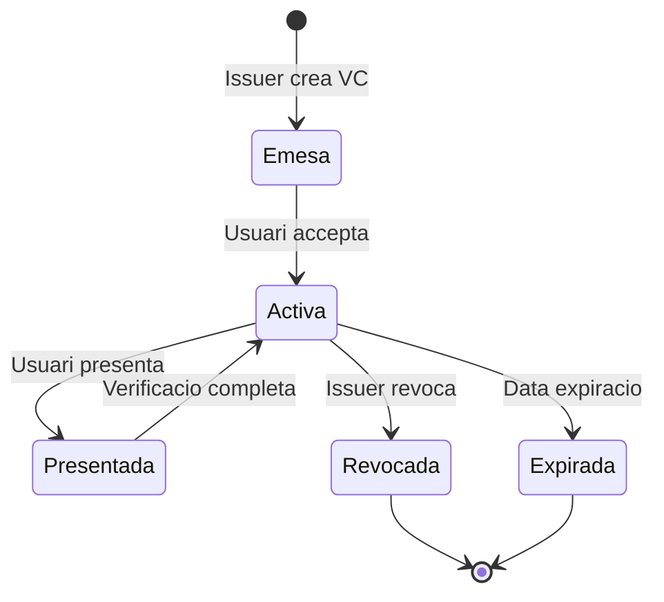

# Model de Credencials

Aquesta seccio descriu el model de credencials verificables implementat a EUDIStack, seguint les especificacions de l'ARF (Architecture and Reference Framework) de la Comissio Europea.

<div class="grid cards" markdown>

-   :material-graph:{ .lg .middle } **Ontologia**

    ---

    Estructura semantica i relacions del model de dades

    [:octicons-arrow-right-24: Veure ontologia](ontologia.md)

-   :material-code-json:{ .lg .middle } **Esquemes**

    ---

    Definicions JSON Schema de les credencials

    [:octicons-arrow-right-24: Veure esquemes](esquemas.md)

-   :material-card-account-details:{ .lg .middle } **Tipus de Credencial**

    ---

    Cataleg de tipus de credencial suportats

    [:octicons-arrow-right-24: Veure tipus](tipos-credencial.md)

</div>

## Visio general

EUDIStack implementa credencials verificables seguint els estandards:

- **W3C Verifiable Credentials Data Model 2.0**
- **ISO/IEC 18013-5 (mDL)** per a credencials mDOC
- **SD-JWT VC** per a credencials amb divulgacio selectiva

### Formats suportats

| Format | Descripcio | Cas d'us |
|--------|------------|----------|
| **JWT VC** | JSON Web Token | Interoperabilitat web |
| **SD-JWT VC** | Selective Disclosure JWT | Divulgacio selectiva |
| **mDOC/mDL** | ISO 18013-5 | Documents d'identitat |

## Estructura d'una credencial

Una credencial verificable a EUDIStack te la seguent estructura:

```json
{
  "@context": [
    "https://www.w3.org/2018/credentials/v1",
    "https://eudistack.example.com/contexts/v1"
  ],
  "type": ["VerifiableCredential", "VerifiableId"],
  "issuer": {
    "id": "did:web:issuer.eudistack.example.com",
    "name": "Govern d'Espanya"
  },
  "issuanceDate": "2024-01-15T10:00:00Z",
  "expirationDate": "2029-01-15T10:00:00Z",
  "credentialSubject": {
    "id": "did:key:z6Mk...",
    "given_name": "Maria",
    "family_name": "Garcia",
    "birth_date": "1990-05-20",
    "nationality": "ES"
  },
  "credentialStatus": {
    "id": "https://issuer.eudistack.example.com/status/1",
    "type": "StatusList2021Entry",
    "statusListIndex": "94567",
    "statusListCredential": "https://issuer.eudistack.example.com/status-list/1"
  },
  "proof": {
    "type": "JsonWebSignature2020",
    "created": "2024-01-15T10:00:00Z",
    "verificationMethod": "did:web:issuer.eudistack.example.com#key-1",
    "proofPurpose": "assertionMethod",
    "jws": "eyJhbGciOiJFUzI1NiIs..."
  }
}
```

## Components clau

### Context (@context)

Defineix el vocabulari semantic utilitzat a la credencial:

```json
"@context": [
  "https://www.w3.org/2018/credentials/v1",
  "https://eudistack.example.com/contexts/v1"
]
```

### Tipus (type)

Identifica el tipus de credencial:

```json
"type": ["VerifiableCredential", "VerifiableId"]
```

### Emissor (issuer)

Informacio sobre qui emet la credencial:

```json
"issuer": {
  "id": "did:web:issuer.example.com",
  "name": "Entitat Emissora"
}
```

### Subjecte (credentialSubject)

Dades del titular de la credencial:

```json
"credentialSubject": {
  "id": "did:key:z6Mk...",
  "given_name": "Maria",
  "family_name": "Garcia"
}
```

### Estat (credentialStatus)

Mecanisme per verificar si la credencial ha estat revocada:

```json
"credentialStatus": {
  "type": "StatusList2021Entry",
  "statusListIndex": "94567",
  "statusListCredential": "https://issuer.example.com/status-list/1"
}
```

## Cicle de vida



## Seguents passos

- [:material-graph: Explorar l'ontologia](ontologia.md)
- [:material-code-json: Veure esquemes JSON](esquemas.md)
- [:material-card-account-details: Tipus de credencial](tipos-credencial.md)
