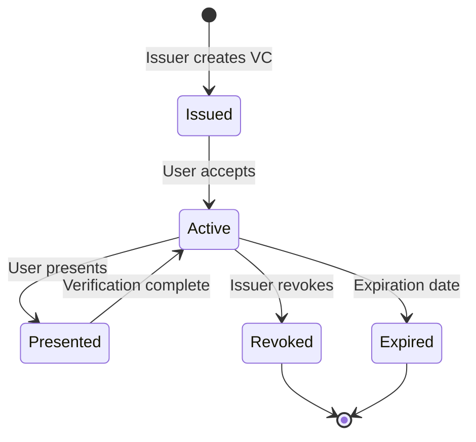

# Credential Model

This section describes the verifiable credentials model implemented in EUDIStack, following the specifications of the ARF (Architecture and Reference Framework) from the European Commission.

<div class="grid cards" markdown>

-   :material-graph:{ .lg .middle } **Ontology**

    ---

    Semantic structure and data model relationships

    [:octicons-arrow-right-24: View ontology](ontologia.md)

-   :material-code-json:{ .lg .middle } **Schemas**

    ---

    JSON Schema definitions for credentials

    [:octicons-arrow-right-24: View schemas](esquemas.md)

-   :material-card-account-details:{ .lg .middle } **Credential Types**

    ---

    Catalog of supported credential types

    [:octicons-arrow-right-24: View types](tipos-credencial.md)

</div>

## Overview

EUDIStack implements verifiable credentials following these standards:

- **W3C Verifiable Credentials Data Model 2.0**
- **ISO/IEC 18013-5 (mDL)** for mDOC credentials
- **SD-JWT VC** for selective disclosure credentials

### Supported Formats

| Format | Description | Use Case |
|--------|-------------|----------|
| **JWT VC** | JSON Web Token | Web interoperability |
| **SD-JWT VC** | Selective Disclosure JWT | Selective disclosure |
| **mDOC/mDL** | ISO 18013-5 | Identity documents |

## Credential Structure

A verifiable credential in EUDIStack has the following structure:

```json
{
  "@context": [
    "https://www.w3.org/2018/credentials/v1",
    "https://eudistack.example.com/contexts/v1"
  ],
  "type": ["VerifiableCredential", "VerifiableId"],
  "issuer": {
    "id": "did:web:issuer.eudistack.example.com",
    "name": "Government of Spain"
  },
  "issuanceDate": "2024-01-15T10:00:00Z",
  "expirationDate": "2029-01-15T10:00:00Z",
  "credentialSubject": {
    "id": "did:key:z6Mk...",
    "given_name": "Maria",
    "family_name": "Garcia",
    "birth_date": "1990-05-20",
    "nationality": "ES"
  },
  "credentialStatus": {
    "id": "https://issuer.eudistack.example.com/status/1",
    "type": "StatusList2021Entry",
    "statusListIndex": "94567",
    "statusListCredential": "https://issuer.eudistack.example.com/status-list/1"
  },
  "proof": {
    "type": "JsonWebSignature2020",
    "created": "2024-01-15T10:00:00Z",
    "verificationMethod": "did:web:issuer.eudistack.example.com#key-1",
    "proofPurpose": "assertionMethod",
    "jws": "eyJhbGciOiJFUzI1NiIs..."
  }
}
```

## Key Components

### Context (@context)

Defines the semantic vocabulary used in the credential:

```json
"@context": [
  "https://www.w3.org/2018/credentials/v1",
  "https://eudistack.example.com/contexts/v1"
]
```

### Type (type)

Identifies the credential type:

```json
"type": ["VerifiableCredential", "VerifiableId"]
```

### Issuer (issuer)

Information about who issues the credential:

```json
"issuer": {
  "id": "did:web:issuer.example.com",
  "name": "Issuing Entity"
}
```

### Subject (credentialSubject)

Data of the credential holder:

```json
"credentialSubject": {
  "id": "did:key:z6Mk...",
  "given_name": "Maria",
  "family_name": "Garcia"
}
```

### Status (credentialStatus)

Mechanism to verify if the credential has been revoked:

```json
"credentialStatus": {
  "type": "StatusList2021Entry",
  "statusListIndex": "94567",
  "statusListCredential": "https://issuer.example.com/status-list/1"
}
```

## Lifecycle



## Next Steps

- [:material-graph: Explore the ontology](ontologia.md)
- [:material-code-json: View JSON schemas](esquemas.md)
- [:material-card-account-details: Credential types](tipos-credencial.md)
