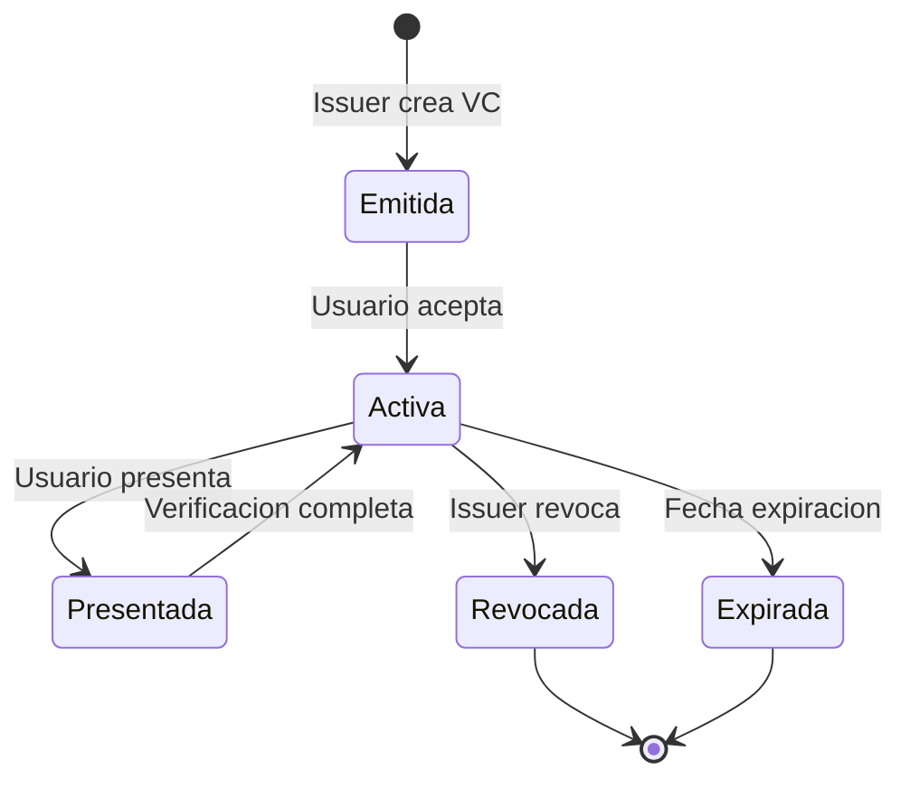

# Modelo de Credenciales

Esta seccion describe el modelo de credenciales verificables implementado en EUDIStack, siguiendo las especificaciones del ARF (Architecture and Reference Framework) de la Comision Europea.

<div class="grid cards" markdown>

-   :material-graph:{ .lg .middle } **Ontologia**

    ---

    Estructura semantica y relaciones del modelo de datos

    [:octicons-arrow-right-24: Ver ontologia](ontologia.md)

-   :material-code-json:{ .lg .middle } **Esquemas**

    ---

    Definiciones JSON Schema de las credenciales

    [:octicons-arrow-right-24: Ver esquemas](esquemas.md)

-   :material-card-account-details:{ .lg .middle } **Tipos de Credencial**

    ---

    Catalogo de tipos de credencial soportados

    [:octicons-arrow-right-24: Ver tipos](tipos-credencial.md)

</div>

## Vision general

EUDIStack implementa credenciales verificables siguiendo los estandares:

- **W3C Verifiable Credentials Data Model 2.0** - modelo de datos principal
- **IETF SD-JWT VC** - credenciales con revelacion selectiva
- **ISO/IEC 18013-5 (mDL)** - documentos de identidad moviles

El modelo se alinea con el **marco eIDAS 2** y el **EUDI Wallet ARF v2.4.0**, soportando credenciales empresariales como LEARCredential (mandatos digitales) y credenciales de cumplimiento Gaia-X.

### Formatos soportados

| Formato | Descripcion | Caso de uso |
|---------|-------------|-------------|
| **JWT VC** | JSON Web Token | Interoperabilidad web |
| **SD-JWT VC** | Selective Disclosure JWT | Divulgacion selectiva |
| **mDOC/mDL** | ISO 18013-5 | Documentos de identidad |

## Estructura de una credencial

Una credencial verificable en EUDIStack tiene la siguiente estructura:

```json
{
  "@context": [
    "https://www.w3.org/2018/credentials/v1",
    "https://eudistack.example.com/contexts/v1"
  ],
  "type": ["VerifiableCredential", "VerifiableId"],
  "issuer": {
    "id": "did:web:issuer.eudistack.example.com",
    "name": "Gobierno de Espana"
  },
  "issuanceDate": "2024-01-15T10:00:00Z",
  "expirationDate": "2029-01-15T10:00:00Z",
  "credentialSubject": {
    "id": "did:key:z6Mk...",
    "given_name": "Maria",
    "family_name": "Garcia",
    "birth_date": "1990-05-20",
    "nationality": "ES"
  },
  "credentialStatus": {
    "id": "https://issuer.eudistack.example.com/status/1",
    "type": "StatusList2021Entry",
    "statusListIndex": "94567",
    "statusListCredential": "https://issuer.eudistack.example.com/status-list/1"
  },
  "proof": {
    "type": "JsonWebSignature2020",
    "created": "2024-01-15T10:00:00Z",
    "verificationMethod": "did:web:issuer.eudistack.example.com#key-1",
    "proofPurpose": "assertionMethod",
    "jws": "eyJhbGciOiJFUzI1NiIs..."
  }
}
```

## Componentes clave

### Contexto (@context)

Define el vocabulario semantico utilizado en la credencial:

```json
"@context": [
  "https://www.w3.org/2018/credentials/v1",
  "https://eudistack.example.com/contexts/v1"
]
```

### Tipo (type)

Identifica el tipo de credencial:

```json
"type": ["VerifiableCredential", "VerifiableId"]
```

### Emisor (issuer)

Informacion sobre quien emite la credencial:

```json
"issuer": {
  "id": "did:web:issuer.example.com",
  "name": "Entidad Emisora"
}
```

### Sujeto (credentialSubject)

Datos del titular de la credencial:

```json
"credentialSubject": {
  "id": "did:key:z6Mk...",
  "given_name": "Maria",
  "family_name": "Garcia"
}
```

### Estado (credentialStatus)

Mecanismo para verificar si la credencial ha sido revocada:

```json
"credentialStatus": {
  "type": "StatusList2021Entry",
  "statusListIndex": "94567",
  "statusListCredential": "https://issuer.example.com/status-list/1"
}
```

## Ciclo de vida



## Siguientes pasos

- [:material-graph: Explorar la ontologia](ontologia.md)
- [:material-code-json: Ver esquemas JSON](esquemas.md)
- [:material-card-account-details: Tipos de credencial](tipos-credencial.md)
