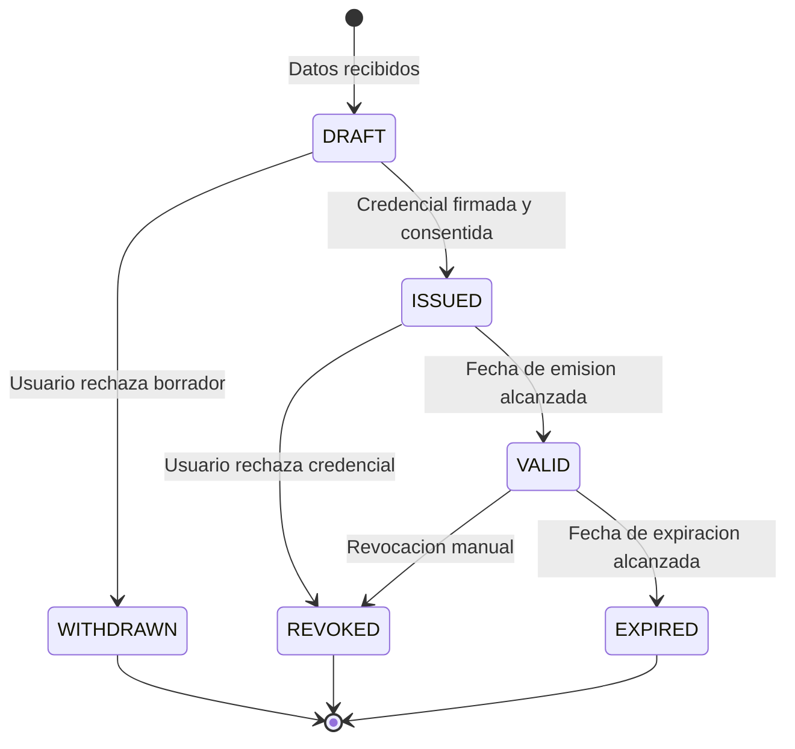

# Modelo de Credenciales

Esta seccion describe el modelo de credenciales verificables implementado en EUDIStack, siguiendo las especificaciones del ARF (Architecture and Reference Framework) de la Comision Europea.

<div class="grid cards" markdown>

-   :material-graph:{ .lg .middle } **Ontologia**

    ---

    Estructura semantica y relaciones del modelo de datos

    [:octicons-arrow-right-24: Ver ontologia](ontologia.md)

-   :material-code-json:{ .lg .middle } **Esquemas**

    ---

    Definiciones JSON Schema de las credenciales

    [:octicons-arrow-right-24: Ver esquemas](esquemas.md)

-   :material-card-account-details:{ .lg .middle } **Tipos de Credencial**

    ---

    Catalogo de tipos de credencial soportados

    [:octicons-arrow-right-24: Ver tipos](tipos-credencial.md)

</div>

## Vision general

EUDIStack implementa credenciales verificables siguiendo el estandar **W3C Verifiable Credentials Data Model 2.0**.

El modelo se alinea con el **marco eIDAS 2** y el **EUDI Wallet ARF v2.4.0**, soportando credenciales empresariales como LEARCredential (mandatos digitales) y credenciales de cumplimiento Gaia-X.

!!! note "Formato implementado"
    EUDIStack utiliza exclusivamente **JWT VC** (JSON Web Token Verifiable Credentials) siguiendo el W3C VC DM v2.0. Otros formatos contemplados en el EUDI Wallet ARF (SD-JWT VC, ISO mDoc) no estan implementados en esta version.

## Estructura de una credencial

Una credencial verificable en EUDIStack tiene la siguiente estructura. La credencial se firma externamente como JWT, por lo que no incluye un bloque `proof` embebido.

```json
{
  "@context": [
    "https://www.w3.org/ns/credentials/v2",
    "https://eudistack.example.com/contexts/v1"
  ],
  "id": "urn:uuid:12345678-1234-1234-1234-123456789abc",
  "type": ["VerifiableCredential", "VerifiableId"],
  "issuer": {
    "id": "did:elsi:VATES-A12345678",
    "organization": "Gobierno de Espana",
    "organizationIdentifier": "VATES-A12345678",
    "country": "ES"
  },
  "validFrom": "2024-01-15T10:00:00Z",
  "validUntil": "2029-01-15T10:00:00Z",
  "credentialSubject": {
    "id": "did:key:z6Mk...",
    "given_name": "Maria",
    "family_name": "Garcia",
    "birth_date": "1990-05-20",
    "nationality": "ES"
  },
  "credentialStatus": {
    "id": "https://issuer.eudistack.example.com/status/1#12345",
    "type": "BitstringStatusListEntry",
    "statusPurpose": "revocation",
    "statusListIndex": "12345",
    "statusListCredential": "https://issuer.eudistack.example.com/status/1"
  }
}
```

!!! info "Firma externa"
    La credencial se envuelve en un JWT firmado con el sello electronico del emisor. Los datos del sello (certificado X.509) se utilizan para construir el objeto `issuer`.

## Componentes clave

### Contexto (@context)

Define el vocabulario semantico utilizado en la credencial:

```json
"@context": [
  "https://www.w3.org/ns/credentials/v2",
  "https://eudistack.example.com/contexts/v1"
]
```

### Tipo (type)

Identifica el tipo de credencial:

```json
"type": ["VerifiableCredential", "VerifiableId"]
```

### Emisor (issuer)

Informacion sobre quien emite la credencial, construida a partir del sello electronico:

```json
"issuer": {
  "id": "did:elsi:VATES-A12345678",
  "organization": "Entidad Emisora",
  "organizationIdentifier": "VATES-A12345678",
  "country": "ES"
}
```

### Sujeto (credentialSubject)

Datos del titular de la credencial:

```json
"credentialSubject": {
  "id": "did:key:z6Mk...",
  "given_name": "Maria",
  "family_name": "Garcia"
}
```

### Estado (credentialStatus)

Mecanismo para verificar si la credencial ha sido revocada mediante Bitstring Status List:

```json
"credentialStatus": {
  "id": "https://issuer.example.com/status/1#12345",
  "type": "BitstringStatusListEntry",
  "statusPurpose": "revocation",
  "statusListIndex": "12345",
  "statusListCredential": "https://issuer.example.com/status/1"
}
```

## Ciclo de vida



| Estado | Descripcion |
|--------|-------------|
| **DRAFT** | Datos recibidos, credencial poblada, pendiente de vinculacion criptografica y firma |
| **WITHDRAWN** | Borrador retirado/cancelado por el usuario antes de ser emitido |
| **ISSUED** | Credencial firmada y consentida por el titular, pero cuya fecha de emision aun no ha llegado |
| **VALID** | Credencial valida y activa (fecha de emision ≤ ahora < fecha de expiracion) |
| **REVOKED** | Credencial revocada manualmente desde el Issuer o rechazada por el usuario |
| **EXPIRED** | Credencial cuya fecha de expiracion ha sido alcanzada |

!!! tip "Renovacion automatica"
    El sistema incluye un proceso automatico que detecta credenciales proximas a caducar para notificar y facilitar la emision de una nueva.

## Siguientes pasos

- [:material-graph: Explorar la ontologia](ontologia.md)
- [:material-code-json: Ver esquemas JSON](esquemas.md)
- [:material-card-account-details: Tipos de credencial](tipos-credencial.md)
