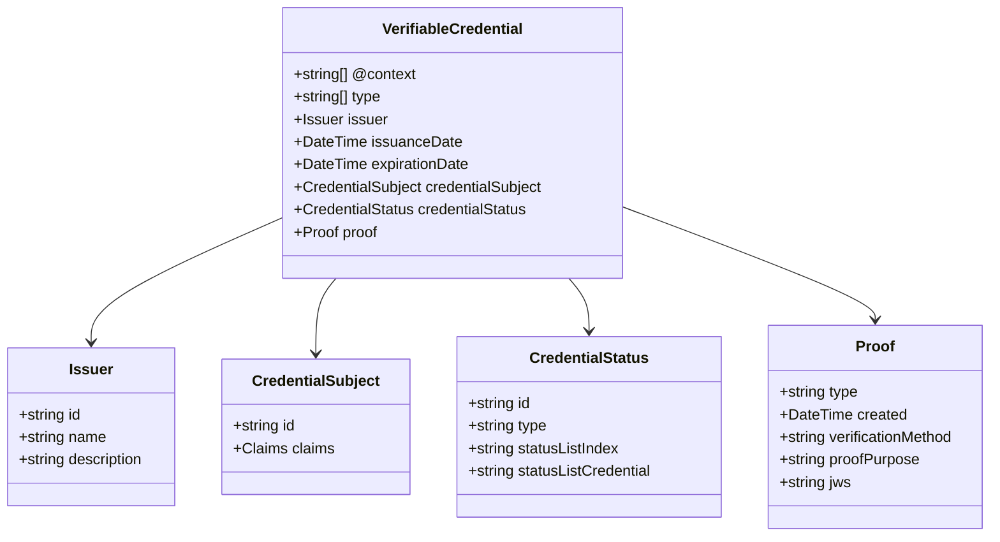
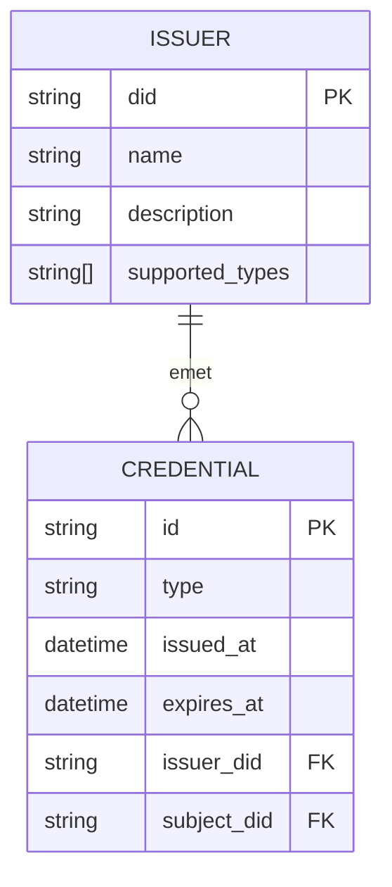
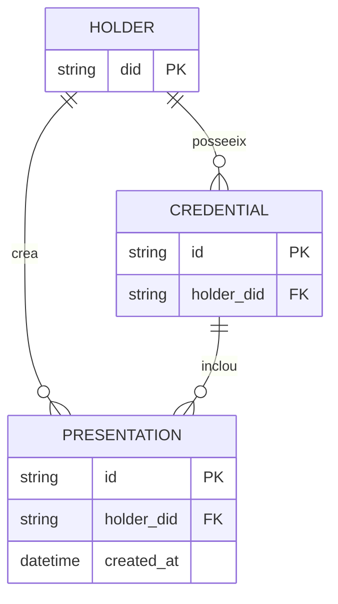

# Ontologia

L'ontologia d'EUDIStack defineix l'estructura semantica i les relacions entre els diferents elements del model de credencials verificables.

## Model conceptual



## Vocabularis utilitzats

EUDIStack utilitza els seguents vocabularis estandard:

### W3C Verifiable Credentials

| Terme | URI | Descripcio |
|-------|-----|------------|
| VerifiableCredential | `https://www.w3.org/2018/credentials#VerifiableCredential` | Classe base de credencial |
| issuer | `https://www.w3.org/2018/credentials#issuer` | Entitat emissora |
| credentialSubject | `https://www.w3.org/2018/credentials#credentialSubject` | Subjecte de la credencial |
| issuanceDate | `https://www.w3.org/2018/credentials#issuanceDate` | Data d'emissio |
| expirationDate | `https://www.w3.org/2018/credentials#expirationDate` | Data d'expiracio |

### Schema.org

| Terme | URI | Descripcio |
|-------|-----|------------|
| Person | `https://schema.org/Person` | Persona fisica |
| Organization | `https://schema.org/Organization` | Organitzacio |
| givenName | `https://schema.org/givenName` | Nom de pila |
| familyName | `https://schema.org/familyName` | Cognoms |
| birthDate | `https://schema.org/birthDate` | Data de naixement |

### EUDI-specific

| Terme | URI | Descripcio |
|-------|-----|------------|
| PersonIdentificationData | `https://eudi.example.com/vocab#PID` | Dades d'identificacio personal |
| nationality | `https://eudi.example.com/vocab#nationality` | Nacionalitat |
| documentNumber | `https://eudi.example.com/vocab#documentNumber` | Numero de document |

## Context JSON-LD

El context JSON-LD d'EUDIStack defineix els mappings semantics:

```json
{
  "@context": {
    "@version": 1.1,
    "@protected": true,

    "VerifiableCredential": "https://www.w3.org/2018/credentials#VerifiableCredential",
    "VerifiablePresentation": "https://www.w3.org/2018/credentials#VerifiablePresentation",

    "id": "@id",
    "type": "@type",

    "issuer": {
      "@id": "https://www.w3.org/2018/credentials#issuer",
      "@type": "@id"
    },

    "credentialSubject": {
      "@id": "https://www.w3.org/2018/credentials#credentialSubject",
      "@type": "@id"
    },

    "issuanceDate": {
      "@id": "https://www.w3.org/2018/credentials#issuanceDate",
      "@type": "http://www.w3.org/2001/XMLSchema#dateTime"
    },

    "expirationDate": {
      "@id": "https://www.w3.org/2018/credentials#expirationDate",
      "@type": "http://www.w3.org/2001/XMLSchema#dateTime"
    },

    "given_name": "https://schema.org/givenName",
    "family_name": "https://schema.org/familyName",
    "birth_date": "https://schema.org/birthDate",
    "nationality": "https://eudi.example.com/vocab#nationality",

    "VerifiableId": "https://eudi.example.com/credentials#VerifiableId",
    "VerifiableDiploma": "https://eudi.example.com/credentials#VerifiableDiploma"
  }
}
```

## Relacions entre entitats

### Emissor - Credencial

Un emissor pot emetre multiples credencials:



### Titular - Credencial

Un titular pot posseir multiples credencials:



## Tipus d'identificadors

### DIDs (Decentralized Identifiers)

EUDIStack suporta els seguents metodes DID:

| Metode | Exemple | Us |
|--------|---------|-----|
| `did:web` | `did:web:issuer.example.com` | Emissors institucionals |
| `did:key` | `did:key:z6Mk...` | Titulars (wallet) |
| `did:jwk` | `did:jwk:eyJr...` | Claus efimeres |

### URIs de credencials

Les credencials s'identifiquen mitjancant URIs unics:

```
urn:uuid:3978344f-8596-4c3a-a978-8fcaba3903c5
```

O URLs si estan allotjades:

```
https://issuer.example.com/credentials/12345
```

## Seguent pas

[:material-code-json: Veure esquemes JSON](esquemas.md){ .md-button }
