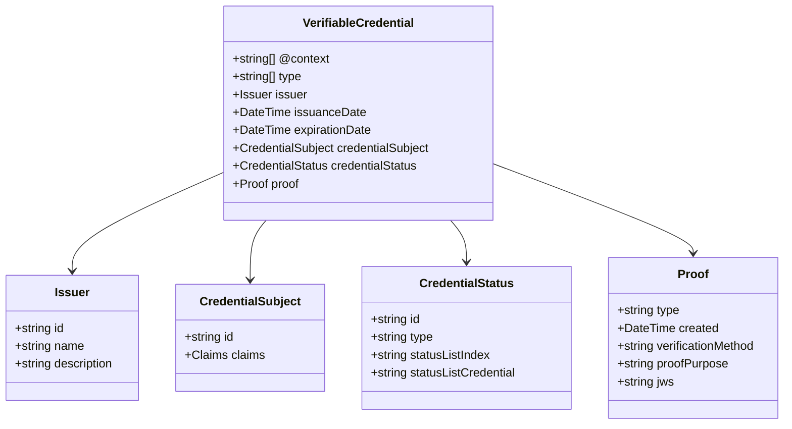
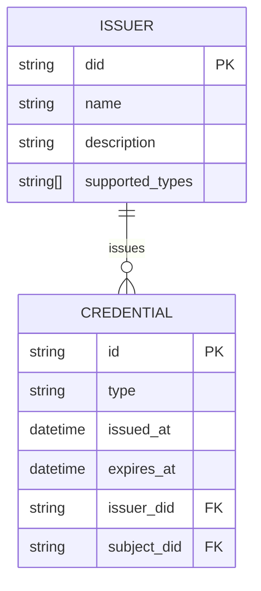
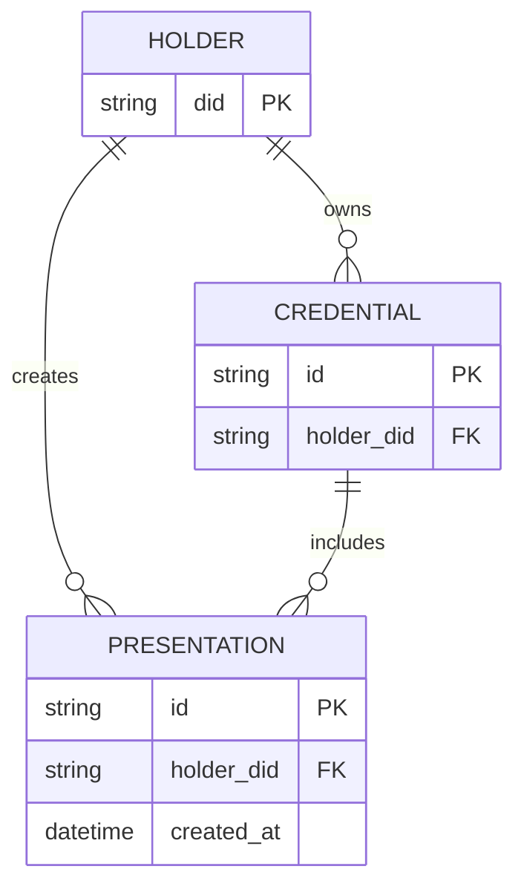

# Ontology

The EUDIStack ontology defines the semantic structure and relationships between different elements of the verifiable credentials model.

## Conceptual Model



## Vocabularies Used

EUDIStack uses the following standard vocabularies:

### W3C Verifiable Credentials

| Term | URI | Description |
|------|-----|-------------|
| VerifiableCredential | `https://www.w3.org/2018/credentials#VerifiableCredential` | Base credential class |
| issuer | `https://www.w3.org/2018/credentials#issuer` | Issuing entity |
| credentialSubject | `https://www.w3.org/2018/credentials#credentialSubject` | Credential subject |
| issuanceDate | `https://www.w3.org/2018/credentials#issuanceDate` | Issuance date |
| expirationDate | `https://www.w3.org/2018/credentials#expirationDate` | Expiration date |

### Schema.org

| Term | URI | Description |
|------|-----|-------------|
| Person | `https://schema.org/Person` | Natural person |
| Organization | `https://schema.org/Organization` | Organization |
| givenName | `https://schema.org/givenName` | First name |
| familyName | `https://schema.org/familyName` | Family name |
| birthDate | `https://schema.org/birthDate` | Date of birth |

### EUDI-specific

| Term | URI | Description |
|------|-----|-------------|
| PersonIdentificationData | `https://eudi.example.com/vocab#PID` | Personal identification data |
| nationality | `https://eudi.example.com/vocab#nationality` | Nationality |
| documentNumber | `https://eudi.example.com/vocab#documentNumber` | Document number |

## JSON-LD Context

The EUDIStack JSON-LD context defines semantic mappings:

```json
{
  "@context": {
    "@version": 1.1,
    "@protected": true,

    "VerifiableCredential": "https://www.w3.org/2018/credentials#VerifiableCredential",
    "VerifiablePresentation": "https://www.w3.org/2018/credentials#VerifiablePresentation",

    "id": "@id",
    "type": "@type",

    "issuer": {
      "@id": "https://www.w3.org/2018/credentials#issuer",
      "@type": "@id"
    },

    "credentialSubject": {
      "@id": "https://www.w3.org/2018/credentials#credentialSubject",
      "@type": "@id"
    },

    "issuanceDate": {
      "@id": "https://www.w3.org/2018/credentials#issuanceDate",
      "@type": "http://www.w3.org/2001/XMLSchema#dateTime"
    },

    "expirationDate": {
      "@id": "https://www.w3.org/2018/credentials#expirationDate",
      "@type": "http://www.w3.org/2001/XMLSchema#dateTime"
    },

    "given_name": "https://schema.org/givenName",
    "family_name": "https://schema.org/familyName",
    "birth_date": "https://schema.org/birthDate",
    "nationality": "https://eudi.example.com/vocab#nationality",

    "VerifiableId": "https://eudi.example.com/credentials#VerifiableId",
    "VerifiableDiploma": "https://eudi.example.com/credentials#VerifiableDiploma"
  }
}
```

## Entity Relationships

### Issuer - Credential

An issuer can issue multiple credentials:



### Holder - Credential

A holder can possess multiple credentials:



## Identifier Types

### DIDs (Decentralized Identifiers)

EUDIStack supports the following DID methods:

| Method | Example | Use |
|--------|---------|-----|
| `did:web` | `did:web:issuer.example.com` | Institutional issuers |
| `did:key` | `did:key:z6Mk...` | Holders (wallet) |
| `did:jwk` | `did:jwk:eyJr...` | Ephemeral keys |

### Credential URIs

Credentials are identified by unique URIs:

```
urn:uuid:3978344f-8596-4c3a-a978-8fcaba3903c5
```

Or URLs if hosted:

```
https://issuer.example.com/credentials/12345
```

## Next Step

[:material-code-json: View JSON schemas](esquemas.md){ .md-button }
