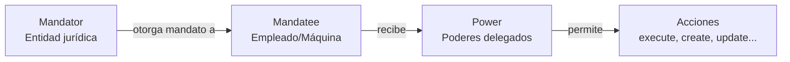
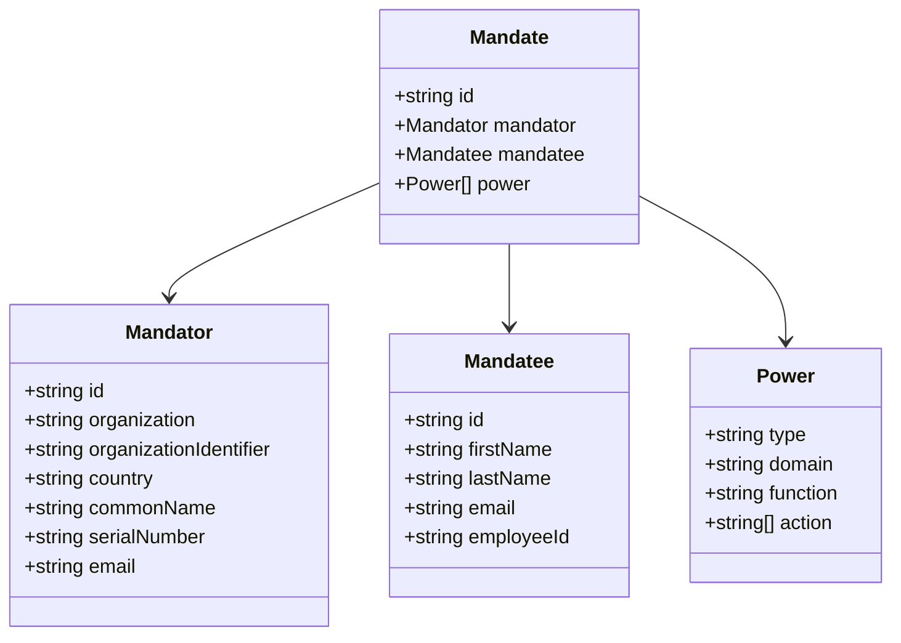
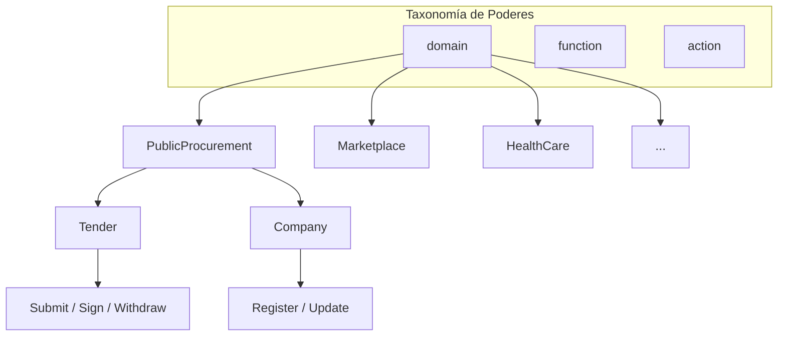

# Ontología de Credenciales

## Introducción

Este documento define la ontología y los principios fundamentales que sustentan el uso de Credenciales Verificables en EUDIStack, particularmente en su aplicación a:

- **Representación legal de entidades** - mediante mandatos digitales
- **Autenticación de máquinas y servicios** - para flujos M2M
- **Certificación de cumplimiento normativo** - mediante credenciales de conformidad

EUDIStack implementa el estándar **W3C Verifiable Credentials Data Model v2.0** como único formato de credenciales verificables.

!!! note "Formato implementado"
    EUDIStack utiliza exclusivamente **W3C VC DM v2.0**. Otros formatos como SD-JWT VC o ISO mDoc, aunque contemplados en el EUDI Wallet ARF, no están implementados en esta versión.

El marco legal está proporcionado por el **reglamento eIDAS2** y los lineamientos técnicos del **EUDI Wallet ARF v2.4.0**.

---

## Marco de referencia

### W3C Verifiable Credentials v2.0

EUDIStack utiliza **W3C Verifiable Credentials Data Model v2.0** como estándar de datos para la representación estructurada y verificable de afirmaciones sobre entidades.

Este estándar permite:

- Enriquecer credenciales con semántica explícita (`@context`)
- Definir tipologías especializadas (`type`)
- Implementar mecanismos de firma compatibles con **JAdES** y **AdESeal**

!!! info "Otros formatos del ecosistema EUDI"
    El EUDI Wallet ARF contempla también otros formatos como **SD-JWT VC** (revelación selectiva) e **ISO/IEC 18013-5 mDoc** (documentos de identidad móviles). Estos formatos no están implementados actualmente en EUDIStack, pero el modelo de datos es compatible para una futura extensión.

---

### Relación con eIDAS 2 y EUDI Wallet ARF

La elección de este modelo se alinea con el **Marco de Identidad Digital Europeo (eIDAS2)**, que contempla la emisión de mandatos digitales y representaciones electrónicas como instrumentos clave para habilitar interacciones confiables.

El uso de **LEARCredential** como forma estandarizada de e-Mandato permite:

- [x] Representar legalmente poderes delegados por una organización a un empleado, dispositivo o servicio
- [x] Aprovechar el marco legal europeo y la presunción de no repudio mediante firmas cualificadas
- [x] Garantizar la interoperabilidad con el ARF del EUDI Wallet mediante OpenID4VCI

!!! success "Alineación estratégica"
    Esta alineación garantiza que la LEARCredential pueda ser adoptada como una credencial interoperable y jurídicamente sólida, facilitando su integración en los ecosistemas nacionales y europeos de identidad digital.

---

### LEARCredential como mandato digital

Aunque el término **LEAR** (Legal Entity Appointed Representative) proviene de los procesos de onboarding de la Comisión Europea, en nuestro modelo `LEARCredential` representa un **mandato otorgado formalmente** por una persona jurídica a un sujeto concreto —empleado, máquina o servicio— para actuar en su nombre.

#### Estructura ontológica del mandato

La estructura sigue el patrón:

```
mandante → mandatario → poder
```



Este modelo refleja una delegación clara y auditable de autoridad, donde una credencial puede ser simultáneamente:

- **VerifiableID** - mecanismo de autenticación
- **VerifiableAuthorization** - mecanismo de autorización

#### Ontología RPaM

El modelo de datos de la LEARCredential se basa en la **Ontología RPaM** (Representation of Powers and Mandates), un proyecto iniciado en 2018 por la DG DIGIT de la Comisión Europea, financiado por el Programa ISA².

!!! note "Adaptación de RPaM"
    Adaptamos los resultados del proyecto RPaM con simplificaciones y especializaciones al entorno concreto de EUDIStack. Se recomienda consultar el [Glosario de la Ontología RPaM](https://joinup.ec.europa.eu/collection/rpam) para obtener más detalles.

---

### Representación semántica de entidades técnicas

En el caso de `LEARCredentialMachine`, distinguimos dos niveles semánticos:

| Nivel | Descripción | Uso |
|-------|-------------|-----|
| **Identidades funcionales básicas** | Permiten a servicios o dispositivos identificarse como pertenecientes a una organización, sin poderes explícitos | Autenticación simple |
| **Agentes delegados** | Actúan como *principals* con capacidad de acción gracias a poderes representados formalmente | Control de acceso (ACLs, ABAC) |

Ambos casos están cubiertos por el modelo `credentialSubject.mandate`, y la diferencia semántica reside en la presencia o no de objetos `power`.

---

### Ontología del mandato y formalismo legal

Las estructuras de mandato (`mandate`) utilizadas en el modelo están inspiradas en conceptos legales:

| Concepto | Descripción |
|----------|-------------|
| `mandator` | Entidad jurídica que otorga el mandato (empresa o su representante legal) |
| `mandatee` | Sujeto (natural o técnico) que recibe el poder |
| `power` | Conjunto formal de capacidades otorgadas |



!!! tip "Interoperabilidad"
    Este enfoque facilita la validación automática, interoperabilidad entre ecosistemas y trazabilidad legal de los actos realizados bajo mandato. Los poderes pueden expresarse mediante lenguajes como **ODRL** (Open Digital Rights Language).

---

### Taxonomía de poderes (Powers)

Los **poderes** (`power`) representan **capacidades legales abstractas** que un mandante delega a un mandatario. Es fundamental entender qué son los poderes y qué **no** son.

#### ¿Qué es un poder?

Un poder es una **declaración de capacidad legal**, no un permiso técnico. Cuando una organización otorga a un empleado el poder `Onboarding - Execute`, está declarando legalmente:

> "Esta persona tiene la capacidad de ejecutar procesos de onboarding en nombre de nuestra organización"

!!! warning "Poder ≠ Permiso técnico"
    Un poder **no** es:

    - Un rol en un sistema (como "admin" o "editor")
    - Un permiso de acceso a una API
    - Una regla de firewall o ACL

    Un poder **es**:

    - Una capacidad legal delegada formalmente
    - Una declaración verificable de autoridad
    - Un atributo que puede ser interpretado por diferentes sistemas

#### Poderes vs Políticas vs Roles

Es común confundir estos tres conceptos. La siguiente tabla clarifica sus diferencias:

| Concepto | Naturaleza | Quién lo define | Ejemplo |
|----------|------------|-----------------|---------|
| **Poder** | Capacidad legal abstracta | El mandante (organización) | "Puede ejecutar onboardings" |
| **Política** | Regla de negocio que interpreta poderes | El sistema/plataforma | "Solo usuarios con poder Onboarding-Execute pueden registrar empresas" |
| **Rol** | Agrupación de permisos técnicos | El administrador del sistema | "Rol 'gestor' tiene acceso a /api/companies" |

```mermaid
flowchart LR
    subgraph Credencial["LEARCredential"]
        P[Power<br/>Onboarding - Execute]
    end

    subgraph Sistema["Sistema receptor"]
        POL[Política<br/>"Requiere poder Onboarding"]
        ROL[Rol asignado<br/>"gestor_onboarding"]
        PERM[Permisos técnicos<br/>POST /api/register]
    end

    P -->|presenta| POL
    POL -->|evalúa y asigna| ROL
    ROL -->|otorga| PERM
```

#### Ejemplo práctico: El poder de firmar contratos

Imaginemos una empresa de construcción que delega poderes a sus empleados:

**Escenario**: CONSTRUCCIONES ACME, S.A. tiene varios empleados que interactúan con diferentes plataformas de contratación pública.

| Empleado | Poder delegado | Significado legal |
|----------|----------------|-------------------|
| María García | `Contracts - Sign` | Puede firmar contratos en nombre de ACME |
| Juan López | `Contracts - Submit` | Puede presentar ofertas, pero NO firmar |
| Ana Ruiz | `Contracts - Sign`, `Contracts - Submit` | Puede presentar Y firmar |

**¿Cómo interpreta cada plataforma estos poderes?**

=== "Plataforma de Licitaciones UE"

    La plataforma EU Tenders define su **política**:

    - Solo el LEAR puede ejecutar el onboarding inicial
    - `Contracts - Sign` permite firmar ofertas vinculantes
    - `Contracts - Submit` permite subir documentación

    María puede firmar, Juan solo puede subir documentos.

=== "Portal de Contratación Nacional"

    Este portal tiene una **política diferente**:

    - Cualquier empleado con `Contracts - Submit` puede registrar la empresa
    - `Contracts - Sign` solo se requiere en la adjudicación final

    Juan puede registrar la empresa aquí, aunque no pueda en EU Tenders.

=== "Marketplace B2B"

    El marketplace interpreta los poderes de otra forma:

    - No distingue entre Sign y Submit
    - Cualquier poder relacionado con `Contracts` da acceso completo

    Todos los empleados tienen los mismos permisos aquí.

!!! tip "El poder es portable, la política es local"
    El mismo poder (`Contracts - Sign`) viaja en la credencial del empleado a todas las plataformas. Cada plataforma decide, mediante sus **políticas**, qué acciones técnicas permite a quien posee ese poder.

#### Estructura del poder

Cada poder se define mediante cuatro atributos:

| Atributo | Descripción | Ejemplo |
|----------|-------------|---------|
| `type` | Tipo de poder (actualmente siempre `domain`) | `domain` |
| `domain` | Ecosistema o ámbito donde aplica el poder | `PublicProcurement` |
| `function` | Función o capacidad abstracta | `Contracts` |
| `action` | Verbo(s) que describen la capacidad | `["Sign", "Submit"]` |

!!! info "Sobre el atributo `domain`"
    El `domain` **no** es la organización que otorga el poder. Es el **ecosistema o ámbito** donde ese poder tiene significado. Por ejemplo:

    - `PublicProcurement` → Contratación pública
    - `HealthCare` → Sector sanitario
    - `Finance` → Sector financiero

    Una misma organización puede otorgar poderes en diferentes dominios.

#### Ejemplos de poderes por dominio

=== "Contratación Pública"

    | Domain | Function | Action | Significado |
    |--------|----------|--------|-------------|
    | `PublicProcurement` | `Tender` | `Submit` | Presentar ofertas a licitaciones |
    | `PublicProcurement` | `Tender` | `Sign` | Firmar ofertas vinculantes |
    | `PublicProcurement` | `Tender` | `Withdraw` | Retirar ofertas presentadas |
    | `PublicProcurement` | `Company` | `Register` | Registrar la empresa en plataformas |

=== "Marketplace Digital"

    | Domain | Function | Action | Significado |
    |--------|----------|--------|-------------|
    | `Marketplace` | `Onboarding` | `Execute` | Ejecutar el proceso de registro |
    | `Marketplace` | `ProductOffering` | `Create` | Crear ofertas de productos |
    | `Marketplace` | `ProductOffering` | `Update` | Modificar ofertas existentes |
    | `Marketplace` | `ProductOffering` | `Delete` | Eliminar ofertas |
    | `Marketplace` | `Certification` | `Attest` | Atestar certificaciones de productos |

=== "Sector Sanitario"

    | Domain | Function | Action | Significado |
    |--------|----------|--------|-------------|
    | `HealthCare` | `Prescription` | `Issue` | Emitir recetas médicas |
    | `HealthCare` | `Prescription` | `Dispense` | Dispensar medicamentos |
    | `HealthCare` | `MedicalRecord` | `Read` | Consultar historiales |
    | `HealthCare` | `MedicalRecord` | `Write` | Actualizar historiales |

#### Ejemplo JSON de poderes

```json
"power": [
  {
    "type": "domain",
    "domain": "PublicProcurement",
    "function": "Tender",
    "action": ["Submit", "Sign"]
  },
  {
    "type": "domain",
    "domain": "PublicProcurement",
    "function": "Company",
    "action": ["Register"]
  }
]
```

Este empleado puede:

- Presentar y firmar ofertas en licitaciones públicas
- Registrar su empresa en plataformas de contratación

#### Origen: Ontología RPaM

La taxonomía de poderes se basa en la **Ontología RPaM** (Representation of Powers and Mandates), desarrollada por la DG-DIGIT de la Comisión Europea bajo el programa ISA².

El proyecto RPaM define un marco conceptual para representar:

- **Poderes**: capacidades legales delegadas
- **Mandatos**: actos formales de delegación
- **Representación**: relación entre mandante y mandatario

!!! abstract "Referencias RPaM"
    - [RPaM Ontology Development Report](https://github.com/everis-rpam/RPaM-Ontology/wiki/Ontology-Development-Report)
    - [RPaM Glossary](https://everis-rpam.github.io/Glossary.html)
    - [ISA² Programme](https://ec.europa.eu/isa2/home_en/)

#### Extensibilidad y gobernanza

La taxonomía de poderes es **extensible**. Cada ecosistema puede definir sus propios dominios, funciones y acciones, manteniendo la compatibilidad con el modelo base.



!!! note "Gobernanza de la taxonomía"
    La definición de nuevos poderes debe seguir un proceso de gobernanza que garantice:

    - **Consistencia semántica**: los poderes deben ser claros y no ambiguos
    - **Interoperabilidad**: diferentes sistemas deben interpretar el poder de forma similar
    - **Trazabilidad legal**: el poder debe tener un fundamento jurídico claro

---

## Credenciales Verificables

### LEARCredentialEmployee

La `LEARCredentialEmployee` es una credencial verificable emitida a favor de una **persona física (empleada)** que actúa en representación de una entidad jurídica.

Formaliza mediante un mandato digital los poderes otorgados por una organización a un trabajador identificado, bajo el marco legal del eIDAS 2.

!!! info "Caso de uso"
    Especialmente relevante en contextos donde los flujos requieren no solo autenticación del sujeto, sino también verificación del rol, autoridad y poderes funcionales delegados.

#### Formato W3C VC DM v2.0

La credencial tiene los siguientes campos de primer nivel:

| Campo | Descripción |
|-------|-------------|
| `@context` | Contextos JSON-LD |
| `id` | Identificador único de la credencial |
| `type` | Tipos de la credencial |
| `issuer` | Información del emisor |
| `validFrom` / `validUntil` | Período de validez |
| `credentialSubject` | Datos del mandato |
| `credentialStatus` | Estado de revocación |

##### Ejemplo W3C VC

```json title="sample/lear-credential-employee-v3.json"
--8<-- "docs/modelo-credenciales/sample/lear-credential-employee-v3.json"
```

---

### LEARCredentialMachine

La `LEARCredentialMachine` es una credencial verificable emitida a favor de una **entidad técnica** (máquina, servicio o dispositivo) que actúa en representación de una organización legal.

Su semántica responde al patrón legal `mandator → mandatee → power`, representando una delegación explícita de poderes técnicos y funcionales, firmada y auditable.

#### Estructura

| Atributo | Cardinalidad | Tipo | Descripción |
|----------|--------------|------|-------------|
| `@context` | REQUIRED | Array | Hereda del estándar W3C v2 + contexto específico |
| `type` | REQUIRED | Array | Incluye `VerifiableCredential` y `LEARCredentialMachine` |
| `name` | OPTIONAL | String | Nombre de la credencial |
| `description` | OPTIONAL | String | Descripción o propósito |
| `issuer` | REQUIRED | Object | Entidad certificadora |
| `credentialSubject.mandate.id` | REQUIRED | String | Identificador único (UUID o URN) |
| `credentialSubject.mandate.mandator` | REQUIRED | Object | Persona jurídica que otorga el mandato |
| `credentialSubject.mandate.mandatee` | REQUIRED | Object | Identidad técnica (DID, dominio, IP) |
| `credentialSubject.mandate.power` | REQUIRED | Array | Lista de poderes conferidos |
| `validFrom` / `validUntil` | REQUIRED | String | Período de validez legal |
| `credentialStatus` | REQUIRED | Object | Método de revocación |

#### Ejemplo (Agente)

```json title="sample/lear-credential-machine-v2.json"
--8<-- "docs/modelo-credenciales/sample/lear-credential-machine-v2.json"
```

!!! success "Beneficios"
    Esta credencial permite que una máquina actúe como agente técnico de una organización, ejecutando procesos de onboarding y otras acciones. Garantiza:

    - **Seguridad legal**: mediante firma electrónica avanzada
    - **Trazabilidad y control**: poderes explícitamente declarados
    - **Autonomía técnica**: flujos M2M sin intervención humana

---

### gx:LabelCredential

La **Gaia-X Label Credential** es una credencial verificable que representa el cumplimiento de un conjunto de criterios técnicos, organizativos y legales por parte de un Cloud Service Provider (CSP).

Estas credenciales están diseñadas conforme al marco de Gaia-X y estructuradas con el estándar W3C VC v2.0, utilizando contextos semánticos específicos (`gx:`).

#### Estructura

| Atributo | Cardinalidad | Descripción |
|----------|--------------|-------------|
| `type` | REQUIRED | Incluye `gx:LabelCredential` |
| `credentialSubject` | REQUIRED | Vincula al identificador del servicio |
| `gx:labelLevel` | REQUIRED | Nivel de cumplimiento (`BL` = Baseline) |
| `gx:engineVersion` | REQUIRED | Versión del compliance engine |
| `gx:rulesVersion` | REQUIRED | Versión del rulesBook (ej: `CD25.03`) |
| `gx:compliantCredentials` | REQUIRED | Lista de criterios cumplidos |
| `gx:validatedCriteria` | REQUIRED | Lista de criterios validados |

#### Tipos de cumplimiento

| Tipo | Descripción |
|------|-------------|
| `gx:DataProtection` | Protección de datos |
| `gx:Cybersecurity` | Ciberseguridad |
| `gx:Portability` | Portabilidad |
| `gx:Sustainability` | Sostenibilidad |
| `gx:EuropeanControl` | Control europeo |

#### Ejemplo

```json title="sample/gx-label-credential.json"
--8<-- "docs/modelo-credenciales/sample/gx-label-credential.json"
```

#### Relación con Gaia-X

Gaia-X establece más de 60 criterios de cumplimiento agrupados en áreas como protección de datos, ciberseguridad, portabilidad, control europeo y sostenibilidad.

!!! info "Perfil DOME"
    El ecosistema DOME define un perfil propio basado en **20 criterios obligatorios**, recogidos en el DOME Compliance Policy v1.0.

#### Ontología

Todos los identificadores están definidos mediante el namespace `gx:` disponible en:

- [https://w3id.org/gaia-x/specs](https://w3id.org/gaia-x/specs)
- [Gaia-X Service Characteristics](https://gaia-x.eu/)

---

## Revocación de credenciales

El mecanismo de revocación garantiza que un verificador pueda conocer de forma fiable y en tiempo casi real si una credencial sigue siendo válida.

### Bitstring Status List

EUDIStack implementa la especificación **Bitstring Status List v1.0** (W3C, mayo 2025), que introduce un mecanismo eficiente y preservador de la privacidad mediante estructuras de bitstring.

Este mecanismo permite:

- Validar en tiempo real la vigencia de las credenciales
- Escalar a millones de entradas con coste mínimo
- Garantizar la privacidad del titular

### Beneficios

En conjunto, estos mecanismos permiten:

- [x] Verificar en tiempo real la validez de las credenciales
- [x] Integrar la comprobación en servicios de verificación estándar
- [x] Evitar accesos indebidos tras finalización de contrato, cambio de rol o sospecha de mal uso

---

## Siguiente paso

[:material-code-json: Ver esquemas JSON](esquemas.md){ .md-button }
