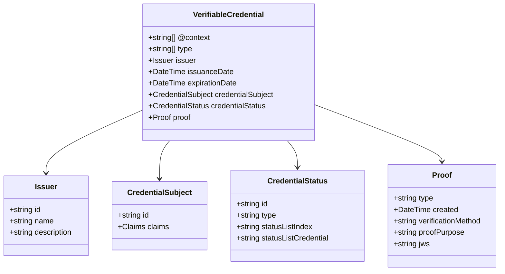
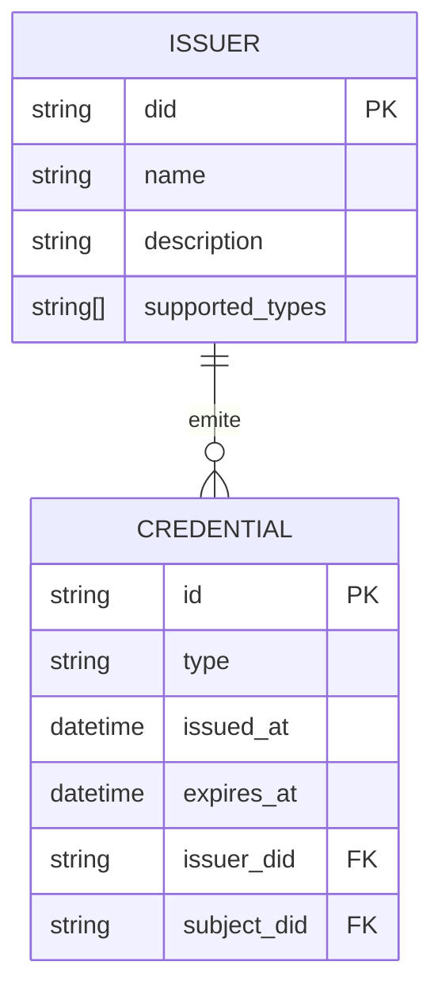
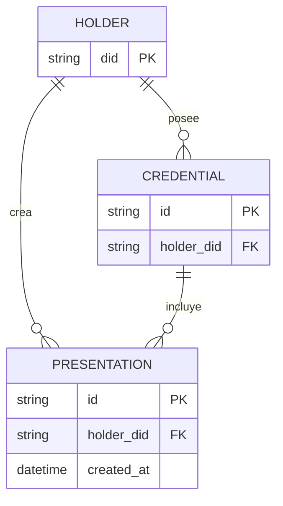

# Ontologia

La ontologia de EUDIStack define la estructura semantica y las relaciones entre los diferentes elementos del modelo de credenciales verificables.

## Modelo conceptual



## Vocabularios utilizados

EUDIStack utiliza los siguientes vocabularios estandar:

### W3C Verifiable Credentials

| Termino | URI | Descripcion |
|---------|-----|-------------|
| VerifiableCredential | `https://www.w3.org/2018/credentials#VerifiableCredential` | Clase base de credencial |
| issuer | `https://www.w3.org/2018/credentials#issuer` | Entidad emisora |
| credentialSubject | `https://www.w3.org/2018/credentials#credentialSubject` | Sujeto de la credencial |
| issuanceDate | `https://www.w3.org/2018/credentials#issuanceDate` | Fecha de emision |
| expirationDate | `https://www.w3.org/2018/credentials#expirationDate` | Fecha de expiracion |

### Schema.org

| Termino | URI | Descripcion |
|---------|-----|-------------|
| Person | `https://schema.org/Person` | Persona fisica |
| Organization | `https://schema.org/Organization` | Organizacion |
| givenName | `https://schema.org/givenName` | Nombre de pila |
| familyName | `https://schema.org/familyName` | Apellidos |
| birthDate | `https://schema.org/birthDate` | Fecha de nacimiento |

### EUDI-specific

| Termino | URI | Descripcion |
|---------|-----|-------------|
| PersonIdentificationData | `https://eudi.example.com/vocab#PID` | Datos de identificacion personal |
| nationality | `https://eudi.example.com/vocab#nationality` | Nacionalidad |
| documentNumber | `https://eudi.example.com/vocab#documentNumber` | Numero de documento |

## Contexto JSON-LD

El contexto JSON-LD de EUDIStack define los mappings semanticos:

```json
{
  "@context": {
    "@version": 1.1,
    "@protected": true,

    "VerifiableCredential": "https://www.w3.org/2018/credentials#VerifiableCredential",
    "VerifiablePresentation": "https://www.w3.org/2018/credentials#VerifiablePresentation",

    "id": "@id",
    "type": "@type",

    "issuer": {
      "@id": "https://www.w3.org/2018/credentials#issuer",
      "@type": "@id"
    },

    "credentialSubject": {
      "@id": "https://www.w3.org/2018/credentials#credentialSubject",
      "@type": "@id"
    },

    "issuanceDate": {
      "@id": "https://www.w3.org/2018/credentials#issuanceDate",
      "@type": "http://www.w3.org/2001/XMLSchema#dateTime"
    },

    "expirationDate": {
      "@id": "https://www.w3.org/2018/credentials#expirationDate",
      "@type": "http://www.w3.org/2001/XMLSchema#dateTime"
    },

    "given_name": "https://schema.org/givenName",
    "family_name": "https://schema.org/familyName",
    "birth_date": "https://schema.org/birthDate",
    "nationality": "https://eudi.example.com/vocab#nationality",

    "VerifiableId": "https://eudi.example.com/credentials#VerifiableId",
    "VerifiableDiploma": "https://eudi.example.com/credentials#VerifiableDiploma"
  }
}
```

## Relaciones entre entidades

### Emisor - Credencial

Un emisor puede emitir multiples credenciales:



### Titular - Credencial

Un titular puede poseer multiples credenciales:



## Tipos de identificadores

### DIDs (Decentralized Identifiers)

EUDIStack soporta los siguientes metodos DID:

| Metodo | Ejemplo | Uso |
|--------|---------|-----|
| `did:web` | `did:web:issuer.example.com` | Emisores institucionales |
| `did:key` | `did:key:z6Mk...` | Titulares (wallet) |
| `did:jwk` | `did:jwk:eyJr...` | Claves efimeras |

### URIs de credenciales

Las credenciales se identifican mediante URIs unicos:

```
urn:uuid:3978344f-8596-4c3a-a978-8fcaba3903c5
```

O URLs si estan alojadas:

```
https://issuer.example.com/credentials/12345
```

## Siguiente paso

[:material-code-json: Ver esquemas JSON](esquemas.md){ .md-button }
