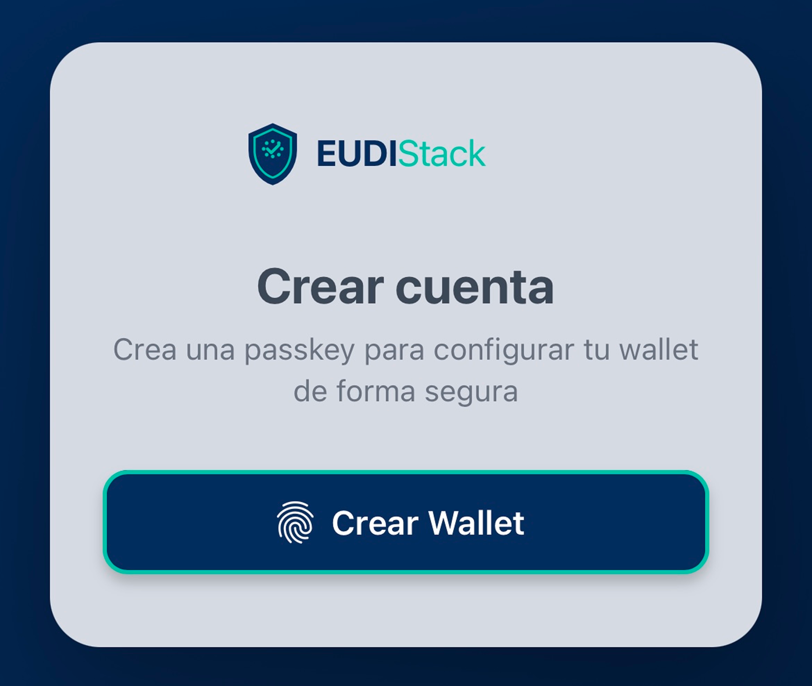
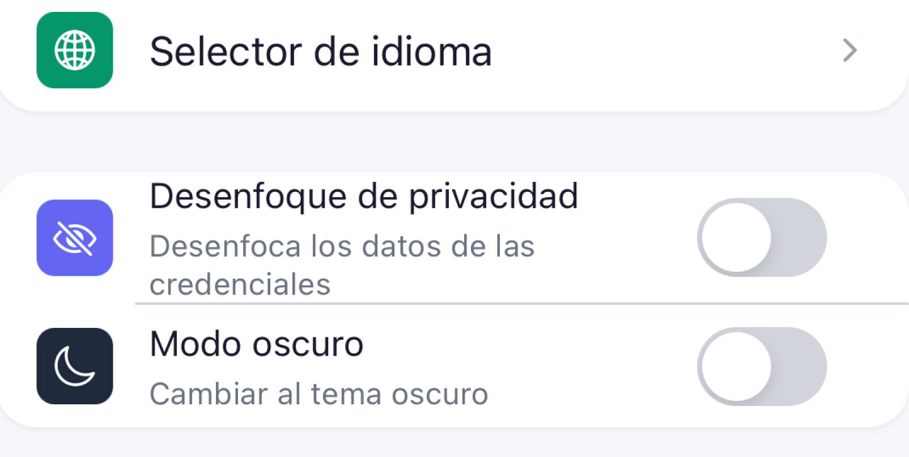

# Primeros pasos — EUDIW

<!-- TODO: contenido pendiente -->

Esta guía te llevará paso a paso por la primera configuración del Wallet EUDIW: instalación como PWA <small>*(Progressive Web App — instalable desde el navegador)*</small>, alta de passkey, ajustes recomendados y verificación de que el wallet está operativo.

## Requisitos

- Navegador moderno (Chrome, Edge, Safari, Firefox actualizado).
- Dispositivo compatible con WebAuthn / Passkey (PRF).
- Conexión a internet para el alta inicial.

## Pasos

1. **Abrir el wallet**: navega a la URL del wallet de tu organización.
2. **Crear passkey**: el wallet pedirá registrar un passkey con tu biometría o PIN.
    { width="320" }
3. **Confirmar configuración**: revisa idioma, modo claro/oscuro y privacidad.
    { width="320" }

<!-- TODO: insertar capturas paso a paso -->

## Siguiente paso

[Recibir tu primera credencial →](receive-credentials.md)
