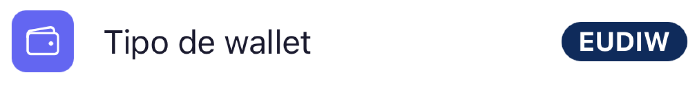

# Wallet — EUDIW

EUDIW (European Digital Identity Wallet) es la versión **personal** del wallet de EUDIStack. Las claves criptográficas y las credenciales se generan y almacenan **en tu dispositivo** (modo *Browser*), protegidas con passkey/biometría.

!!! tip "¿Cómo sé que estoy en EUDIW?"
    Abre **Ajustes**. En el campo **Tipo de wallet** verás el modo activo: `EUDIW` corresponde al wallet personal y `Business Wallet` al organizacional.
    
    { width="320" }

## En esta sección

-   :material-rocket-launch: [**Primeros pasos**](getting-started.md)

    Instala el wallet, configura tu passkey y prepara el dispositivo.

-   :material-download: [**Recibir credenciales**](receive-credentials.md)

    Cómo aceptar una credencial emitida por un Issuer (QR o enlace).

-   :material-share: [**Presentar credenciales**](present-credentials.md)

    Cómo compartir tus credenciales con un Verifier de forma selectiva.

-   :material-folder-account: [**Gestionar credenciales**](manage-credentials.md)

    Ver y eliminar credenciales del wallet.

<!-- TODO: añadir capturas reales del wallet PWA en modo browser -->
