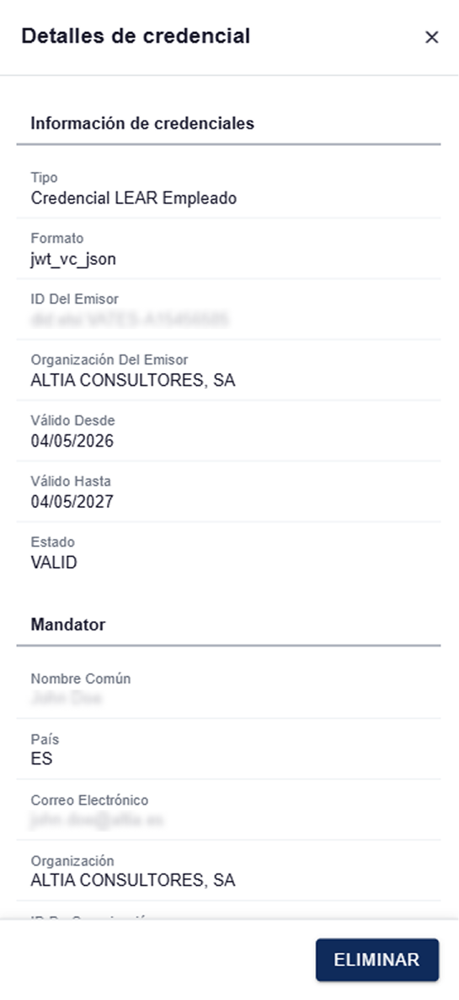
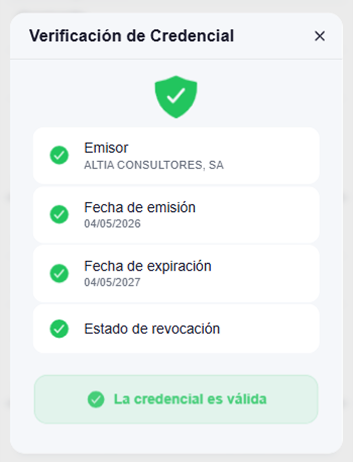
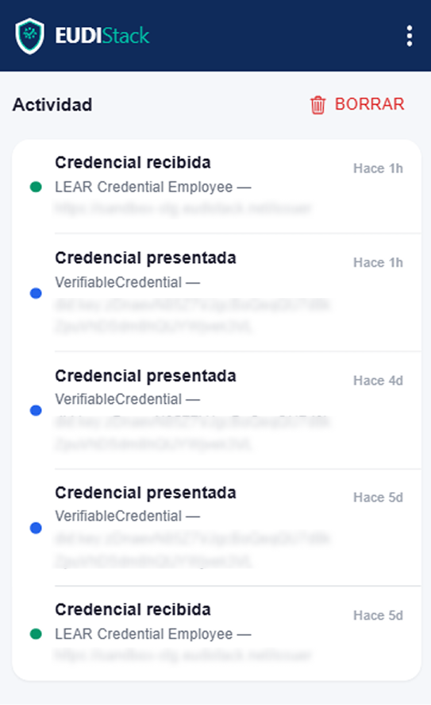

# Gestionar credenciales — EUDIW

<!-- TODO: contenido pendiente -->

Cómo consultar y eliminar credenciales del wallet.

## Pestaña Credenciales

Lista todas las credenciales activas con:

- Tipo de credencial (Employee, ID, Estudios...).
- Emisor.
- Estado (válida, expirada, revocada).
- Fecha de emisión y caducidad.

## Acciones

- **Ver detalle**: muestra todos los atributos de la credencial.

    <figure markdown style="display: table; margin-left: 0;">
      { width="300" }
    </figure>
    
- **Verificar credencial**: comprueba la validez de la credencial en el momento. Muestra el emisor, la fecha de emisión, la fecha de expiración y el estado de revocación.

    <figure markdown style="display: table; margin-left: 0;">
      { width="240" }
    </figure>

- **Eliminar**: borra la credencial localmente (no la revoca en el emisor).

## Actividad

Accede a través de **Ajustes → Actividad**. Lista cada presentación enviada y cada credencial recibida, con timestamp y verifier/issuer asociado.

<figure markdown style="display: table; margin-left: 0;">
{ width="320" }
</figure>

<figure markdown style="display: table; margin-left: 0;">
{ width="240" }
</figure>

<!-- TODO: insertar capturas de la pestaña Credenciales y Actividad -->
