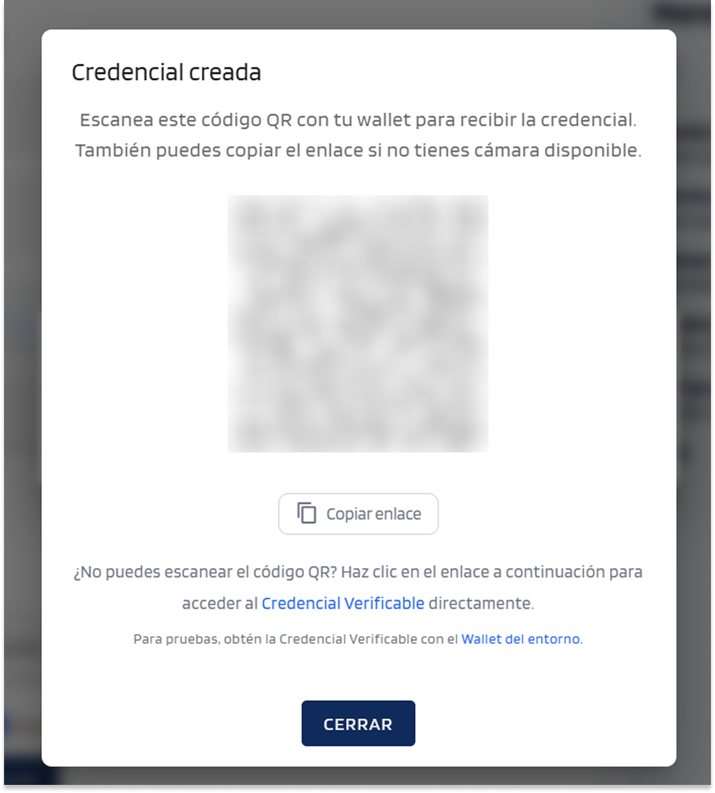
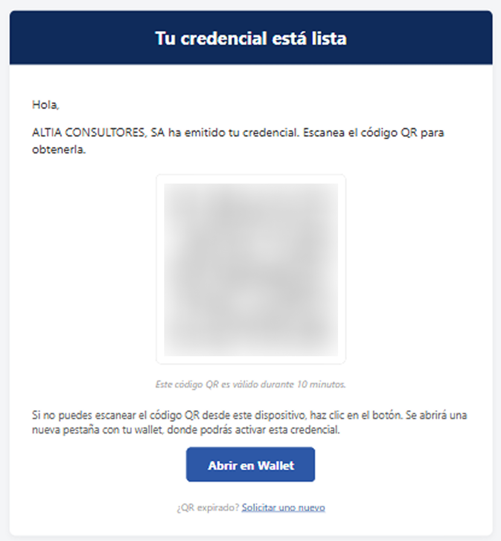
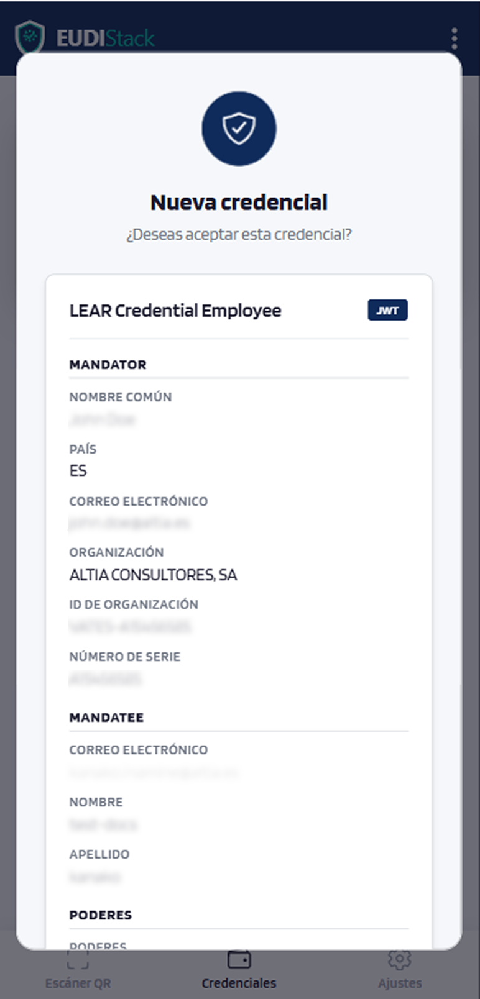
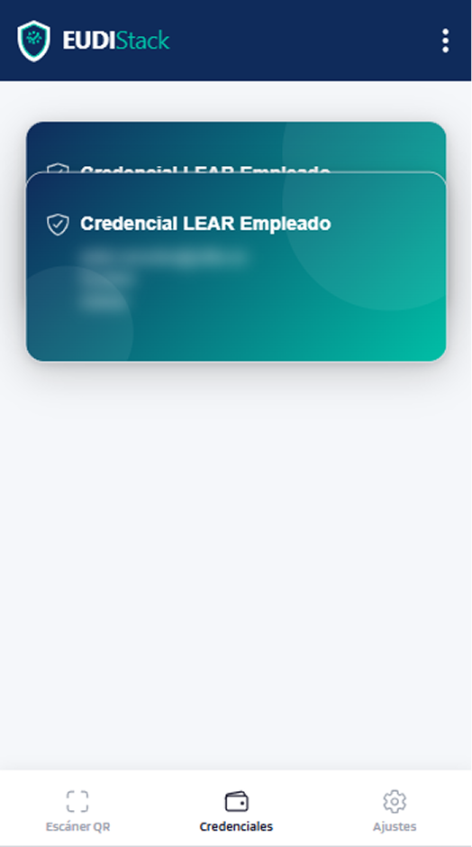

# Recibir credenciales — EUDIW

<!-- TODO: contenido pendiente -->

Cómo aceptar una credencial verificable emitida por un Issuer.

## Métodos disponibles

- **Escaneo de QR**: el Issuer presenta un QR; lo escaneas desde el wallet.
- **Por email**: recibes un correo con un código QR y un botón *Abrir en Wallet*; escanea el QR o pulsa el botón para añadir la credencial a tu wallet.

## Flujo paso a paso

1. **Recibes la oferta**: desde el portal del Issuer (QR en pantalla) o por email (con QR y botón *Abrir en Wallet*).

    <figure markdown style="display: table; margin-left: 0;">
      { width="400" }
      <figcaption>Portal del Issuer — QR en pantalla</figcaption>
    </figure>

    <figure markdown style="display: table; margin-left: 0;">
      { width="400" }
      <figcaption>Correo — QR y botón Abrir en Wallet</figcaption>
    </figure>

2. **El wallet abre la oferta**: escanea el QR o pulsa el botón del email; el wallet muestra el emisor, el tipo de credencial y los atributos que recibirás.

    { width="320" }

3. **Confirmas con tu passkey**: tras la confirmación, la credencial se almacena en el wallet.
4. **Listo**: la credencial aparece en la pestaña *Credenciales*.

    { width="320" }

<!-- TODO: insertar capturas del flujo OID4VCI desde la perspectiva del usuario -->

## Errores comunes

Consulta [solución de problemas](../troubleshooting.md) si la oferta no se abre, el QR no escanea o aparece un error tras la confirmación.
